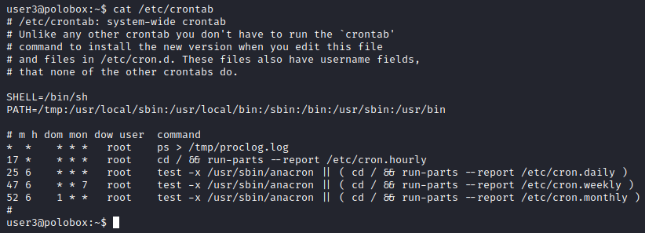
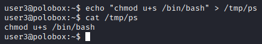
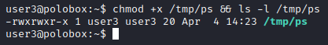
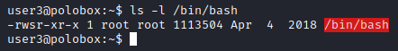
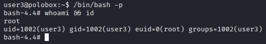
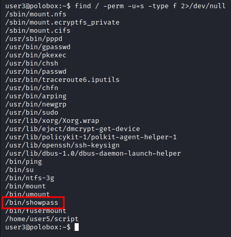
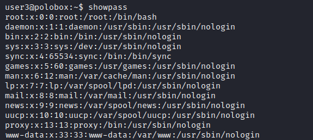
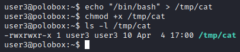
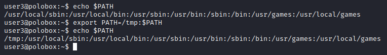
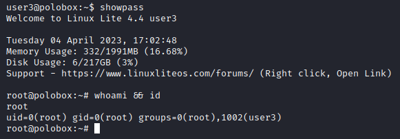

## Introduction
The *PATH* environmental variable is a colon-delimited list of directories that tells the shell which directories to search for executable when running a command. Say for example that you have two binaries that share the same name located in two different directories. If executed, the shell will run the file that is in the directory that comes first in the *PATH* variable. Use of the *PATH* variable means that we don't have to specify an absolute path to a binary when running a command. Consequently, a misconfigured *PATH* variable can result in an easy privilege escalation vector.

We print the current value of *PATH* variable as follows:

```console
echo $PATH

/usr/local/sbin:/usr/local/bin:/usr/sbin:/usr/bin:/sbin:/bin:/usr/local/games:/usr/games
```
When a command is executed, the shell will traverse the colon-separated paths from left to right. In the above listed command, the shell will look for the `echo` binary in the `/usr/local/sbin` directory first before moving on to `/usr/local/bin` and so forth.

We can add a new path to the *PATH* variable using the `export` command. To prepend a new path, we reassign our new *PATH* variable with our new desired path at the beginning of the existing *PATH* variable (indicated by `$PATH`).

```console
export PATH=/new_path:$PATH
```
To append a new path, the *PATH* variable is reassigned with the new path at the end.

```console
export PATH=$PATH:/new_path
```
Note that new paths added using the `export` command are non-persistent between shell sessions. When closing and opening a new shell session, the added path will be lost.

## Exploiting PATH Variable
Exploitation of the *PATH* variable to gain privilege escalation in Linux systems requires the following two conditions to be satisfied:

1. Misconfigured *PATH* variable where a globally-writeable directory (or a directory which a low privileged user has write access to) has been prepended to the existing *PATH* variable.
2. Missing absolute path in binaries and commands which can be exploited via the *PATH* variable.

It should be noted that most exploits involving the *PATH* variable will inevitably require the use of SUID binaries, misconfigured cron job, or other misconfigured file permissions on the system.

### Exploiting Missing Absolute Paths in Cron Jobs
In this example, we will look at exploiting a situation where a system administrator has misconfigured the *PATH* variable by prepending a globally-writeable directory to the existing *PATH* variable. To make matters worse, the schedule task created by the system administrator does not use absolute paths for the binaries being called.

By default, Cron runs as root when executing scheduled tasks. By redirecting Cron to a binary or script we control, we can escalate our privileges to those of the root user. Let's see this in action.

We begin by looking at the contents of `/etc/crontab`.



Here we can see that the system administrator has prepended the globally-writeable `/tmp` directory to the *PATH* variable. Furthermore, the top scheduled task calls the `ps` binary without defining its absolute path. From above we know that if we call a duplicate file located in different folders, the Linux shell will execute the file that is in the directory that comes first in the *PATH* variable.

Since the globally-writeable `/tmp` is the first path in the *PATH* variable, we can redirect Cron to execute our modified file instead of the actual one by creating a modified `ps` script in the `/tmp` folder with malicious code.



Here, we use the `echo` command to create a new `ps` script in the `/tmp` directory which sets the SUID bit on the `/bin/bash` binary. In order for Cron to be able to be execute our script, we need to mark it as executable.



With the executable permissions set, all we need to do is but wait for Cron to run the job which will execute our script to set the SUID bit on `/bin/bash`.



We can now execute the `/bin/bash` binary with the `-p` flag which does not reset the effective user id and allows the binary to be ran as the owner (ie: root in this case).



### Exploiting Missing Absolute Paths in SUID Binaries
SUID are permissions that allow users to execute a binary with the permissions of its owner. Exploiting missing absolute paths in SUID binaries requires us to modify our local *PATH* variable to point the binary to a resource we control at runtime. This task isn't always trivial as discerning what might be going-on under the hood of the binary at runtime without source code is not as straightforward and requires a degree of reverse engineering and even trial and error.

Let's see this in action. We begin off by searching the system for any files with the SUID (or 4000) permission using the `find` command.

```console
$ find / -perm -u=s -type f 2>/dev/null
```


In the list of the SUID binaries found above, we see a custom binary which is not part of the standard binaries included in Linux systems. Let's go ahead and execute the binary to see what it does.



Without access to the source code for the binary, we can't be certain about what functions the binary calls. Looking at the output, we can make an educated guess that when executed, the binary calls the `cat` function, which is a standard Linux binary, to print out the contents of the `/etc/passwd` file.

To test our theory, we can use the `echo` command to create a new `cat` script in the `/tmp` directory which calls the `/bin/bash` binary. Remember to mark the script file as executable.



Now let's modify our local *PATH* variable using the `export` command to include the location of our script file.



Now execute the SUID binary. If our theory is correct, when executed, the binary will call our `cat` script file instead of the original binary located at `/bin/cat` thereby executing the `/bin/bash` binary with root privileges.



## Conclusion
Developers should take care to ensure that system commands and binaries are called in a secure manner. Missing absolute paths in binary calls together with a modified *PATH* variable can make privilege escalation trivial. The above two examples illustrate how we can abuse the *PATH* variable in situations where absolute paths are not clearly defined when executing binaries or commands.