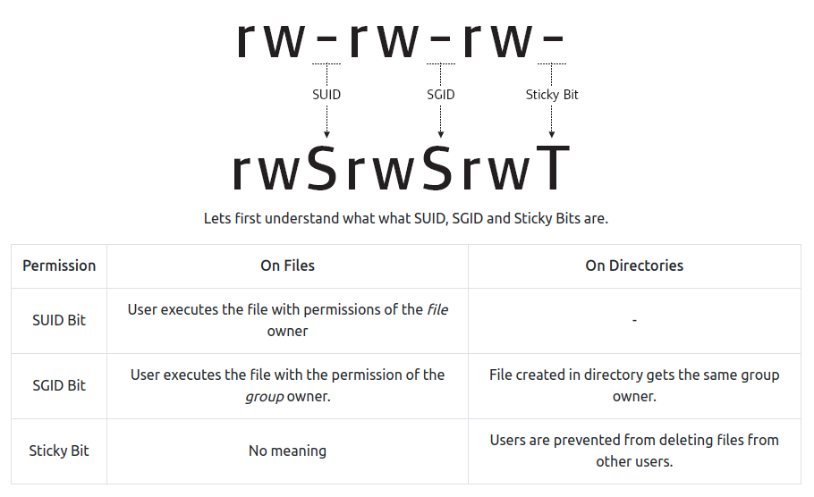

## Linux File Permissions
File permissions are core to the security model used by Linux systems. Permissions determine who can access files and directories and the level of interaction users or group owners are permitted. Each file and directory in a Linux system has three user based permission groups as illustrated in the diagram below. 


1. **Owner**: The owner permissions only apply to the owner of the file or the directory and do not impact the actions of other users.
2. **Group**: The group permissions apply only to the group that has been assigned to the file or directory and do not impact the actions of other users.
3. **Other Users (Others)**: The other users permissions apply to all other users on the system who are not an owner of the file or directory or a group assigned to the file or directory. These users are typically low privilege users.

Each file or directory has three basic permission types which can be assigned to each class of users:

1. **Read**: Read permissions are indicated by "r" and refer to a user's ability to read the contents of a file or view the contents of a directory. Read permissions are required to make copies of a file as you need to access the file's contents in order to make a duplicate of it.
2. **Write**: Write Permissions are indicated by "w" and refer to a user's ability to write or modify a file or the contents of a directory. Write permissions on a directory are required to move, remove, or otherwise modify content contained within it.
3. **Execute**: Execute permissions are indicated by "x" and affect a user's ability to execute a file or access a directory.  

Note that a "-" in any basic permission type field indicates that the respective user does not have the correct permissions to perform that particular action on the file or directory in question.

We can view the assigned permissions for a file by using the `ls -l` command. The following image illustrates an example of file permissions as displayed in a Linux console.


## Modifying File Permissions
In Linux systems, file permissions can be modified by using the `chmod` command. Permissions in Linux can be assigned explicitly or by using binary references. Although we will be defining permissions explicitly, it is recommended to research and understand how binary references can be used for setting permissions on a file or a directory.

When defining permissions explicitly, we need to reference the permissions groups and the permission types discussed above. The permission groups are abbreviated as follows:

- **u** - Owner
- **g** - Group
- **o** - Other Users
- **a** - All Users

The permission groups can be combined with the three basic permission types using assignment operations `+` and `-` to either add or remove specific permissions. Let's look at an example. The original permissions for `file.txt` are presented below.


Say we wanted to grant write permissions to the group. We can do this by using the `chmod g+w file.txt` command.


Now say that we wanted to remove the read access from all other users as we don't want anyone but the owner and the group to be able to read the contents of our file. We can do this by using the `chmod o-r file.txt` command.


As you can see from the image above, the read permissions from other users have been removed.

## SUID/SGID
SUID (Set User Identification) and SGID (Set Group Identification) are permissions that allow users to execute a binary or script with the permissions of its owner (SUID) or of its group (SGID). Some system binaries, have this permission by default as they are required to perform certain actions with elevated privileges. Improper assignment of SUID or SGID permissions on some key binaries can lead to privilege escalation vectors.



### Manually Finding SUID Binaries
The following command can be used to identify binaries which have SUID permissions assigned to them:

```text
$ find / -perm -u=s -type f 2>/dev/null
```
Here:

- `/` instructs the find command to start from the root of the file system and find every directory.
- `-perm` denotes that we want to search for the permissions that follow.
- `-u=s` denotes that we want to look for files that are owned by the root user.
- `-type f` denotes that we are looking for a file type.
- `2>/dev/null` denotes that stderr are redirected to /dev/null.

We can also use the following command which searches for files with permissions `-4000/-2000/-6000`.

```text
$ find / -perm -4000 -o- -perm -2000 -o- -perm -6000
```
Alternatively, we can use one of the following commands which search for all files with the SUID and SGID bit set.

```text
find / -perm /u=s,g=s -type f -exec ls -la {} \; 2>/dev/null
```
```text
find / -type f -a \( -perm -u+s -o -perm -g+s \) -exec ls -l {} \; 2> /dev/null
```

!!! tip
    Alternatively, automated enumeration tools like [LinPEAS](https://github.com/carlospolop/PEASS-ng/tree/master/linPEAS) and [LinEnum](https://github.com/rebootuser/LinEnum) can be utilized to find SUID binaries.

### Exploiting Vulnerable SUID Binaries
Vulnerable system binaries with the SUID bit set are an easy vector for privilege escalation on Linux systems. These binaries can potentially be used to access and modify restricted files and even execute commands with root privileges.

Let's look at two simple examples of exploiting vulnerable SUID binaries.

#### Example 1 - cat (File Read)
`cat` is a common Linux command used to concatenate files and print the contents on the standard output. Looking at the permissions for the cat binary, we see that the binary is owned by the root user who has full read, write, and execute permissions for the binary. A typical low privilege user only has execute permission set. This is typical for a properly configured Linux system.


Suppose a system administrator accidentally sets the SUID bit on the `/bin/cat` binary. This would permit any low privileged user to view contents of a file which they normally would not have permissions to access. One such file could be the `/etc/shadow`, which contains the encrypted passwords of all users with access on the system. Let's see this in action.

We begin by confirming that the SUID bit is set on the `/bin/cat` binary.


Looking at the permissions for `/etc/shadow` we see that only the *owner:root* and *group:shadow* have permissions to read the contents of the file (note that only the root user has write permissions to the shadow file). 


Normally a low privileged user should not be able to view the contents but since the SUID bit on the `/bin/cat` binary is set (and it is owned by the root user), we can execute it with root privileges; thus allowing a low privilege user to read the contents of the `/etc/shadow` file.


#### Example 2 - cp (File Write)
`cp` is a Linux binary which permits users to copy files or directories. In a properly configured system, the `cp` binary has the following permissions.


Suppose during our enumeration, we discover that a system administrator has set the SUID bit on the `/bin/cp` binary. Having the ability to execute the `cp` command with the permissions of its owner (root) means that we are able to write data to files which low privilege users should not be authorized to. A prime candidate for writing data to would be the `/etc/passwd` file. The `/etc/passwd` file is used to keep track of every user that has access to a system.

The `/etc/passwd` file is globally readable but only writeable by the owner of the file and the group assigned to the file.


We can leverage the fact that the SUID bit on `/bin/cp` is set to add a new line to the `/etc/passwd` file; effectively allowing us to add a new user to the system with root privileges or alternatively overwrite the password of an existing user. Let's put this into action .

Start by confirming the permissions on the `/bin/cp` binary.


With the knowledge that the SUID bit is set, we can generate a new user password hash using `openssl` which typically comes installed with most Linux distributions.


We need to create a copy of the `/etc/passwd` file which we can modify to add the new user. A common directory to work out of is the `/tmp` directory as this directory typically has the least restrictive permissions.


We can now modify the copied file by appending the following line to the file.

```text
newuser:$1$newuser$CrQin45KYNZnptM8rhDV/0:0:0:root:/root:/bin/bash
```
The values of fields, in the order from left to right are:

1. `newuser`: Username
2. `$1$newuser$CrQin45KYNZnptM8rhDV/0`: Password hash for our user
3. `0`: UID denoting our user has root privileges
4. `0`: GID denoting our user belongs to the root group
5. `root`: GECOS field which describes the person or an account and is typically used for information only
6. `/root`: Path to the user's home directory
7. `/bin/bash`: Shell that is started every time our user logs in

With our new user added, we can now replace the `/etc/passwd` file with our modified one. Normally this would not be possible due to lack of write permissions but since the SUID bit is set on the `/bin/cp` binary, we are able to copy the file over with root privileges.


We can confirm if the `passwd` file was successfully overwritten by reading the contents of the file.


Now all that is left for us to do is to log in as the new user with the following credentials: `newuser:pass123`


## Conclusion
SUID and SGID is a special type of permission which can be given to a file which allows the file to always run with permissions of the owner or the group instead of the user executing it. The above two examples illustrate two simple ways of how SUID binaries can be exploited to gain root access in a system. There are many more examples of how SUID binaries can be exploited. 

!!! tip
    A good resource on exploiting SUID binaries is [GTFOBins](https://gtfobins.github.io/). GTFOBins is a curated list of UNIX binaries that can be used to bypass local security restrictions in misconfigured systems.

## References
- [GTFOBins](https://gtfobins.github.io/)
- [Steflan Security](https://steflan-security.com/linux-privilege-escalation-suid-binaries/)
- [Hacking Articles](https://www.hackingarticles.in/linux-privilege-escalation-using-suid-binaries/)
