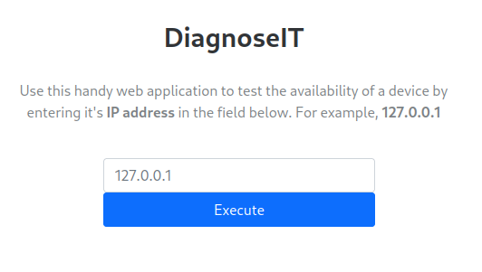
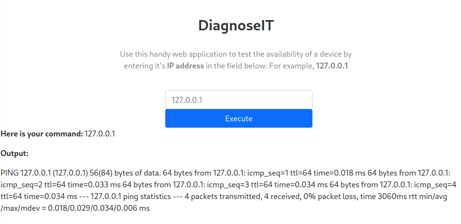
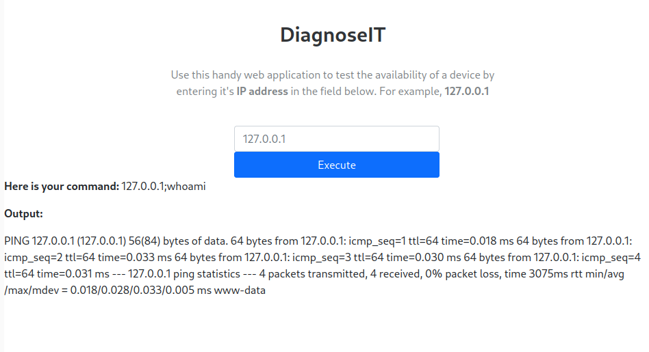
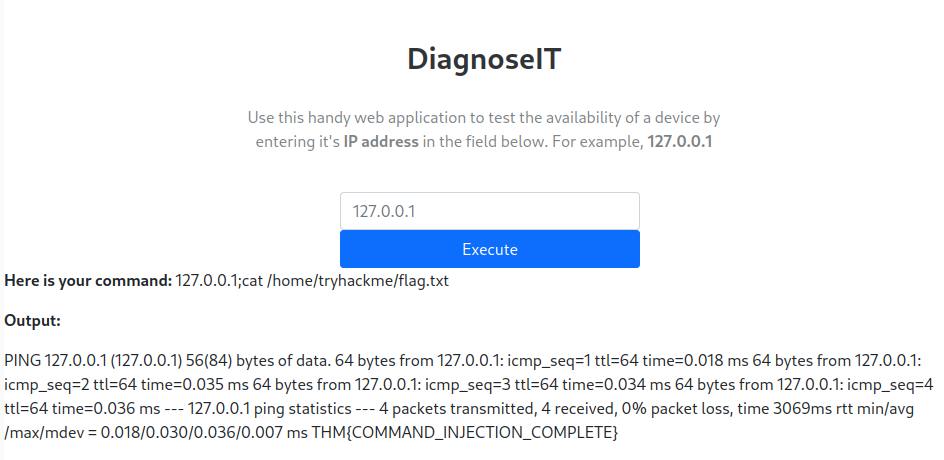

## Task 1 - Introduction
Web vulnerabilities related to command injection will be covered in this room. We will be looking at:

- How to discover command injection vulnerabilities.
- How to test and exploit this vulnerability using payloads designed for different OS.
- How to prevent this vulnerability in an application.
- Apply theory into practice.

Command injection is the abuse of an application's behaviour to execute commands on the operating system with the same privileges that the application on a device is running with. A command injection vulnerability is also known as `Remote Code Execution (RCE)`.

## Task 2 - Discovering Command Injection
Command injection vulnerabilities exist because applications often use functions in programming languages such as PHP, Python, and NodeJS to pass data to and make system calls to the machine's OS. Take for example the code snippet below. Here the application takes data that the user enters in an input field to search a directory for a song title.

```php
<?php
$song = "/var/www/html/songs"

if (isset $_GET["title"]){
    $title = $_GET["title"];

    $command = "grep $title /var/www/html/songtitle.txt";
    
    $search = exec($command);
    if ($search == ""){
        $return = "The requested song $title does not exist!";
    } else{
        $return = "The requested song $title does exist!";
    }

    echo $return;
}
?>
```

In the code snippet above, the application stores MP3 in the `/var/www/html/songs` directory on the OS. The user input `$title` is passed to the command `grep` to search a text file named *songtitle.txt*. The output of this search determines whether the application informs the user if the song exists or not.

An attacker could abuse this application by injecting their own commands for the application to execute. Abusing applications this way can be possible no matter the programming language the application uses. As long as the application processes and executes it, it can result in command injection. An example of of an application written in Python is presented below.

```python
import subprocess

from flask import Flask
app = Flast(__name__)

def execute_command(shell):
    return subprocess.Popen(shell, shell=True, stdout=subprocess.PIPE).stdout.read()

@app.route('/<shell>')
def command_server(shell):
    return execute_command(shell)
```

The application above uses the *flask* Python package to setup a web server. The function is defined which uses the *subprocess* package to execute a command on the device. Finally a route is used in the web server that will execute what is provided. For example, to execute the command `whoami`, a user will need to visit `http://flaskapp.thm/whoami`.

## Task 3 - Exploiting Command Injection
You can often determine whether or not command injection may occur based on the behaviour of the application. Applications that use user input to populate system commands with data can often be combined in unintended behaviour. For example, the shell operators `;`, `&`, and `&&` will combine two (or more) system commands and execute them both.

Command Injection can be detected in one of two ways:

1. **Blind Command Injection**: This type of injection is where there is no direct output from the application when testing payloads. You will have to investigate the behaviour of the application to determine whether or not the payload was successful.
2. **Verbose Command Injection**: This type of injection is where there is direct feedback from the application. 

### Detecting Blind Command Injection
For blind command injection, we will need to use payloads that will cause some time delay. For example, the `ping` and `sleep` commands are significant payloads to test with as they cause the system to hang and execute the command before proceeding.

Another method of detecting blind command injection is by forcing some type of output. This can be done by using the redirect operator such as `>` to write the output of a command to a file whose contents can then be read to determine if the command was successful.

Testing command injection this way is often complicated and requires a bit of experimentation. The `curl` command is also a great way to test for command injection. This is because you are able able to use `curl` to deliver data to and from an application in your payload. Take for example the command below:

```text
curl http://vulnerable.app/process.php%3Fsearch%3DThe%20Beatles%3B%20whoami
```

### Detecting Verbose Command Injection
Verbose command injection is easier to detect as the application gives you the feedback or output as what is happening or being executed. The results will be directly displayed on the web application.

### Useful Payloads
The following are some valuable payloads for both Linux and Windows.

#### Linux Payloads
|Payload|Description|
|:-:|:--|
|whoami|See what user the application is running under.|
|ls|List the contents of the current directory.|
|ping|This command will invoke the application to hang. This is useful in testing an application for blind command injection.|
|sleep| This is another useful payload in testing an application for blind command injection.|
|nc|Netcat can be used to spawn a reverse shell onto the vulnerable application.|

#### Windows Payloads
|Payload|Description|
|:-:|:--|
|whoami|See what user the application is running under.|
|dir|List the contents of t he current directory.|
|ping|This command will invoke the application to hang. This is useful in testing an application for blind command injection.|
|timeout|This command will also invoke the application to hang.|

## Remediating Command Injection
Command injection can be prevented in a variety of ways. Let's look at some PHP examples below.

### Vulnerable Functions
In PHP, many functions interact with the operating system to execute commands via shell. These include:

- Exec
- Passthru
- System

These functions take input such as a string or user data and will execute whatever is provided on the system. Any application that uses these functions without proper checks will be vulnerable to command injection.

Take the following code snippet for example. Here, the application will only accept and process numbers that are input into the form. This means that any command such as `whoami` will not be processed.

```php
<input type="text" id="ping" name="ping" pattern="[0-9]+"></input>

<?php
echo passthru("/bin/ping -c 4 "$_GET["ping"].");
?>
```

Here the application will only accept a specific patter of characters (the digits 0-9) and will then only proceed to execute this data (which is all numerical).

### Input Sanitization
Sanitizing user input is a great way to prevent command injection. This is a process of specifying the formats or types of data that a user can submit. For example, an input field that only accepts numerical data or removes any special characters such as `>`, `&`, and `/`.

In the code snippet below, the `filter_input` PHP function is used to check whether or not any data submitted via an input form is a number or not.

```php
<?php
if (!filter_input(INPUT_GET, "number", FILTER_VALIDATE_NUMBER)){

}
?>
```

### Bypassing Filters
Applications will employ numerous techniques in filtering and sanitizing user input. These filters restrict the use of specific payloads. We can abuse the logic behind an application to bypass these filters. For example, an application may strip out quotation marks; we can instead use the hexadecimal value of this to achieve the same result.

When executed, although the data will be in a different format that what is expected, it can still be interpreted and will have the same result.

```text
$payload = "\x2f\x65\x74\x63\x2f\x70\x61\x73\x73\x77\x64"
```

## Task 5 - Practical: Command Injection
Let's look at a practical example of command injection. The task provides us with a web application and asks us to find the contents of the flag located at `/home/tryhackme/flag.txt`.



Inputting a valid IP address, we are presented with the output of what appears to be a `ping` command.



We can find what user the `ping` command is running under by appending a `;whoami` to the ip address, making our payload `127.0.0.1;whoami`.



To read the contents of the flag file, we can use the `cat` command.



