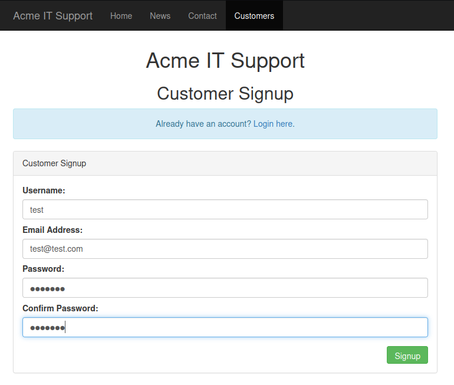
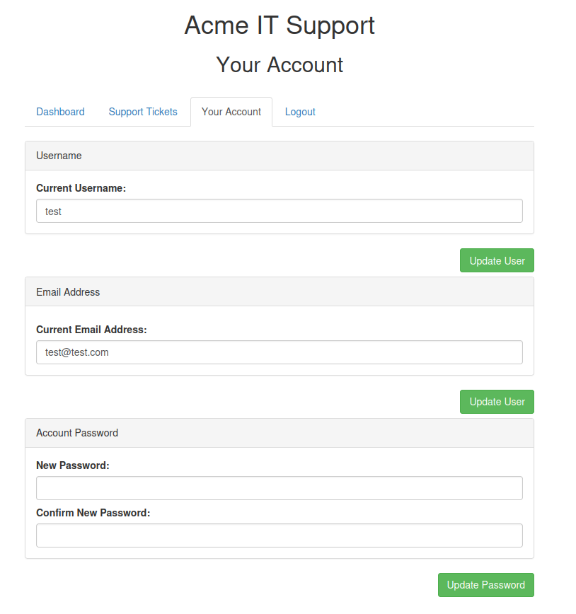
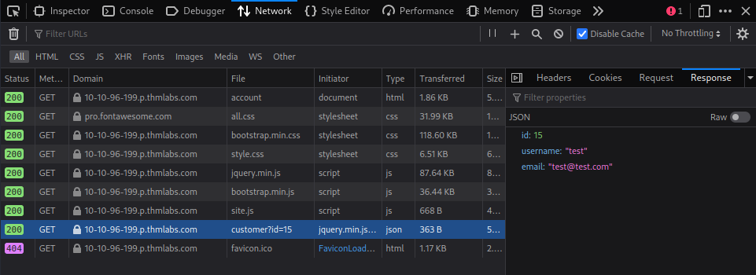
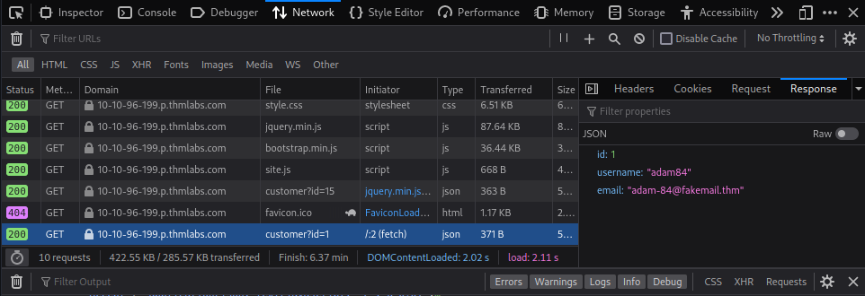

## What are Insecure Direct Object Reference Vulnerabilities?

Insecure direct object reference (or IDOR) is a type of access control vulnerability that results when a web application uses a unique identifier for direct access to an internal object without additional access control or authentication checks.

Exposed direct object references are not necessarily a security risk by themselves; however when combined with improper or insufficient access control, direct object references enable possibility of enumeration attacks which could lead to circumvention of poor access control measures. 

An IDOR vulnerability arises when the following conditions are satisfied:

1. An application exposes a direct reference to an internal object or operation.
2. A client can modify the object reference through manipulation of the URL via GET and POST parameters (URL Tampering) and/or form parameters (Body Manipulation).
3. The application grants client access to the internal object without an authorization check.

## Basis of an IDOR Vulnerability Attack
Consider the following website with an access control vulnerability:

```
https://www.example.com/account?id=001
```
In this case, the `id` parameter is used as an index in the *id table* in the database (ie. exposed direct object reference). When passed an appropriate value, the web application queries the internal database and returns relevant information to the client.

Since the `id` parameter is used directly to query the database, an attacker can enumerate valid parameters to gain access to information associated with any other `id`. In our example, passing parameter `id=002` will result in the web application returning relevant information associated with that specific database index.

As a result of this IDOR vulnerability, an attacker can perform horizontal privilege escalation attacks against the web application thereby accessing information they normally should not have access to. If the attacker is able to enumerate an `id`  associated with elevated privileges then a vertical privilege escalation is also possible.

Note that direct object references do not necessarily need to be in plain-text as developers may opt to encode or encrypt them using myriad of encoding methods or encryption algorithms.

It is worth mentioning that the most common type of IDOR vulnerabilities are associated with directory or path traversal which can permit an attacker to manipulate file system resources by allowing uploading or downloading of files and gain access to sensitive resources.

## Practical Example of an IDOR Attack
Consider the web application presented below.


The web application permits users to register new accounts by accessing the *Customers* section of the website. A common methodology to discover IDOR vulnerabilities is to create test accounts which can be used to enumerate the web application and aid in vulnerability discovery. In our example, we have registered a new user account which will server as a launching pad for further exploration.



Exploring the web application, we note that under the *Your Account* tab of the user's account, the current logged in user is permitted to change their username, email address, and password. Also note that the username and email fields are pre-populated which implies that the web application must be extracting this information from backend queries.



The developer tools available on most modern browsers can be used to investigate requests to and responses from the web server running the web application. Under the *Network* tab of developer tools, we observe a response for an endpoint with the path `/api/vi/customer?id=15`. The response from this endpoint contains the user's id, username, and email address in JSON format.



By modifying the `id` field, the web application can be coerced to return personal information of other user accounts bypassing any authentication checks.



The above was a simple example of how IDOR vulnerabilities can lead to exposure of sensitive information.

## Preventing IDOR Vulnerabilities
The best way to protect against possible IDOR vulnerabilities is through implementation of strict authorization and access control to validate and manage user access. Syntactic validation can also be employed to identify suspicious user inputs before the input is processed by the web server.

Additionally, indirect reference mapping can be employed to avoid exposing direct object references. This allows substitution of direct object references with difficult to guess indirect references. The mapping between indirect references and direct references could then be maintained on a secure server. 

Alternatively, salted hashes can be used to replace direct object references. For more information, refer to [Insecure Direct Object Reference Prevention](https://cheatsheetseries.owasp.org/cheatsheets/Insecure_Direct_Object_Reference_Prevention_Cheat_Sheet.html) on OWASP cheat Sheet Series on IDOR.
