## Recon/OSINT
Target IP: 10.10.88.133 ($IP)

## Enumeration

### Nmap Scan
Open ports:

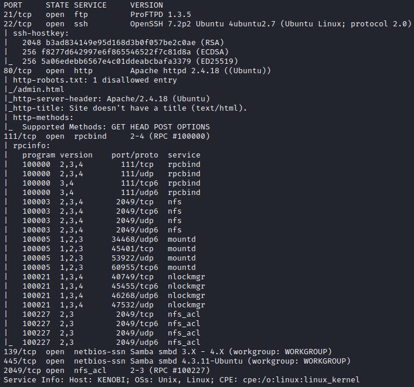

Samba enabled on ports 139 and 445.

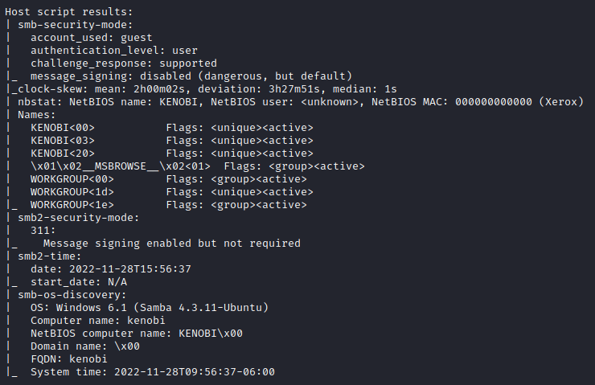

Enumerate for Samba shares on port 445 using Nmap script.

```text
nmap -p 445 --script=smb-enum-shares.nse,smb-enum-users.nse $IP
```
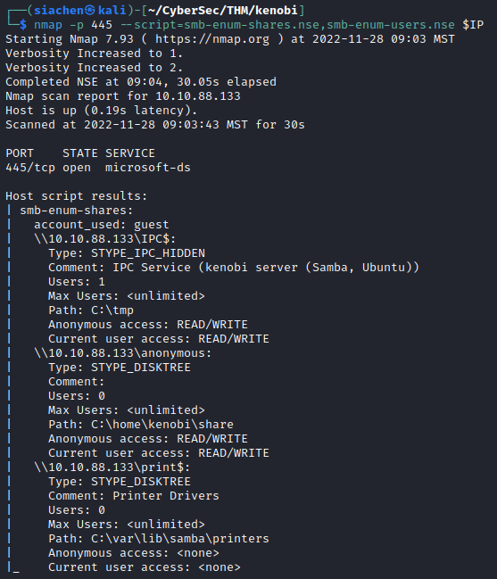

### SMBClient
Connect to `anonymous` share using `smbclient`. Supply an empty password.

```text
smbclient //$IP/anonymous
```
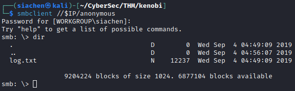

Download `log.txt` and examine content. Log file shows that an RSA private and public key pair is saved in `/home/kenobi/.ssh/id_rsa`.

### RPC
Enumerate port 111 (RPC service).

```text
nmap -p 111 --script=nfs-ls,nfs-statfs,nfs-showmount $IP
```
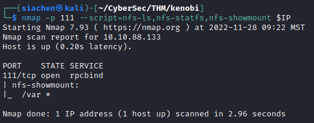

Found mount `/var`.

## Exploitation
Search `ExploitDB` or `searchsploit` for any exploits for `ProFTPd version 1.3.5`. 

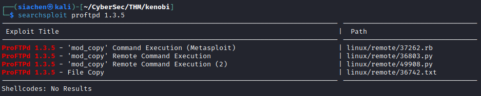

Seems like `ProFTPd version 1.3.5` is vulnerable to remote command execution using `mod_copy module`.

!!! note

    The mod_copy module implements SITE CPFR and SITE CPTO commands, which can be used to copy files/directories from one place to another on the server. Any unauthenticated client can leverage these commands to copy files from any part of the filesystem to a chosen destination.
    

Copy Kenobi's private RSA key using: [SITE CPFR and SITE CPTO command](http://www.proftpd.org/docs/contrib/mod_copy.html).   

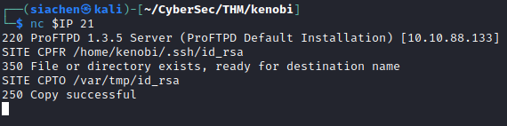

Mount `/var` to our local machine.

```text
sudo mkdir /mnt/kenobiNFS
```
```text
sudo mount $IP:/var /mnt/kenobiNFS
```
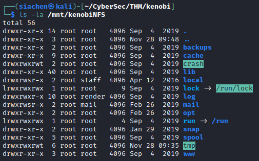

Navigate to `/tmp` directory and  use the Kenobi's `id_rsa` private key to login through `SSH`.

Setting file permissions on `/mnt/kenobiNFS` was giving trouble so copied the `id_rsa` to a local folder and set `chmod 600` permissions.

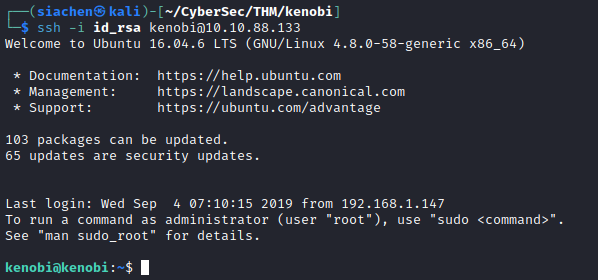

User flag found!

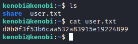

## Privilege Escalation
Search for system files with SUID bit set.

```text
find / -perm -u=s -type f 2>/dev/null
```
`Menu` binary looks suspicious.

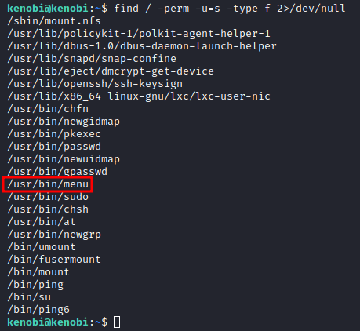

Run the `menu` binary to see what it is.

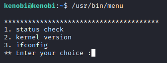

Running `strings` on `/usr/bin/menu` shows that the binary is running without a full path for `curl`.

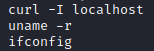

We can manipulate the fact that this binary executes with root user privileges by manipulating our path to `curl` to gain a root shell.

```text
$ cd /tmp
$ echo /bin/sh > curl
$ chmod 777 curl
$ export PATH=/tmp:$PATH
```
Here, we echoed `/bin/sh` to a file named `curl`, assigned full permissions, and put its location in our path. This means that when `/usr/bin/menu` is run, it uses our temporary path to execute our modified "curl binary" which in turn executes `/bin/sh` with root privileges.

Execute the `menu` binary again to gain root privileges.

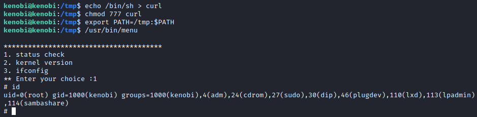

Found root flag!

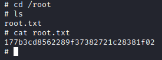
