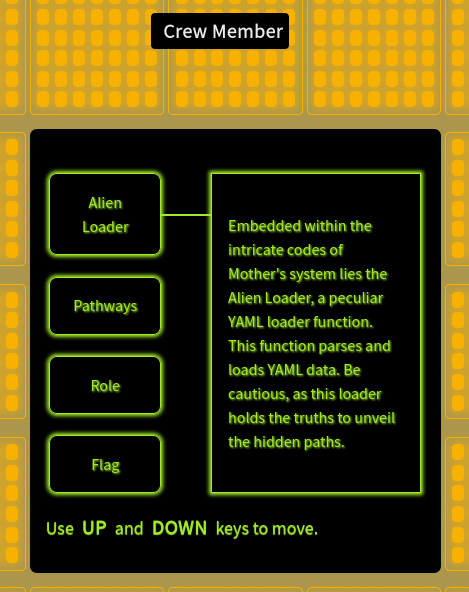
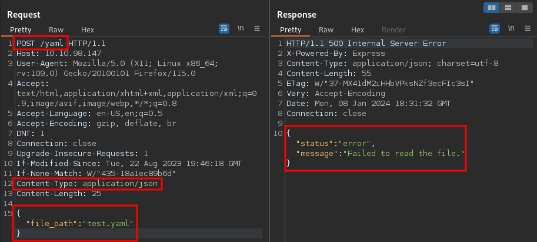
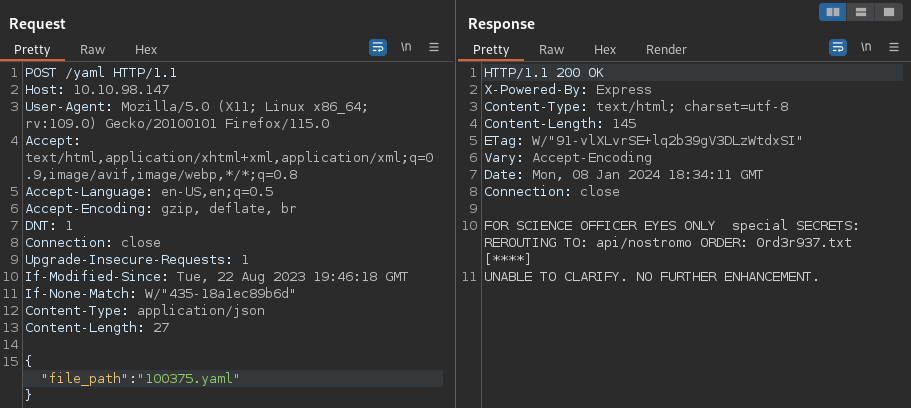
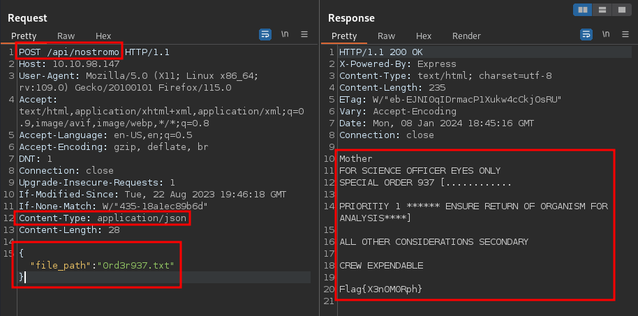
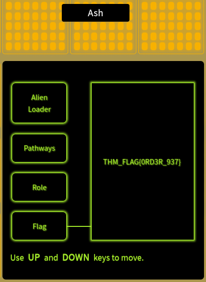
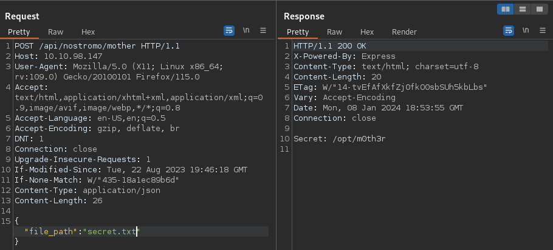
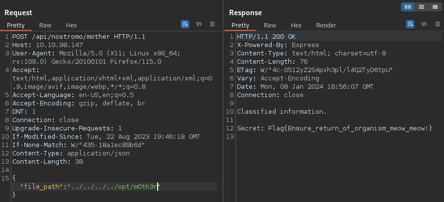

## Introduction
In this challenge, we will investigate the compromised computer system of TryHackMe's Cargo Star Ship Nostromo. We are tasked with uncovering the secrets by exploiting vulnerabilities in the web application running on the Nostromo server.

## Recon/OSINT
This particular room does not require any reconnaissance as all the necessary information and codebase is provided to get us started.

We are provided the following hints:
- Emergency command override is 100375. Use it when accessing *Alien Loaders*.
- Download the task files to learn about the server routes.
- Can you guess what is `/api/nostromo/mother/secret.txt`?

The provided task files are a set of javascript files detailing the server API routes.

```js
//yaml.js

import express from "express";
import yaml from "js-yaml";
import fs from "fs";
import { attachWebSocket } from "../websocket.js";

const Router = express.Router();

const isYaml = (filename) => filename.split(".").pop() === "yaml";

Router.post("/", (req, res) => {
  let file_path = req.body.file_path;
  const filePath = `./public/${file_path}`;

  if (!isYaml(filePath)) {
    res.status(500).json({
      status: "error",
      message: "Not a YAML file path.",
    });
    return;
  }

  fs.readFile(filePath, "utf8", (err, data) => {
    if (err) {
      res.status(500).json({
        status: "error",
        message: "Failed to read the file.",
      });
      return;
    }

    res.status(200).send(yaml.load(data));

    attachWebSocket().of("/yaml").emit("yaml", "YAML data has been processed.");
  });
});

export default Router;
```

```js
// Nostromo.js

import express from "express";
import fs from "fs";
// import { attachWebSocket } from "../../mothers_secret_challenge/websocket.js";
import { attachWebSocket } from "../websocket.js";
import { isYamlAuthenticate } from "./yaml.js";
let isNostromoAuthenticate = false;

const Router = express.Router();

Router.post("/nostromo", (req, res) => {
  let file_path = req.body.file_path;
  const filePath = `./public/${file_path}`;

  fs.readFile(filePath, "utf8", (err, data) => {
    if (err) {
      res.status(500).json({
        status: "error",
        message: "Science Officer Eyes Only",
      });
      return;
    }

    isNostromoAuthenticate = true
    res.status(200).send(data);

    attachWebSocket()
      .of("/nostromo")
      .emit("nostromo", "Nostromo data has been processed.");
  });
});

Router.post("/nostromo/mother", (req, res) => {
 
  let file_path = req.body.file_path;
  const filePath = `./mother/${file_path}`;

  if(!isNostromoAuthenticate || !isYamlAuthenticate){
    res.status(500).json({
      status: "Authentication failed",
      message: "Kindly visit nostromo & yaml route first.",
    });
    return 
  }

  fs.readFile(filePath, "utf8", (err, data) => {
    if (err) {
      res.status(500).json({
        status: "error",
        message: "Science Officer Eyes Only",
      });
      return;
    }

    res.status(200).send(data);

    // attachWebSocket()
    //   .of("/nostromo")
    //   .emit("nostromo", "Nostromo data has been processed.");
  });
});

export default Router;
```

## Exploitation
We we can view the main page by navigating to the server's IP address.



We notice that we currently have the current role and access permissions of `Crew Member`.

Let's begin exploring the available endpoints on the server. The code provided in `yaml.js` is a server-side route handler using `Node.js` and `Express`. Some key points related to the code are as follows:

1. The route handles a POST request to the root `/` endpoint.
2. It extracts the `file_path` from the request body.
3. It checks if the file has a YAML extension using the `isYaml` function.
4. If the file is not a YAML file or the YAML file does not exist, it sends an 500 Internal Server Error response.
5. If the file is a YAML file, it reads the content of the file asynchronously using fs.readFile.
6. It parses the YAML data using the yaml.load method.
7. It sends the parsed YAML data in the response.
8. It emits a WebSocket event to the `/yaml` namespace indicating that YAML data has been processed.

Let's see this in action in BurpSuite. Let's begin by issuing a POST request with a random YAML file name to the `/yaml` endpoint. We begin by capturing a request to the `/yaml` endpoint and changing the request method to POST in BurpSuite. As we will be passing data along in JSON format, we also need to change the `Content-Type` in the HTTP request header to `application/json`.



Looking at the response we get back from the server, we find that we received a 500 Internal Server Error. This is because the file we requested is not found on the server. One of the hints provided refers to an emergency command override code `100375`. Perhaps this is a reference to the file we are looking for.



Looks like we were successfully able to read the contents of the `100375.yaml` file. The contents of the file point to a second endpoint located at `api/nostromo`. Let's have a look at the code for `nostromo.js`. The code has the following key points:

1. Handles a POST request to `/nostromo`.
2. Reads the content of a text file specified by the `file_path` from the request body.
3. If successful, sets `isNostromoAuthenticate` to `true`.
4. Sends the file data in the response.
5. Emits a WebSocket event to the `/nostromo` namespace.

Based on the contents of the previous response from the `/yaml` endpoint, let's try requesting the `0rd3r937.txt` file.



The response provides us with the hidden flag in the Nostromo route: `Flag{X3n0M0Rph}`

Since we were successful in reading the contents of the file, the code sets the `isNostromoAuthenticate` to `true`; in essence, authenticating us as a Science Officer rather than a Crew Member. If we switch back to the server website in our browser, we can see that we have been authenticated as `Ash` as evident from the value indicated under `Role`. Switching to the `Flag` tab, we can extract the flag for the Science Officer role: `THM_FLAG{0RD3R_937}`



Now we can extract the contents of `secret.txt` located at `/api/nostromo/mother` in a similar manner.



The contents of `secret.txt` point to the location where Mother's Secret is located at. Let's see if the endpoint is vulnerable to a directory traversal attack (LFI). 



Flag: `Flag{Ensure_return_of_organism_meow_meow!}`