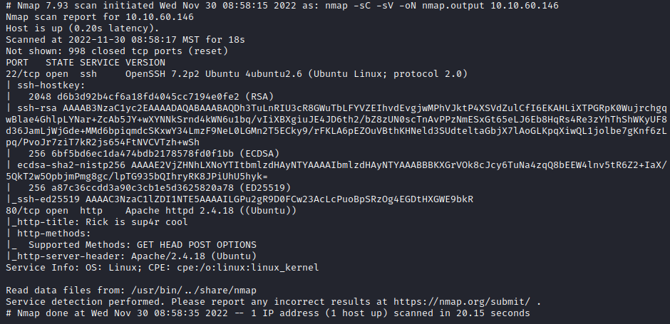
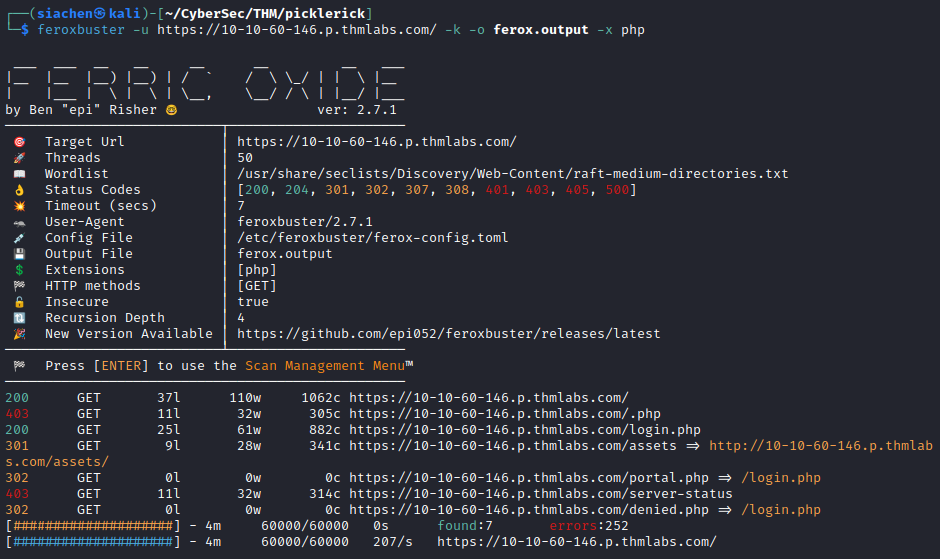
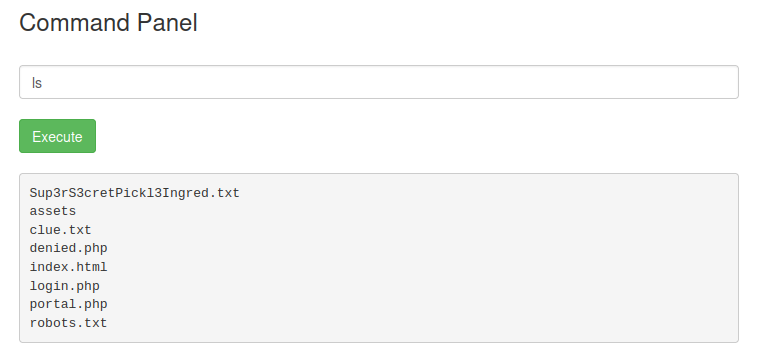
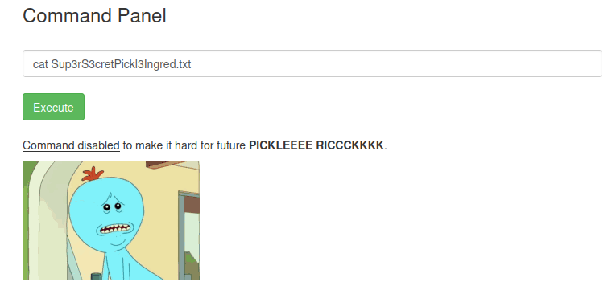
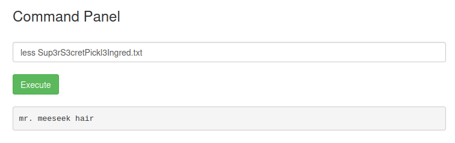
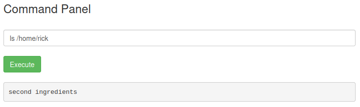
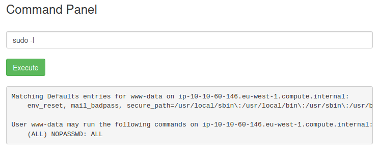

## Recon/OSINT
Target IP: 10.10.60.146 ($IP)
Website: https://10-10-60-146.p.thmlabs.com/

Looking at the page source for the website:

> Username: R1ckRul3s

Checking `robots.txt`:

> Wubbalubbadubdub

## Enumeration

### *Nmap Scan*



### *Feroxbuster Scan*



Looks like Feroxbuster found an `/assets` directory and `/login.php` page. `/assets` contains a few Javascript, CSS, and image files; none of which are of any particular importance.

## Exploit

Successfully logged in on `https://10-10-60-146.p.thmlabs.com/login.php` using `R1ckRul3s` and `Wubbalubbadubdub`.

Looks like we are presented with some sort of a command panel which executes linux commands put in the text field.

Running the `ls` command:



Running `cat` on `Sup3rS3cretPickl3Ingred.txt` reveals that the `cat` command is disabled.



Need to find some other way to display contents of the `Sup3rS3cretPickl3Ingred.txt` file.

Using `less` command we find the first ingredient Rick needs is `mr. meeseek hair`.



Looking at the contents of `clue.txt` reveals that we need to look around the file system for other ingredients.

Running command `ls /home/rick` reveals the a file containing the second ingredient.



Reading contents of the `/home/rick/second ingredients` reveals that the second ingredient Rick needs is `1 jerry tear`. Due to the space in the file name, use single quotes around the path to read the contents.

```console
$ less '/home/rick/second ingredients'
```

## Privilege Escalation
Running command `sudo -l` shows that user-data may run all commands without password.



Running `whoami` reveals that we are running as `www-data` which means we should be able to execute any command without password.

Running `sudo -la /root` reveals the a file with third ingredient.

Reading contents of `3rd.txt` using `sudo less /root/3rd.txt` reveals that the third ingredient Rick needs is `fleeb juice`.