## Task 1- What is an SSRF?
Server-Side Request Forgery (SSRF) is a vulnerability that allows malicious users to cause a web server to make an additional or edited HTTP request to a resource of attacker's choosing. There are two types of SSRF vulnerabilities:
1. Regular SSRF where data is returned to the attacker's screen.
2. Blind SSRF where SSRF occurs but no information is returned to the attacker's screen.

A successful SSRF attack can result in access to unauthorized areas, access to organizational data, ability to scale the internal network, and reveal authentication tokens/credentials amongst other things.

## Task 2 - SSRF Examples
In this task, we look at a simple example of an SSRF vulnerability. The example below shows how an attacker can have complete control over the page requested by the web server. The expected request is what the web server is expecting to receive, with the section in the red being the URL that the website will fetch for the information. The attacker can modify the area in red to a URL of their choosing.

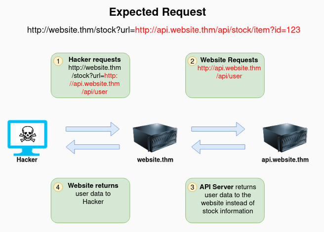

The below example shows how an attacker can reach a the `/api/user` page with only having control over the path by using directory traversal. 

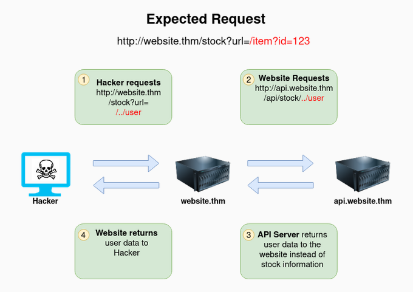

The example below shows how an attacker can control the server's subdomain to which the request is made. Note that the payload ending in `&x=` is used to stop the remaining path from being appended to the end of the attacker's URL and instead turns it into a parameter (`?x=`) on the query string.

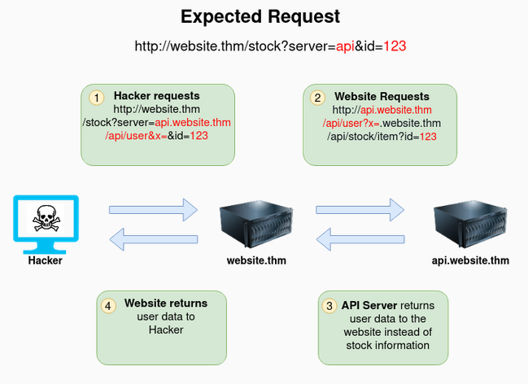

The example below shows how an attacker can force a web server to request a server of the attacker's choice. By doing so, we can capture request headers that are sent to the attacker's specific domain. These headers can contain authentication credentials or API keys sent by the targeted server.

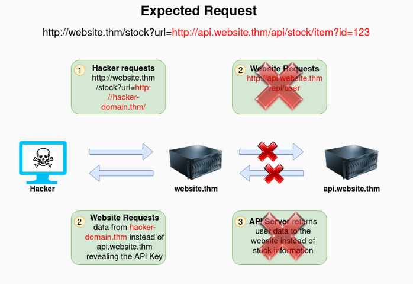

## Task 3 - Finding an SSRF
Potential SSRF vulnerabilities can be spotted in a web application in many different ways. The following are four common places to look:
- When a full URL is used in a parameter in the address bar: 
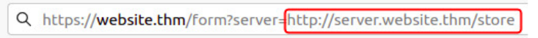
- A hidden filed in a form: 
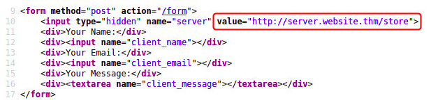
- A partial URL such as just the hostname: 
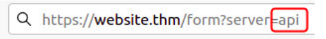
- Only the path of the URL: 
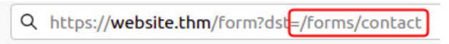

When working with blind SSRF where no output is reflected back to you, you will need to use an external HTTP logging tool to monitor requests such as `requestbin.com`, your own HTTP server, or BurpSuite's Collaborator client.

## Defeating Common SSRF Defenses
Developers may implement checks in their applications to make sure the requested resource meets specific rules in order to mitigate risks of SSRF vulnerabilities. There are two common approaches to this: Deny Lists and Allow Lists. Let's look at these a bit further.

### Deny List
A Deny List is where all requests are accepted apart from resources specified in a list or matching a particular pattern. A web application may employ a deny list to protect sensitive endpoints, IP address or domains from being accessed by the public while still allowing access to other locations. A specific endpoint to restrict access is the *localhost* which may contain server performance data or further sensitive information. As a result domain names such as *localhost* or *127.0.0.1* typically appear on a deny list.

Attackers can bypass a Deny List by using alternative *localhost* references such as `0`, `0.0.0.0`, `0000`, `127.1`, `127.*.*.*`, `2130706433`, `017700000001` or subdomains that have a DNS record which resolves to the IP address `127.0.0.0` such as *127.0.01.nip.io*.

In a cloud environment, it would be beneficial to further block access to the IP address *169.254.169.254* which contains metadata for the deployed cloud server. An attacker can bypass this by registering a subdomain on their own domain with a DNS record that points to the IP address *169.254.169.254*.

### Allow List
An allow list is where all requests get denied unless they appear on a list or match a particular pattern. An attacker could quickly circumvent this rule by creating a subdomain on an attacker's domain which matches the desired pattern. The application's logic would then allow this input and let an attacker control the internal HTTP request.

### Open Redirect
If the above bypasses do not work, an attacker could employ the open redirect technique. An open redirect is an endpoint on the server where the website visitor gets automatically redirected to another website address.

Take for example the link `https://website.thm/link?url=https://tryhackme.com`. This endpoint was created to record the number of times visitors have clicked on this link for advertising/marketing purposes. In a scenario where there is a potential SSRF vulnerability with stringent rules which only allowed URLs beginning with *https://website.thm/*, an attacker could utilize the above feature to redirect the internal HTTP request to a domain of the attacker's choice.

## Task 5 - SSRF Practical
In this challenge task, we will be putting what we have learned so far to the test.

The challenge description tells us that we have come across two new endpoints during a content discovery exercise against the Acme IT Support website. The first one is `/private`, which gives us an error message explaining that the contents cannot be viewed from our IP address. The second is a new version of the customer account page at `/customers/new-account-page` with a new feature allowing customers to choose an avatar for their account.

Let's begin by creating a new customer account and sign in.

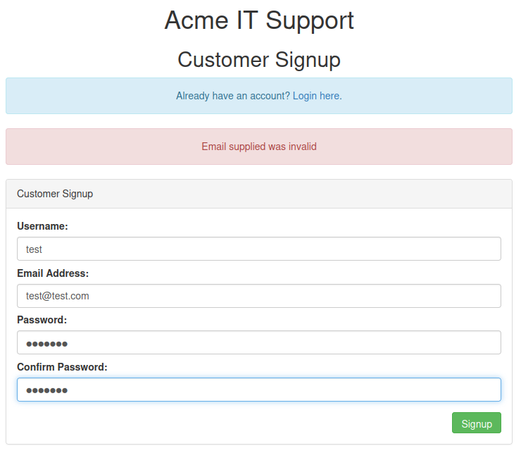

Once signed in, let's visit the second endpoint at `/customers/new-account-page`. Looking at the page source, we see that the avatar form field value contains the path to the image. The background-image style confirms this in the DIV element.

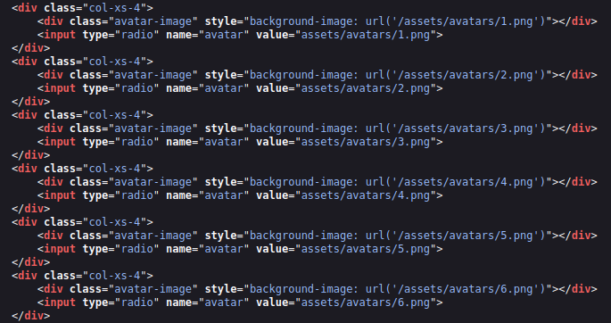

Selecting one of the avatars and then clicking *Update Avatar* button will display the currently selected avatar. Viewing the page source reveals that the current avatar is displayed using the data URI scheme. The image content is base64 encoded.

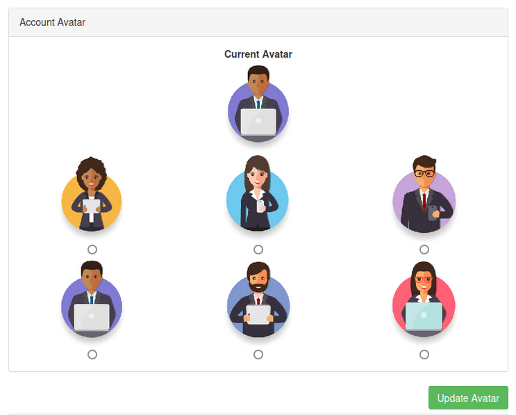

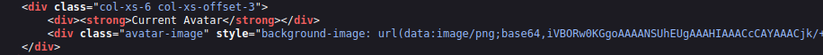

Now let's try making the request again by changing the avatar value to `private` in hopes that the server will access the resource and get past the IP address block. To do this, we will use the developer tools bundled with the browser. Use the *Inspect* tool to highlight the code for one of the avatars and change the value to `private`.

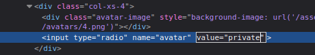

Clicking on the *Update Avatar* button however reveals that the web application has a deny list in place and has blocked access to the `/private` endpoint.

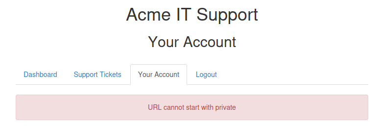

Since the path cannot start with `/private` we can use the directory traversal trick to reach our desired endpoint. This can be accomplished by setting the avatar value to `x/../private` and then selecting the said avatar and clicking *Update Avatar*. This trick works because when the web server receives the request for `x/../private`, it knows that the `../` string means to move up a directory that now translates the request to just `/private`.

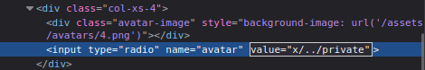

Viewing the page source from the avatar form, we find that the currently set avatar now contains the contents from the `/private` directory in base64 encoding. Decoding this content reveals the flag.

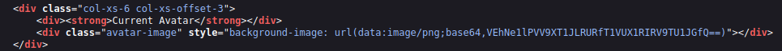

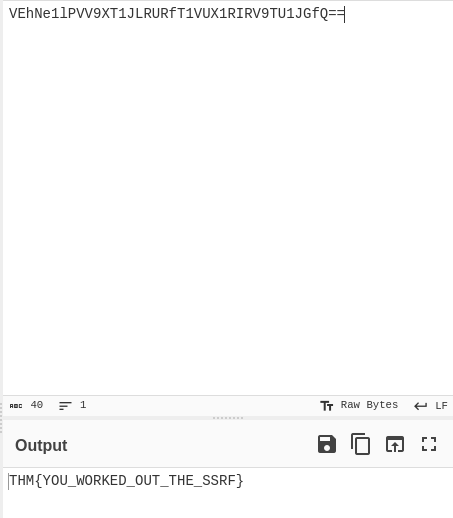
