Let's begin by navigating to the web application's IP address. On the main page, we are greeted with a message indicating that site has been hacked. Looking at the webpage source, we find the website is using a custom JavaScript file `custom.min.js`.

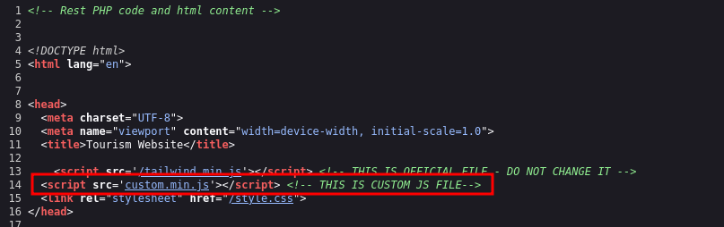

Looking at the contents of `custom.min.js` we find that the code is obfuscated with `hex` encoding .

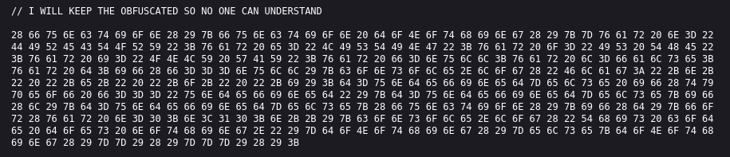

```text
// I WILL KEEP THE OBFUSCATED SO NO ONE CAN UNDERSTAND

28 66 75 6E 63 74 69 6F 6E 28 29 7B 66 75 6E 63 74 69 6F 6E 20 64 6F 4E 6F 74 68 69 6E 67 28 29 7B 7D 76 61 72 20 6E 3D 22 44 49 52 45 43 54 4F 52 59 22 3B 76 61 72 20 65 3D 22 4C 49 53 54 49 4E 47 22 3B 76 61 72 20 6F 3D 22 49 53 20 54 48 45 22 3B 76 61 72 20 69 3D 22 4F 4E 4C 59 20 57 41 59 22 3B 76 61 72 20 66 3D 6E 75 6C 6C 3B 76 61 72 20 6C 3D 66 61 6C 73 65 3B 76 61 72 20 64 3B 69 66 28 66 3D 3D 3D 6E 75 6C 6C 29 7B 63 6F 6E 73 6F 6C 65 2E 6C 6F 67 28 22 46 6C 61 67 3A 22 2B 6E 2B 22 20 22 2B 65 2B 22 20 22 2B 6F 2B 22 20 22 2B 69 29 3B 64 3D 75 6E 64 65 66 69 6E 65 64 7D 65 6C 73 65 20 69 66 28 74 79 70 65 6F 66 20 66 3D 3D 3D 22 75 6E 64 65 66 69 6E 65 64 22 29 7B 64 3D 75 6E 64 65 66 69 6E 65 64 7D 65 6C 73 65 7B 69 66 28 6C 29 7B 64 3D 75 6E 64 65 66 69 6E 65 64 7D 65 6C 73 65 7B 28 66 75 6E 63 74 69 6F 6E 28 29 7B 69 66 28 64 29 7B 66 6F 72 28 76 61 72 20 6E 3D 30 3B 6E 3C 31 30 3B 6E 2B 2B 29 7B 63 6F 6E 73 6F 6C 65 2E 6C 6F 67 28 22 54 68 69 73 20 63 6F 64 65 20 64 6F 65 73 20 6E 6F 74 68 69 6E 67 2E 22 29 7D 64 6F 4E 6F 74 68 69 6E 67 28 29 7D 65 6C 73 65 7B 64 6F 4E 6F 74 68 69 6E 67 28 29 7D 7D 29 28 29 7D 7D 7D 29 28 29 3B
```
Using CyberChef, we can deobfuscate the contents.

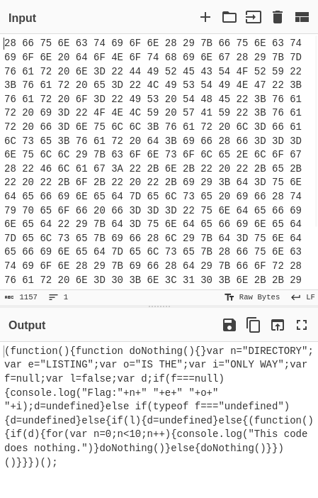

```js
(function(){function doNothing(){}var n="DIRECTORY";var e="LISTING";var o="IS THE";var i="ONLY WAY";var f=null;var l=false;var d;if(f===null){console.log("Flag:"+n+" "+e+" "+o+" "+i);d=undefined}else if(typeof f==="undefined"){d=undefined}else{if(l){d=undefined}else{(function(){if(d){for(var n=0;n<10;n++){console.log("This code does nothing.")}doNothing()}else{doNothing()}})()}}})();
```
Beautified using [js-beautify](https://beautifier.io/):

```js
(function() {
    function doNothing() {}
    var n = "DIRECTORY";
    var e = "LISTING";
    var o = "IS THE";
    var i = "ONLY WAY";
    var f = null;
    var l = false;
    var d;
    if (f === null) {
        console.log("Flag:" + n + " " + e + " " + o + " " + i);
        d = undefined
    } else if (typeof f === "undefined") {
        d = undefined
    } else {
        if (l) {
            d = undefined
        } else {
            (function() {
                if (d) {
                    for (var n = 0; n < 10; n++) {
                        console.log("This code does nothing.")
                    }
                    doNothing()
                } else {
                    doNothing()
                }
            })()
        }
    }
})();
```
Looking at the deobfuscated code, we can extract the flag value from the `console.log` function: `DIRECTORY LISTING IS THE ONLY WAY`

With no other leads on where to go from here, let's look at the page source again. Further down the page source-code, we see comments left by the developer indicating the endpoint where the logs are stored.

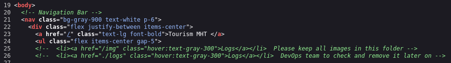

Navigating to the endpoint, we find a file containing email dumps: `email_dump.txt`

```
From: Bob <bob@tourism.mht>
To: Mark <mark@tourism.mht>
Subject: API Credentials

Hey Mark,

Sorry I had to rush earlier for the holidays, but I have created the directory for you with all the required information for the API.
You loved SSDLC so much, I named the API folder under the name of the first phase of SSDLC.
This page is password protected and can only be opened through the key. THM{100100111}

See ya after the holidays

Bob.
```
The email hints that the API endpoint is named after the first phase of S-SDLC which is typically the project planning stage or `planning` for short. Based on this result, we have the endpoint credentials of: `THM{100100111}`. Navigating to the endpoint in the browser and logging in with the credentials yields documentation on an API endpoint `api/?customer_id=1`.

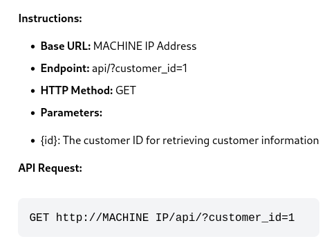

Using Burp Suite, we can extract the email address for `customer_id=5`.

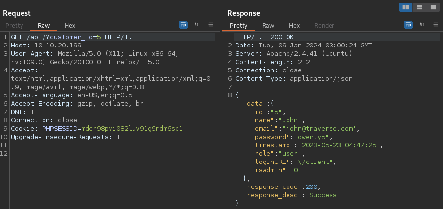

Fuzzing the API endpoint using Burp Suite Intruder (or ffuf), we find that `customer_id=3` has admin privileges with the following credentials: `realadmin@traverse.com:admin_key!!!`

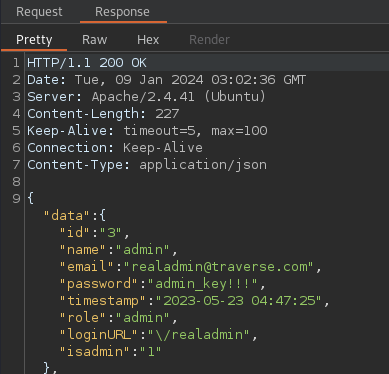

We can log in using the above credentials at the `/realadmin` endpoint.

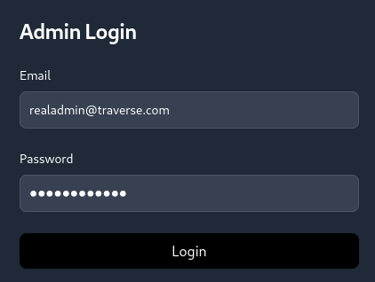

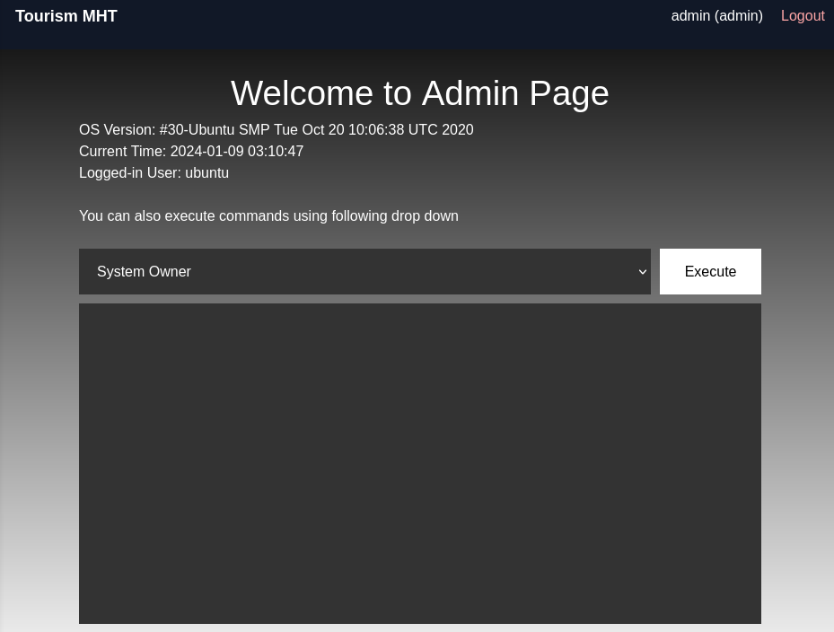

The Admin Page allows us to execute two commands from the drop down menu: System Owner and Current Directory. Intercepting a request using Burp Suite shows that when executing a command, a POST request is made to the `/realadmin/main.php` with the request body parameter of `command`. We can modify the value of the parameter execute any command we desire.

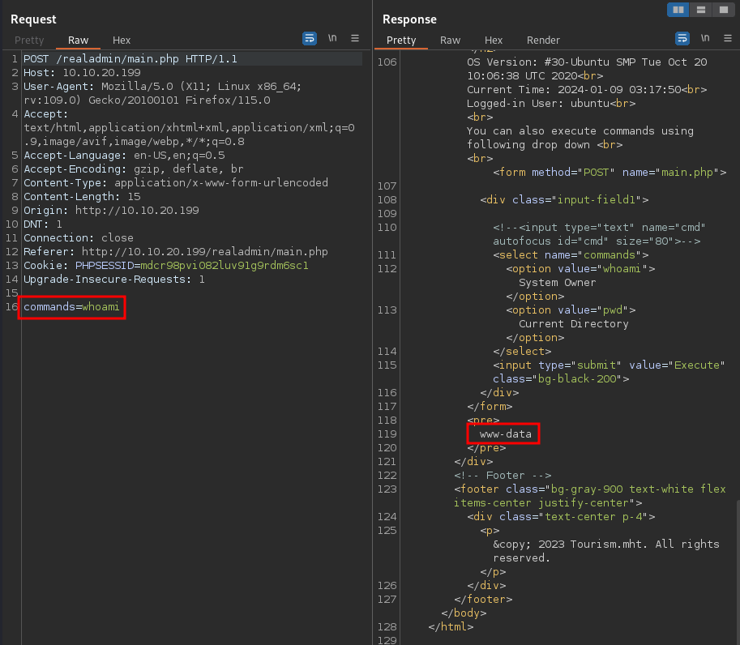

Forwarding a request with the body parameter `command=ls` gives us a response with interesting results.

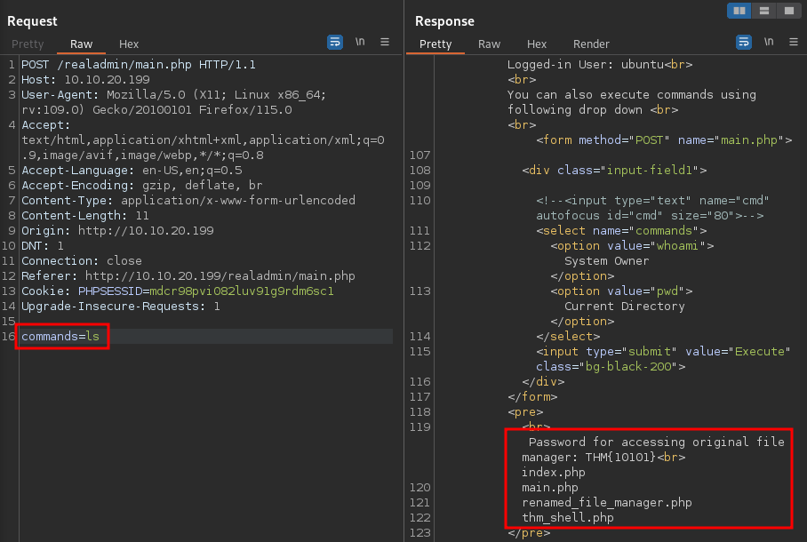

Based on the response received back from the server, the attacker uploaded a web shell named `thm_shell.php` and renamed a file used for managing the server to `renamed_file_manager.php`.

Based on the notes, we can access the original file manager using the password `THM{10101}`. Navigating to `/realadmin/renamed_file_manager.php` gives us a log in prompt to access the Admin File Manager utility. We can log in using the above credentials.

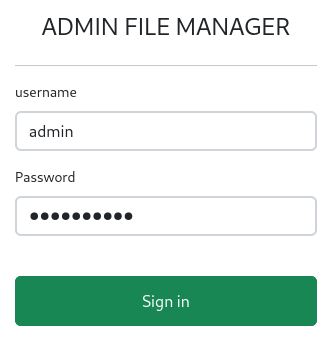

With access to Admin File Manager, we can restore the original website and recover the flag by removing the "FINALLY HACKED" message in the `index.php` file. Incidentally, the flag can also be retrieved by simply reading it from the `index.php` file.

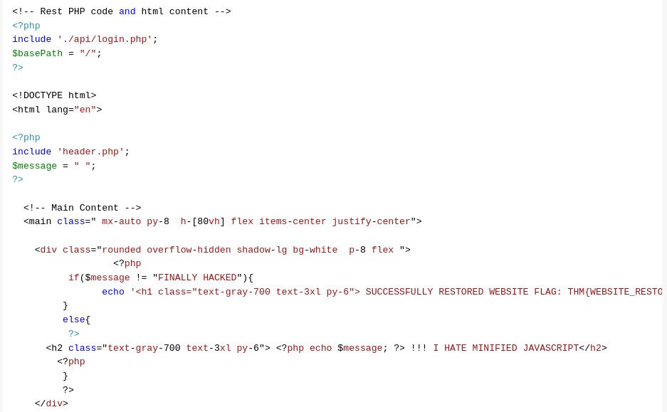

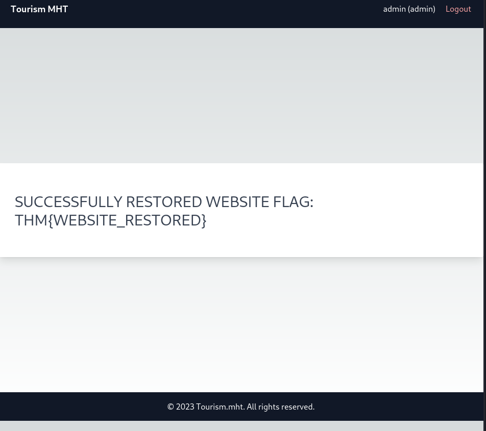

Flag: `THM{WEBSITE_RESTORED}`


